# Channel Structure & PSK

*CHANNEL STRUCTURE · AES-128 · PSK · FLASH STORAGE · PROTOCOL COMMANDS*

══════════════════════════════════════════════════════════════

## 1. What is a channel?

A **channel** in MeshCore is a **shared encryption key for over-the-air broadcast**. All nodes that have the same Pre-Shared Key (PSK) configured can decrypt messages on that channel and send messages to it. There is no server, no message history, and no central "room" — a channel exists solely as a shared secret in the firmware of participating nodes.

**Important:** the word "channel" here has *nothing* to do with a physical radio channel or frequency band. All MeshCore nodes transmit on **exactly the same frequency**, with the same bandwidth and the same LoRa parameters. There is only one shared radio channel. What MeshCore calls a "channel" is purely a **logical separation based on encryption**: messages from different channels travel through the same air but are only readable by nodes that know the corresponding PSK. A repeater that does not have the PSK simply forwards the message — it just cannot decrypt it.

This fundamentally distinguishes a channel from a *Room Server*: a Room Server stores messages so you can retrieve them later. A channel does not — a message that goes over the air is either received at the moment of transmission, or it is lost forever. There is no retransmission mechanism, no synchronisation, and no server component.

| Property | MeshCore channel | Room Server (for comparison) |
|---|---|---|
| Message storage | ❌ None — fire and forget | ✅ Yes — up to 32 unread messages |
| Server required | ❌ No — purely peer-to-peer | ✅ Yes — separate room server node |
| Missing messages | Yes — out of range = message lost | No — retrieve once you have a connection |
| Technical model | Shared AES key for broadcast | Message server with auth + sync |

> [!WARNING]
> **⚠ Note** — Channel communication requires that the device knows the PSK. The GUI cannot send or receive messages on channels for which the device does not have the key. This is the fundamental reason why the GUI cannot *activate* more channels than the device has slots.

══════════════════════════════════════════════════════════════

## 2. Three types of channels

MeshCore has **three channel types** that differ fundamentally in how the PSK is established and who has access. The slot number does *not* determine the type — that is determined solely by the origin and distribution method of the PSK.

🌐 Type 1 — Public

- **PSK:** hardcoded in firmware — `izOH6cXN6mrJ5e26oRXNcg==`
- **Key origin:** fixed, known key, identical on every MeshCore device
- **Access:** anyone with a MeshCore device, without configuration
- **Slot:** always slot 0 — created automatically at startup
- **Write protection:** GUI must never write to slot 0
- **Use:** discovery, open group chat, testing

#️⃣ Type 2 — Hashtag (name-derived key)

- **PSK:** derived from the channel name via a deterministic algorithm
- **Key origin:** `hash(name)` — anyone who knows the name can reproduce the PSK
- **Access:** anyone who knows the channel name — no explicit key exchange required
- **Slot:** slots 1–N (configurable)
- **Use:** community channels, open groups with a known name

🔒 Type 3 — Private (random key)

- **PSK:** randomly generated 16-byte key
- **Key exchange:** out-of-band via QR code export or manual entry
- **Access:** only nodes that have been explicitly given the PSK
- **Slot:** slots 1–N (configurable)
- **Use:** closed groups, security, team communication

> [!NOTE]
> **Key origin determines the type** — Technically, slots 1–N are identical. The difference between Hashtag and Private lies solely in how the PSK is established: derived from the name (Hashtag) or randomly generated (Private). Slot 0 is always Public due to the hardcoded PSK in the firmware.

### Technical comparison

| Property | Public | Hashtag | Private |
|---|---|---|---|
| PSK origin | Hardcoded in firmware | Derived from channel name | Randomly generated |
| Key exchange | None — built-in | Knowing the name is sufficient | QR code or manual entry |
| channel.hash waarde | Always the same (deterministic) | Deterministic on name | Depends on random PSK |
| Access without configuration | Yes — directly on any device | Yes — if name is known | No — PSK must be loaded |
| Repeater-forwarding | Always forward on hash match | Forward on hash match | Forward on hash — PSK not needed |
| GUI schrijven | ❌ Forbidden (slot 0) | ✅ Via CMD_SET_CHANNEL | ✅ Via CMD_SET_CHANNEL |
| Beveiliging berichten | None — PSK globally known | Low — name is the key | High — PSK only with members |

> [!NOTE]
> **Hash byte and repeaters** — Repeaters forward on the `channel.hash` byte without decrypting. For the Public channel, every node knows the hash. For private channels, repeaters also know the hash — but cannot read the content without the PSK. Repeaters do not need to know the PSK to forward messages.

══════════════════════════════════════════════════════════════

## 3. Data structure: ChannelDetails

On the device, each channel is stored in a `ChannelDetails` struct with three fields:

| Field | Type | Size | Purpose |
|---|---|---|---|
| `channel.secret` | `uint8_t[32]` | 32B | Pre-Shared Key — AES-128 uses the first 16 bytes |
| `channel.hash` | `uint8_t[1]` | 1B | SHA-256(secret)[0] — computed at runtime, never stored. Fast packet matching. |
| `name` | `char[32]` | 32B | Display name, null-terminated UTF-8. Max 31 usable characters. |

### File format: /channels2

Channels are persistently stored in `/channels2` on the device filesystem (SPIFFS/LittleFS). Each record is exactly **68 bytes**:

0x00
4B
unused — reserved for future metadata
0x04
32B
name
— channel name, null-padded
0x24
32B
channel.secret
— Pre-Shared Key (AES-128, first 16 bytes)

4 + 32 + 32 = **68 bytes per record**. The `channel.hash` is recomputed at every startup and never stored.

### Slot array on the device

> [!NOTE]
> **channels[MAX_GROUP_CHANNELS]** — `MAX_GROUP_CHANNELS` is a compile-time build flag (default: **8**, configurable up to e.g. 40). The device reports the actual value as `max_channels` (uint8) in the `RESP_CODE_DEVICE_INFO` response (byte 3, firmware ≥ v3). Slot 0 = always Public.

══════════════════════════════════════════════════════════════

## 4. Protocol command's

### CMD_GET_CHANNEL (0x1F) — request channel info

0x1F
cmd
idx
slot 0–N

Response: `PACKET_CHANNEL_INFO (0x12)` — channel name (32B) + secret (16B).

### CMD_SET_CHANNEL (0x20) — write channel (private slots only!)

0x20
cmd
idx
slot ≠ 0
naam · 32 bytes · null-padded
name
secret · 32 bytes
PSK

Frame size: **66 bytes**. BLE requires MTU ≥ 66 (request MTU = 512B). Upon receipt the device recomputes `hash` and writes to `/channels2`.

### CMD_SEND_CHANNEL_TXT_MSG (0x03) — send message

0x03
cmd
type
txt_type
idx
kanaal
timestamp · 4B little-endian Unix
ts
tekst · max 133 tekens UTF-8
payload
══════════════════════════════════════════════════════════════

## 5. Flow diagrams

### Flow 1 — Device startup & channel initialisation

Figure 1 — Device startup sequence: loading /channels2, hash computation, Public auto-add if absent

### Flow 2 — Send channel message (GUI → radio)

The sending path for public and private channels is identical. The difference lies solely in the PSK.

Figure 2 — Sending path: GUI → AES-128 encryption → LoRa TX.

### Flow 3 — Receive channel message (radio → GUI)

The hash scan makes the system efficient: the device compares one byte per slot before performing the heavier AES decryption.

Figure 3 — Receive path: LoRa RX → hash scan → AES-128 decrypt → GUI.

### Flow 4 — Write preset to device slot (CMD_SET_CHANNEL)

Only private slots (idx ≥ 1) may be written to. The GUI is responsible for slot 0 protection.

Figure 4 — Write preset: GUI → CMD_SET_CHANNEL → RAM + hash → /channels2 → confirmation back to GUI

══════════════════════════════════════════════════════════════

## 6. Cryptographic details

### Encryption: AES-128

| Aspect | Detail |
|---|---|
| Algorithm | AES-128 (encryptThenMAC pattern) |
| Key length | 16 bytes — the first 16 bytes of `channel.secret[32]` |
| PSK format (external) | Base64-encoded, 16 bytes decoded. Public example: `izOH6cXN6mrJ5e26oRXNcg==` |
| Hash byte | `SHA-256(secret)[0]` — packet matching, not for security |
| Storage on device | Flash as `secret[32]`; `hash` recomputed at runtime on startup |
| Storage on host (GUI) | Production: OS keychain. v1: JSON (consciously accepted risk) |

> [!WARNING]
> **⚠ Hash collisions** — The hash byte is only 1 byte (256 values). With 8 active channels: ~3% chance of collision. On a collision the device attempts AES decryption on both matching slots — MAC verification determines which is correct. Designed behaviour, not a bug.

### Public / Hashtag / Private: cryptographic difference

| Property | Public | Hashtag | Private |
|---|---|---|---|
| PSK origin | Hardcoded in firmware — always the same | Deterministically derived from name | Random — unique per channel |
| channel.hash | Deterministic, identical on all nodes | Deterministic on name | Depends on the random PSK |
| Access without configuration | Yes — directly available on any device | Yes — knowing the name is sufficient | No — PSK must be loaded first |
| AES decrypt by third parties | Yes — PSK globally known | Yes — if name is derivable | Only at nodes with the same PSK |
| Repeater-forwarding | Every repeater recognises hash and forwards | Forward on hash — PSK not needed | Forward on hash — PSK not needed |
| GUI schrijven | ❌ Forbidden | ✅ Via CMD_SET_CHANNEL | ✅ Via CMD_SET_CHANNEL |

══════════════════════════════════════════════════════════════

## 7. Limitations summary

| Limitation | Value | Changeable without firmware? |
|---|---|---|
| Max active channels | `MAX_GROUP_CHANNELS` (default 8) | No — compile-time build flag |
| Max channel name | 31 usable characters + null terminator | No — fixed struct field size |
| Secret format | 32 bytes internal, first 16 for AES-128 | No — protocol definition |
| Slot 0 | Always Public (hardcoded PSK) — GUI never writes here | No — firmware initialisation |
| BLE MTU for CMD_SET_CHANNEL | ≥ 66 bytes (request MTU = 512) | GUI responsibility |
| Firmware version for max_channels | Firmware ≥ v3 required (RESP_CODE_DEVICE_INFO byte 3) | GUI must check firmware_ver |

Sources
meshcore-dev/MeshCore @ 9f1a3eaf — ChannelDetails.h
meshcore-dev/MeshCore @ 9f1a3eaf — DataStore.cpp
docs.meshcore.io — Companion Protocol

Translated from Dutch by Anthropic Claude
