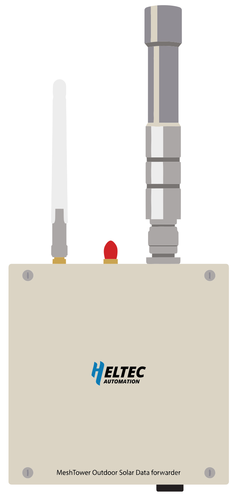
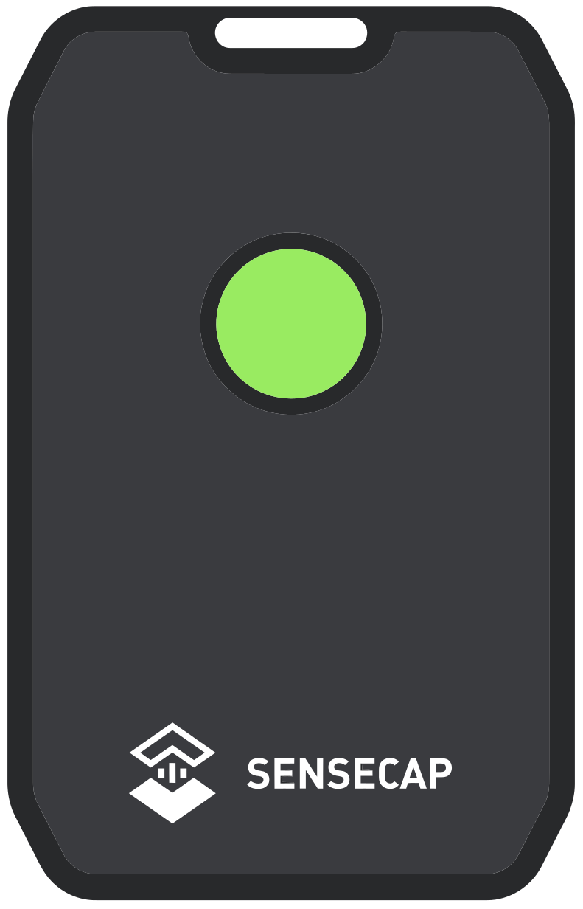
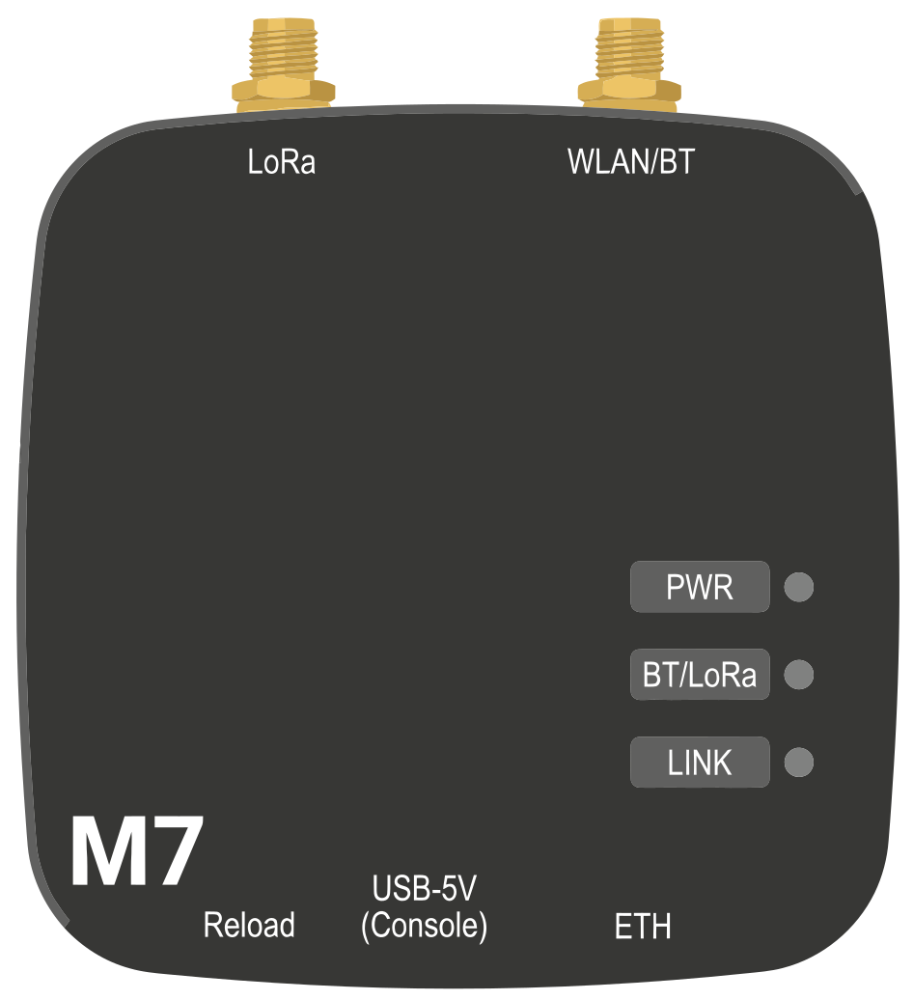
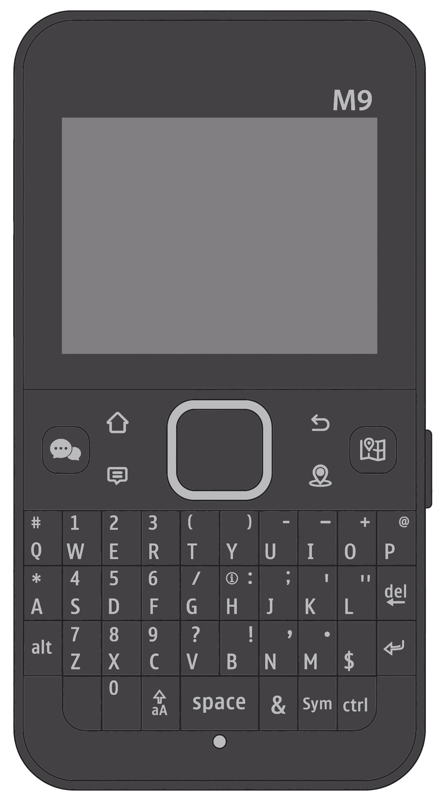

# Nodematrix

*ZESTIG BOARDS · MCU · RADIO · RANDAPPARATUUR · PRIJS*

Elk apparaat dat de MeshCore web flasher aanbiedt, naast elkaar op
platformfamilie, geheugen, radio, randapparatuur en prijs. Dit hoofdstuk is
een naslagtabel, geen keuzehulp: waarom het platform uitmaakt staat in
[MeshCore Platforms](platforms.md), en wat er per familie in de chip zit in
[De vier platformfamilies](platform-families.md).

> [!NOTE]
> **Bron.** De apparatenlijst komt uit `config.json` van
> [meshcore-dev/flasher.meshcore.io](https://github.com/meshcore-dev/flasher.meshcore.io), commit `b84f889`,
> 9 september 2026 — de bronrepo van de web flasher, MIT-licentie. Daaruit
> komen naam, fabrikant, platformfamilie en de firmware die de flasher per
> apparaat aanbiedt; na te rekenen met
> [`tools/platform-overview.py`](https://github.com/pe1hvh/meshcore-docs/blob/main/tools/platform-overview.py) via
> `--flasher-config`. Voor de vier apparaten die MeshCore v1.17.1 toevoegt
> komen core, RAM, kloksnelheid, radio, display en GPS uit de firmware
> zelf, commit `d929643`, 14 augustus 2026: `boards/*.json` en de
> `build_flags` van `variants/*/platformio.ini`, na te lopen met
> [`tools/variant-pins.py`](https://github.com/pe1hvh/meshcore-docs/blob/main/tools/variant-pins.py). Voor de overige
> apparaten volgen RAM, kloksnelheid en koppelingsmogelijkheden uit de SoC
> en staan ze in de datasheets; accu, behuizing en prijs komen van
> fabrikants- en communitybronnen. Herkomst per kolom staat onder
> [Bronnen](#bronnen).

## Wat er in de lijst staat

Vijfenzestig apparaten over drie platformfamilies: 35 met een ESP32, 29
met een nRF52840 en één met een RP2040. Voor STM32WL biedt de flasher niets aan.
Waarom die verdeling zo ligt, staat in
[MeshCore Platforms](platforms.md).

Eén apparaat heeft geen LoRa-radio. De LilyGo T-Display Pro staat in de
flasher als ESP-NOW-bord; ESP-NOW werkt op 2,4 GHz en is geen LoRa. Het
apparaat staat hieronder gewoon mee, met `n.v.t.` in de kolom
zendvermogen.

### Twee firmwareprojecten in één flasher

Niet elk apparaat in de lijst kan MeshCore draaien. Elk firmwareblok in
`config.json` draagt een `class`: `community` voor MeshCore en `ripple`
voor de Ripple-firmware, een ander project dat dezelfde flasher gebruikt.
Negen van de vijfenzestig apparaten hebben uitsluitend `ripple`-builds. Ze
staan hieronder gewoon mee, met een `†` achter de naam:

T-Deck Max · T-Deck Pro · T-Deck Pro v1.1 · T5 E-Paper S3 Pro (H752-XX) ·
T-Lora Pager · T-Display Pro · T-Watch S3 Plus · T-Watch Ultra ·
ThinkNode M9

Bij de ThinkNode M9 wringt dat. De firmware-repo heeft sinds v1.17.1 een
variant `thinknode_m9` met zes build-targets, maar de flasher biedt er
alleen Ripple voor aan. Wie daar MeshCore op wil, bouwt zelf.

## Hoe je deze tabellen leest

De vier tabellen beschrijven dezelfde vijfenzestig apparaten in dezelfde
volgorde, met de nodenaam als sleutel.

- **`°` achter de naam** — minstens één waarde van dit apparaat is nog
  niet bevestigd. Welke, staat in [Nog te bevestigen](#nog-te-bevestigen).
  Dertig van de vijfenzestig apparaten dragen zo'n teken.
- **`†` achter de naam** — de flasher biedt voor dit apparaat geen
  MeshCore-firmware, alleen Ripple. Negen apparaten dragen dit teken; zie
  [Twee firmwareprojecten in één flasher](#twee-firmwareprojecten-in-een-flasher).
- **De namen zijn genormaliseerd.** `config.json` zet de fabrikant in de
  apparaatnaam (`LilyGo T-Echo Lite`, `Elecrow ThinkNode M7`); hier staat de
  fabrikant in een eigen kolom en is hij uit de naam gehaald. Ook de
  schrijfwijze van chipnamen is rechtgezet: `nrf52` wordt `nRF52`, `esp32`
  wordt `ESP32`. Dat geldt voor alle vijfenzestig apparaten. Eén afwijking
  gaat verder dan schrijfwijze: `config.json` geeft de ProMicro nRF52 de
  fabrikant `promicro`, hier staat **DIY**. Dat is een redactionele keuze —
  er is geen fabrikant ProMicro; het is een bordformaat dat door meerdere
  partijen wordt gemaakt en als zelfbouw wordt verkocht.
- **`—` in een cel** — de gebruikte bronnen zeggen hier niets over.
- **ja · optie · nee** in de kolommen GPS, WiFi, BLE en USB. *Optie*
  betekent: afhankelijk van uitvoering, revisie of een losse module.
- **Prijzen** zijn indicatieve straatprijzen in euro, exclusief verzending
  en btw.

### Companion, standalone en repeater

MeshCore splitst zijn firmware in rollen, en die rol bepaalt of je een
telefoon nodig hebt. Een **companion**-node is een radio zonder eigen
interface: je bedient hem met de MeshCore-app, via BLE, USB of WiFi.
Boards met scherm én toetsenbord draaien **standalone** firmware en werken
zonder telefoon. **Repeaters** en room servers hebben tijdens gebruik ook
geen app nodig — alleen bij het instellen.

## Tabel 1 — identiteit en MCU

RAM en kloksnelheid volgen uit de SoC, niet uit het bord. Twee apparaten
met dezelfde chip hebben hier dus dezelfde cijfers, hoe verschillend ze
verder ook zijn.

| Node | Leverancier | Platformfamilie | Core | RAM | Snelheid |
|---|---|---|---|---|---|
| ThinkNode M1 | Elecrow | nRF52 | nRF52840 · Cortex-M4F | 256 KB | 64 MHz |
| ThinkNode M2 | Elecrow | ESP32 | ESP32-S3 · 2× Xtensa LX7 | 512 KB | 240 MHz |
| ThinkNode M3° | Elecrow | nRF52 | nRF52840 · Cortex-M4F | 256 KB | 64 MHz |
| ThinkNode M5 | Elecrow | ESP32 | ESP32-S3 · 2× Xtensa LX7 | 512 KB | 240 MHz |
| ThinkNode M6 | Elecrow | nRF52 | nRF52840 · Cortex-M4F | 256 KB | 64 MHz |
| ThinkNode M7° | Elecrow | ESP32 | ESP32-S3 · 2× Xtensa LX7 | 512 KB | 240 MHz |
| ThinkNode M9†° | Elecrow | ESP32 | ESP32-S3 · 2× Xtensa LX7 | 512 KB | 240 MHz |
| GAT562 30s | GAT-IoT | nRF52 | nRF52840 · Cortex-M4F | 256 KB | 64 MHz |
| GAT562 Tracker° | GAT-IoT | nRF52 | nRF52840 · Cortex-M4F | 256 KB | 64 MHz |
| Wireless Paper | Heltec | ESP32 | ESP32-S3 · 2× Xtensa LX7 | 512 KB | 240 MHz |
| Mesh Node T096 | Heltec | nRF52 | nRF52840 · Cortex-M4F | 256 KB | 64 MHz |
| Mesh Node T1° | Heltec | nRF52 | nRF52840 · Cortex-M4F | 256 KB | 64 MHz |
| MeshPocket° | Heltec | nRF52 | nRF52840 · Cortex-M4F | 256 KB | 64 MHz |
| MeshSolar / MeshTower | Heltec | nRF52 | nRF52840 · Cortex-M4F | 256 KB | 64 MHz |
| MeshTower V2° | Heltec | nRF52 | nRF52840 · Cortex-M4F | 256 KB | 64 MHz |
| T114 | Heltec | nRF52 | nRF52840 · Cortex-M4F | 256 KB | 64 MHz |
| WiFi LoRa 32 v2 | Heltec | ESP32 | ESP32 · 2× Xtensa LX6 | 520 KB | 240 MHz |
| WiFi LoRa 32 v3 | Heltec | ESP32 | ESP32-S3 · 2× Xtensa LX7 | 512 KB | 240 MHz |
| WiFi LoRa 32 v4° | Heltec | ESP32 | ESP32-S3 · 2× Xtensa LX7 | 512 KB | 240 MHz |
| v4 + Expansion Kit (Touch)° | Heltec | ESP32 | ESP32-S3 · 2× Xtensa LX7 | 512 KB | 240 MHz |
| Vision Master E213 | Heltec | ESP32 | ESP32-S3 · 2× Xtensa LX7 | 512 KB | 240 MHz |
| Vision Master E290 | Heltec | ESP32 | ESP32-S3 · 2× Xtensa LX7 | 512 KB | 240 MHz |
| Wireless Tracker | Heltec | ESP32 | ESP32-S3 · 2× Xtensa LX7 | 512 KB | 240 MHz |
| Wireless Tracker v2° | Heltec | ESP32 | ESP32-S3 · 2× Xtensa LX7 | 512 KB | 240 MHz |
| Wireless Stick Lite v3 | Heltec | ESP32 | ESP32-S3 · 2× Xtensa LX7 | 512 KB | 240 MHz |
| Nano° | Ikoka | nRF52 | nRF52840 · Cortex-M4F (XIAO) | 256 KB | 64 MHz |
| Stick° | Ikoka | nRF52 | nRF52840 · Cortex-M4F (XIAO) | 256 KB | 64 MHz |
| LT1° | Keepteen | nRF52 | nRF52840 · Cortex-M4F | 256 KB | 64 MHz |
| LoRa32 v2.1_1.6 | LilyGo | ESP32 | ESP32 · 2× Xtensa LX6 | 520 KB | 240 MHz |
| T-Beam (SX1262) | LilyGo | ESP32 | ESP32 · 2× Xtensa LX6 | 520 KB | 240 MHz |
| T-Beam 1.2 (SX1276) | LilyGo | ESP32 | ESP32 · 2× Xtensa LX6 | 520 KB | 240 MHz |
| T-Beam 1W° | LilyGo | ESP32 | ESP32 · 2× Xtensa LX6 | 520 KB | 240 MHz |
| T-Beam Supreme (SX1262) | LilyGo | ESP32 | ESP32-S3 · 2× Xtensa LX7 | 512 KB + 8 MB PSRAM | 240 MHz |
| T-Deck | LilyGo | ESP32 | ESP32-S3 · 2× Xtensa LX7 | 512 KB + 8 MB PSRAM | 240 MHz |
| T-Deck Max†° | LilyGo | ESP32 | ESP32-S3 · 2× Xtensa LX7 | 512 KB + PSRAM | 240 MHz |
| T-Deck Pro†° | LilyGo | ESP32 | ESP32-S3 · 2× Xtensa LX7 | 512 KB + 8 MB PSRAM | 240 MHz |
| T-Deck Pro v1.1†° | LilyGo | ESP32 | — | — | — |
| T-Display Pro†° | LilyGo | ESP32 | ESP32-S3 · 2× Xtensa LX7 | 512 KB + PSRAM | 240 MHz |
| T-Echo | LilyGo | nRF52 | nRF52840 · Cortex-M4F | 256 KB | 64 MHz |
| T-Echo Card° | LilyGo | nRF52 | nRF52840 · Cortex-M4F | 256 KB | 64 MHz |
| T-Echo Lite° | LilyGo | nRF52 | nRF52840 · Cortex-M4F | 256 KB | 64 MHz |
| T-Lora Pager†° | LilyGo | ESP32 | ESP32-S3 · 2× Xtensa LX7 | 512 KB + 8 MB PSRAM | 240 MHz |
| T-Watch S3 Plus† | LilyGo | ESP32 | ESP32-S3 · 2× Xtensa LX7 | 512 KB + 8 MB PSRAM | 240 MHz |
| T-Watch Ultra†° | LilyGo | ESP32 | ESP32-S3 · 2× Xtensa LX7 | 512 KB + PSRAM | 240 MHz |
| T3 S3 (SX126x) | LilyGo | ESP32 | ESP32-S3 · 2× Xtensa LX7 | 512 KB | 240 MHz |
| T3 S3 (SX127x) | LilyGo | ESP32 | ESP32-S3 · 2× Xtensa LX7 | 512 KB | 240 MHz |
| T5 E-Paper S3 Pro (H752-XX)†° | LilyGo | ESP32 | ESP32-S3 · 2× Xtensa LX7 | 512 KB + PSRAM | 240 MHz |
| R1 Neo | Muzi Works | nRF52 | nRF52840 · Cortex-M4F (RAK4631) | 256 KB | 64 MHz |
| ProMicro nRF52 (faketec)° | DIY | nRF52 | nRF52840 · Cortex-M4F | 256 KB | 64 MHz |
| WisBlock / WisMesh RAK4631 | RAK | nRF52 | nRF52840 · Cortex-M4F | 256 KB | 64 MHz |
| WisBlock 3112 | RAK | ESP32 | ESP32-S3 · 2× Xtensa LX7 | 512 KB | 240 MHz |
| WisMesh 1W Booster | RAK | nRF52 | nRF52840 · Cortex-M4F | 256 KB | 64 MHz |
| WisMesh Tag° | RAK | nRF52 | nRF52840 · Cortex-M4F | 256 KB | 64 MHz |
| Pico 2040 + WaveShare SX1262° | Raspberry Pi | RP2040 | RP2040 · 2× Cortex-M0+ | 264 KB | 133 MHz |
| SenseCAP Solar | Seeed | nRF52 | nRF52840 · Cortex-M4F (XIAO Plus) | 256 KB | 64 MHz |
| SenseCAP T1000-E | Seeed | nRF52 | nRF52840 · Cortex-M4F (WM1110) | 256 KB | 64 MHz |
| SenseCAP MeshTracker X1° | Seeed | nRF52 | nRF52840 · Cortex-M4F | 256 KB | 64 MHz |
| Wio Tracker L1 EINK° | Seeed | nRF52 | nRF52840 · Cortex-M4F | 256 KB | 64 MHz |
| Wio Tracker L1 Pro° | Seeed | nRF52 | nRF52840 · Cortex-M4F | 256 KB | 64 MHz |
| Xiao C3 | Seeed | ESP32 | ESP32-C3 · RISC-V single-core | 400 KB | 160 MHz |
| Xiao nRF52 WIO | Seeed | nRF52 | nRF52840 · Cortex-M4F | 256 KB | 64 MHz |
| Xiao S3 WIO | Seeed | ESP32 | ESP32-S3 · 2× Xtensa LX7 | 512 KB + 8 MB PSRAM | 240 MHz |
| Nano G2 Ultra | UnitEng | nRF52 | nRF52840 · Cortex-M4F | 256 KB | 64 MHz |
| Station G2 | UnitEng | ESP32 | ESP32-S3 · 2× Xtensa LX7 | 512 KB | 240 MHz |
| Voyage Station G3° | UnitEng / B&Q | ESP32 | ESP32-S3 · 2× Xtensa LX7 | 512 KB | 240 MHz |

## Tabel 2 — radio en zendvermogen

> [!WARNING]
> **Zendvermogen is geen toestemming.** De waarde in deze tabel is het
> vermogen van de radio of van de eindtrap, niet het vermogen dat je
> juridisch mag gebruiken. Op 868 MHz geldt in de EU een veel lagere
> limiet. Zet boards boven 22 dBm bewust terug, en lees
> [Regelgeving & Duty Cycle](../usage/regulations.md) voordat je een
> eindtrap aanzet.

| Node | Platformfamilie | Chip (radio) | Zendvermogen |
|---|---|---|---|
| ThinkNode M1 | nRF52 | SX1262 | 22 dBm |
| ThinkNode M2 | ESP32 | SX1262 | 22 dBm |
| ThinkNode M3° | nRF52 | LR1110 | 22 dBm |
| ThinkNode M5 | ESP32 | SX1262 | 22 dBm |
| ThinkNode M6 | nRF52 | SX1262 (nRFLR1262) | 22 dBm |
| ThinkNode M7° | ESP32 | LR1110 | 22 dBm |
| ThinkNode M9†° | ESP32 | LR1110 | 22 dBm |
| GAT562 30s | nRF52 | SX1262 + 30 dBm PA | 30 dBm |
| GAT562 Tracker° | nRF52 | SX1262 | 22 dBm |
| Wireless Paper | ESP32 | SX1262 | 21 dBm |
| Mesh Node T096 | nRF52 | SX1262 + 28 dBm PA | 28 dBm |
| Mesh Node T1° | nRF52 | SX1262 | 22 dBm |
| MeshPocket° | nRF52 | SX1262 | 22 dBm |
| MeshSolar / MeshTower | nRF52 | SX1262 + PA tot 1 W | 30 dBm |
| MeshTower V2° | nRF52 | SX1262 + PA (KCT8103L) | 22 dBm |
| T114 | nRF52 | SX1262 | 22 dBm |
| WiFi LoRa 32 v2 | ESP32 | SX1276 | 20 dBm |
| WiFi LoRa 32 v3 | ESP32 | SX1262 | 21 dBm |
| WiFi LoRa 32 v4° | ESP32 | SX1262 + PA | 27 dBm |
| v4 + Expansion Kit (Touch)° | ESP32 | SX1262 + PA | 27 dBm |
| Vision Master E213 | ESP32 | SX1262 | 21 dBm |
| Vision Master E290 | ESP32 | SX1262 | 21 dBm |
| Wireless Tracker | ESP32 | SX1262 | 21 dBm |
| Wireless Tracker v2° | ESP32 | SX1262 | 21 dBm |
| Wireless Stick Lite v3 | ESP32 | SX1262 | 21 dBm |
| Nano° | nRF52 | SX1262 (EBYTE E22) | 22 dBm |
| Stick° | nRF52 | SX1262 (E22-900M30S/33S) | 33 dBm |
| LT1° | nRF52 | SX1262 | 22 dBm |
| LoRa32 v2.1_1.6 | ESP32 | SX1276 | 20 dBm |
| T-Beam (SX1262) | ESP32 | SX1262 | 22 dBm |
| T-Beam 1.2 (SX1276) | ESP32 | SX1276 | 20 dBm |
| T-Beam 1W° | ESP32 | SX1262 + 1 W PA | 30 dBm |
| T-Beam Supreme (SX1262) | ESP32 | SX1262 | 22 dBm |
| T-Deck | ESP32 | SX1262 | 22 dBm |
| T-Deck Max†° | ESP32 | SX1262 | 22 dBm |
| T-Deck Pro†° | ESP32 | SX1262 | 22 dBm |
| T-Deck Pro v1.1†° | ESP32 | — | — |
| T-Display Pro†° | ESP32 | geen LoRa · ESP-NOW | n.v.t. |
| T-Echo | nRF52 | SX1262 | 22 dBm |
| T-Echo Card° | nRF52 | SX1262 | 22 dBm |
| T-Echo Lite° | nRF52 | SX1262 | 22 dBm |
| T-Lora Pager†° | ESP32 | SX1262 (SX1280 optie) | 22 dBm |
| T-Watch S3 Plus† | ESP32 | SX1262 | 22 dBm |
| T-Watch Ultra†° | ESP32 | SX1262 | 22 dBm |
| T3 S3 (SX126x) | ESP32 | SX1262 | 22 dBm |
| T3 S3 (SX127x) | ESP32 | SX1276 | 20 dBm |
| T5 E-Paper S3 Pro (H752-XX)†° | ESP32 | SX1262 | 22 dBm |
| R1 Neo | nRF52 | SX1262 | 22 dBm |
| ProMicro nRF52 (faketec)° | nRF52 | SX1262 / E22 | 22 dBm |
| WisBlock / WisMesh RAK4631 | nRF52 | SX1262 | 22 dBm |
| WisBlock 3112 | ESP32 | SX1262 | 22 dBm |
| WisMesh 1W Booster | nRF52 | SX1262 + 1 W PA | 30 dBm |
| WisMesh Tag° | nRF52 | SX1262 | 22 dBm |
| Pico 2040 + WaveShare SX1262° | RP2040 | SX1262 (WaveShare HAT) | 22 dBm |
| SenseCAP Solar | nRF52 | SX1262 | 22 dBm |
| SenseCAP T1000-E | nRF52 | LR1110 | 22 dBm |
| SenseCAP MeshTracker X1° | nRF52 | LR2021 | 22 dBm |
| Wio Tracker L1 EINK° | nRF52 | LR1110 | 22 dBm |
| Wio Tracker L1 Pro° | nRF52 | LR1110 | 22 dBm |
| Xiao C3 | ESP32 | SX1262 (Wio-module) | 22 dBm |
| Xiao nRF52 WIO | nRF52 | SX1262 (Wio-module) | 22 dBm |
| Xiao S3 WIO | ESP32 | SX1262 (Wio-module) | 22 dBm |
| Nano G2 Ultra | nRF52 | SX1262 | 22 dBm |
| Station G2 | ESP32 | SX1262 + 37 dBm PA | 37 dBm |
| Voyage Station G3° | ESP32 | SX1262 + PA | 37 dBm |

## Tabel 3 — randapparatuur

De kolommen WiFi, BLE en USB zeggen langs welke weg de MeshCore-app met de
node kan praten. Bij het enige RP2040-apparaat is dat in de praktijk alleen
USB: de Pico W heeft de hardware voor BLE en WiFi wel, maar de firmware
laat beide buiten de build — vandaar *optie* en niet *ja*.

| Node | Display | GPS | Companion-app | WiFi | BLE | USB |
|---|---|---|---|---|---|---|
| ThinkNode M1 | 1,54″ e-ink 200×200 | ja | ja | nee | ja | ja |
| ThinkNode M2 | 1,3″ OLED | nee | ja | ja | ja | ja |
| ThinkNode M3° | geen | ja | ja | nee | ja | ja |
| ThinkNode M5 | 1,54″ e-ink | ja | ja | ja | ja | ja |
| ThinkNode M6 | geen | ja | ja | nee | ja | ja |
| ThinkNode M7° | geen | nee | ja | ja | ja | ja |
| ThinkNode M9†° | TFT (ST7789) | ja | ja | ja | ja | ja |
| GAT562 30s | 1,3″ OLED | ja | ja | nee | ja | ja |
| GAT562 Tracker° | 1,3″ OLED | ja | ja | nee | ja | ja |
| Wireless Paper | 2,13″ e-ink | nee | ja | ja | ja | ja |
| Mesh Node T096 | 0,96″ OLED | ja | ja | nee | ja | ja |
| Mesh Node T1° | OLED | ja | ja | nee | ja | ja |
| MeshPocket° | geen (led) | nee | ja | nee | ja | ja |
| MeshSolar / MeshTower | geen | optie | nee (repeater) | nee | ja | ja |
| MeshTower V2° | geen | ja | ja | nee | ja | ja |
| T114 | 1,14″ TFT (optie) | optie | ja | nee | ja | ja |
| WiFi LoRa 32 v2 | 0,96″ OLED | nee | ja | ja | ja | ja |
| WiFi LoRa 32 v3 | 0,96″ OLED | nee | ja | ja | ja | ja |
| WiFi LoRa 32 v4° | 0,96″ OLED (optie) | nee | ja | ja | ja | ja |
| v4 + Expansion Kit (Touch)° | touch-TFT | nee | nee (standalone) | ja | ja | ja |
| Vision Master E213 | 2,13″ e-ink | nee | ja | ja | ja | ja |
| Vision Master E290 | 2,9″ e-ink | nee | ja | ja | ja | ja |
| Wireless Tracker | 0,96″ TFT | ja | ja | ja | ja | ja |
| Wireless Tracker v2° | 0,96″ TFT | ja | ja | ja | ja | ja |
| Wireless Stick Lite v3 | geen | nee | ja | ja | ja | ja |
| Nano° | geen | nee | ja | nee | ja | ja |
| Stick° | SSD1306 OLED (optie) | nee | ja | nee | ja | ja |
| LT1° | 1,3″ display | ja | ja | nee | ja | ja |
| LoRa32 v2.1_1.6 | 0,96″ OLED | nee | ja | ja | ja | ja |
| T-Beam (SX1262) | 0,96″ OLED | ja | ja | ja | ja | ja |
| T-Beam 1.2 (SX1276) | 0,96″ OLED | ja | ja | ja | ja | ja |
| T-Beam 1W° | 0,96″ OLED | ja | ja | ja | ja | ja |
| T-Beam Supreme (SX1262) | 0,96″ OLED | ja | ja | ja | ja | ja |
| T-Deck | 2,8″ IPS touch + QWERTY | optie | nee (standalone) | ja | ja | ja |
| T-Deck Max†° | groot IPS touch + QWERTY | ja | nee (standalone) | ja | ja | ja |
| T-Deck Pro†° | 3,1″ e-ink touch + QWERTY | ja | nee (standalone) | ja | ja | ja |
| T-Deck Pro v1.1†° | — | — | — | — | — | — |
| T-Display Pro†° | IPS touch | nee | nee (standalone) | ja | ja | ja |
| T-Echo | 1,54″ e-ink | ja | ja | nee | ja | ja |
| T-Echo Card° | e-ink | ja | ja | nee | ja | ja |
| T-Echo Lite° | e-ink | optie | ja | nee | ja | ja |
| T-Lora Pager†° | 2,33″ IPS + QWERTY | ja | nee (standalone) | ja | ja | ja |
| T-Watch S3 Plus† | 1,54″ touch | nee | nee (standalone) | ja | ja | ja |
| T-Watch Ultra†° | AMOLED touch | nee | nee (standalone) | ja | ja | ja |
| T3 S3 (SX126x) | 0,96″ OLED | nee | ja | ja | ja | ja |
| T3 S3 (SX127x) | 0,96″ OLED | nee | ja | ja | ja | ja |
| T5 E-Paper S3 Pro (H752-XX)†° | 4,7″ e-paper touch | nee | nee (standalone) | ja | ja | ja |
| R1 Neo | geen | nee | ja | nee | ja | ja |
| ProMicro nRF52 (faketec)° | OLED (optie) | optie | ja | nee | ja | ja |
| WisBlock / WisMesh RAK4631 | OLED (optie) | optie | ja | nee | ja | ja |
| WisBlock 3112 | geen | nee | ja | ja | ja | ja |
| WisMesh 1W Booster | geen | nee | nee (repeater) | nee | ja | ja |
| WisMesh Tag° | geen | ja | ja | nee | ja | ja |
| Pico 2040 + WaveShare SX1262° | geen | nee | ja (via USB) | optie | optie | ja |
| SenseCAP Solar | geen | ja | nee (repeater) | nee | ja | ja |
| SenseCAP T1000-E | geen | ja | ja | nee | ja | ja |
| SenseCAP MeshTracker X1° | geen | ja | ja | nee | ja | ja |
| Wio Tracker L1 EINK° | e-ink | ja | ja | nee | ja | ja |
| Wio Tracker L1 Pro° | 1,3″ LCD | ja | ja | nee | ja | ja |
| Xiao C3 | geen | nee | ja | ja | ja | ja |
| Xiao nRF52 WIO | geen | nee | ja | nee | ja | ja |
| Xiao S3 WIO | geen | nee | ja | ja | ja | ja |
| Nano G2 Ultra | 1,3″ OLED | ja | ja | nee | ja | ja |
| Station G2 | geen | nee | nee (repeater) | ja | ja | ja |
| Voyage Station G3° | geen | nee | nee (repeater) | ja | ja | ja |

## Tabel 4 — energie, behuizing en prijs

Accu en behuizing zijn de zwakste kolommen van deze matrix. Fabrikanten
wisselen dit per revisie en veel bronnen zwijgen erover; zie
[Over de cijfers](#over-de-cijfers).

| Node | Accu | Behuizing | Prijs |
|---|---|---|---|
| ThinkNode M1 | 1200 mAh intern | kunststof, optionele case | €38–55 |
| ThinkNode M2 | 1000 mAh intern | kunststof, optionele case | €22–42 |
| ThinkNode M3° | intern, klein | weerbestendig, draagoog | €38–42 |
| ThinkNode M5 | 1200 mAh intern | kunststof, optionele case | €48–58 |
| ThinkNode M6 | 7000 mAh + 6 W zon | IP65 buitenkast | €70–82 |
| ThinkNode M7° | — | — | — |
| ThinkNode M9†° | — | — | — |
| GAT562 30s | extern | kaal board, case optioneel | €65–75 |
| GAT562 Tracker° | intern | kaal board, case optioneel | €60–88 |
| Wireless Paper | extern (JST) | kaal board | €20–25 |
| Mesh Node T096 | extern (JST) | kaal board | €30–40 |
| Mesh Node T1° | intern | kunststof behuizing | €35–50 |
| MeshPocket° | 6000 mAh powerbank | kunststof, Qi2-magneet | €45–55 |
| MeshSolar / MeshTower | 3x 18650 + 10 W zon | buitenkast, weerbestendig | €95–120 |
| MeshTower V2° | — | — | — |
| T114 | extern (JST) | kaal board, case optioneel | €25–45 |
| WiFi LoRa 32 v2 | extern (JST) | kaal board | €14–24 |
| WiFi LoRa 32 v3 | extern (JST) | kaal board | €16–32 |
| WiFi LoRa 32 v4° | extern (JST) | kaal board | €16–28 |
| v4 + Expansion Kit (Touch)° | extern (JST) | kaal board + touchmodule | €35–55 |
| Vision Master E213 | extern (JST) | kaal board | €17–28 |
| Vision Master E290 | extern (JST) | kaal board | €27–37 |
| Wireless Tracker | extern (JST) | kaal board | €21–31 |
| Wireless Tracker v2° | extern (JST) | kaal board | €25–35 |
| Wireless Stick Lite v3 | extern (JST) | kaal board | €13–30 |
| Nano° | extern (LiPo) | zelfbouw, geen case | €23–37 |
| Stick° | extern (LiPo) | zelfbouw, geen case | €32–50 |
| LT1° | intern | kunststof behuizing | €45–55 |
| LoRa32 v2.1_1.6 | extern (JST) | kaal board | €18–28 |
| T-Beam (SX1262) | 18650-houder | kaal board | €28–38 |
| T-Beam 1.2 (SX1276) | 18650-houder | kaal board | €28–34 |
| T-Beam 1W° | 18650-houder | kaal board | €45–60 |
| T-Beam Supreme (SX1262) | 18650-houder | kaal board | €44–62 |
| T-Deck | 2000 mAh (Plus) | kunststof, metaal bij Plus | €40–90 |
| T-Deck Max†° | intern | kunststof/metaal | €95–130 |
| T-Deck Pro†° | intern | kunststof behuizing | €75–90 |
| T-Deck Pro v1.1†° | — | — | — |
| T-Display Pro†° | intern | kunststof behuizing | €45–65 |
| T-Echo | 850 mAh intern | kunststof behuizing | €50–62 |
| T-Echo Card° | intern | kaartformaat behuizing | €55–70 |
| T-Echo Lite° | intern | kunststof behuizing | €40–55 |
| T-Lora Pager†° | intern (18650) | kunststof behuizing | €80–105 |
| T-Watch S3 Plus† | ca. 300 mAh intern | horlogekast | €55–70 |
| T-Watch Ultra†° | intern | horlogekast | €85–110 |
| T3 S3 (SX126x) | extern (JST) | kaal board | €22–28 |
| T3 S3 (SX127x) | extern (JST) | kaal board | €20–26 |
| T5 E-Paper S3 Pro (H752-XX)†° | intern | kunststof behuizing | €75–100 |
| R1 Neo | intern | weerbestendig, SMA | €80–90 |
| ProMicro nRF52 (faketec)° | extern | zelfbouw, geen case | €12–25 |
| WisBlock / WisMesh RAK4631 | extern (JST) | kaal board, case optioneel | €26–38 |
| WisBlock 3112 | extern (JST) | kaal board | €25–40 |
| WisMesh 1W Booster | extern | kaal board | €35–50 |
| WisMesh Tag° | intern | waterdicht, kaartformaat | €27–45 |
| Pico 2040 + WaveShare SX1262° | via USB | zelfbouw, geen case | €12–25 |
| SenseCAP Solar | intern + 5 W zon | IPX5 buitenkast | €70–130 |
| SenseCAP T1000-E | 700 mAh intern | IP65 kaartformaat | €32–42 |
| SenseCAP MeshTracker X1° | — | — | — |
| Wio Tracker L1 EINK° | extern | kaal board | €28–38 |
| Wio Tracker L1 Pro° | intern | kunststof behuizing | €37–45 |
| Xiao C3 | extern | kaal board | €10–18 |
| Xiao nRF52 WIO | extern | kaal board | €12–19 |
| Xiao S3 WIO | extern | kaal board | €10–19 |
| Nano G2 Ultra | intern, ca. 3,5 dag | kunststof behuizing | €80–95 |
| Station G2 | USB-PD gevoed | kunststof behuizing | €100–115 |
| Voyage Station G3° | USB-PD gevoed | kunststof behuizing | €110–140 |

## Nieuw in v1.17.1

Vier apparaten kwamen er met deze release bij, elk met een eigen variant in
de firmware-repo. De tekeningen komen uit de bronrepo van de web flasher,
MIT-licentie, Copyright (c) 2025 Rastislav Vysoky.

**Heltec MeshTower V2** — nRF52840 met een SX1262 en een KCT8103L-eindtrap.
GPS aan boord, geen scherm. In `variants/heltec_tower_v2/platformio.ini`
r.15 tekent de firmwareschrijver aan dat de eindtrap aan de antenne
ongeveer 29 dBm haalt; dat is zijn opmerking, geen meting.

**Seeed SenseCAP MeshTracker X1** — nRF52840 met een LR2021, de eerste
variant in de repo die die transceiver gebruikt. GPS aan boord, geen
scherm.

**Elecrow ThinkNode M7** — ESP32-S3 met een LR1110. Het enige nieuwe bord
met `ETHERNET_ENABLED`; wat dat oplevert staat in
[Ethernet](../cli/ethernet.md).

**Elecrow ThinkNode M9** — ESP32-S3 met een LR1110 en een ST7789-scherm,
GPS aan boord. De flasher biedt er geen MeshCore-firmware voor aan; zie
[Twee firmwareprojecten in één flasher](#twee-firmwareprojecten-in-een-flasher).

## Snel filteren

Zes doorsneden door dezelfde vijfenzestig apparaten.

**Met GPS (35)** — inclusief de apparaten waar GPS optie of
uitvoeringsafhankelijk is.

ThinkNode M1 · ThinkNode M3 · ThinkNode M5 · ThinkNode M6 · GAT562 30s ·
GAT562 Tracker · Mesh Node T096 · Mesh Node T1 · MeshSolar / MeshTower ·
T114 · Wireless Tracker · Wireless Tracker v2 · LT1 · T-Beam (SX1262) ·
T-Beam 1.2 (SX1276) · T-Beam 1W · T-Beam Supreme (SX1262) · T-Deck · T-Deck Max ·
T-Deck Pro · T-Echo · T-Echo Card · T-Echo Lite · T-Lora Pager ·
ProMicro nRF52 (faketec) · WisBlock / WisMesh RAK4631 · WisMesh Tag ·
SenseCAP Solar · SenseCAP T1000-E · Wio Tracker L1 EINK · Wio Tracker L1 Pro ·
Nano G2 Ultra ·
MeshTower V2 · SenseCAP MeshTracker X1 · ThinkNode M9

**Met display (43)** — inclusief optionele schermmodules. De
MeshPocket telt hier niet mee: die heeft alleen een led.

ThinkNode M1 · ThinkNode M2 · ThinkNode M5 · GAT562 30s · GAT562 Tracker ·
Wireless Paper · Mesh Node T096 · Mesh Node T1 · T114 · WiFi LoRa 32 v2 ·
WiFi LoRa 32 v3 · WiFi LoRa 32 v4 · v4 + Expansion Kit (Touch) ·
Vision Master E213 · Vision Master E290 · Wireless Tracker ·
Wireless Tracker v2 · Stick · LT1 · LoRa32 v2.1_1.6 · T-Beam (SX1262) ·
T-Beam 1.2 (SX1276) · T-Beam 1W · T-Beam Supreme (SX1262) · T-Deck · T-Deck Max ·
T-Deck Pro · T-Display Pro · T-Echo · T-Echo Card · T-Echo Lite ·
T-Lora Pager · T-Watch S3 Plus · T-Watch Ultra · T3 S3 (SX126x) ·
T3 S3 (SX127x) · T5 E-Paper S3 Pro (H752-XX) · ProMicro nRF52 (faketec) ·
WisBlock / WisMesh RAK4631 · Wio Tracker L1 EINK · Wio Tracker L1 Pro ·
Nano G2 Ultra ·
ThinkNode M9

**Werkt zonder telefoon-app (14)** — standalone boards,
repeaters en room servers.

MeshSolar / MeshTower · v4 + Expansion Kit (Touch) · T-Deck · T-Deck Max ·
T-Deck Pro · T-Display Pro · T-Lora Pager · T-Watch S3 Plus · T-Watch Ultra ·
T5 E-Paper S3 Pro (H752-XX) · WisMesh 1W Booster · SenseCAP Solar · Station G2 ·
Voyage Station G3

**Met WiFi (34)** — allemaal ESP32; de Pico W valt af omdat
MeshCore WiFi daar niet meebouwt.

ThinkNode M2 · ThinkNode M5 · Wireless Paper · WiFi LoRa 32 v2 ·
WiFi LoRa 32 v3 · WiFi LoRa 32 v4 · v4 + Expansion Kit (Touch) ·
Vision Master E213 · Vision Master E290 · Wireless Tracker ·
Wireless Tracker v2 · Wireless Stick Lite v3 · LoRa32 v2.1_1.6 ·
T-Beam (SX1262) · T-Beam 1.2 (SX1276) · T-Beam 1W · T-Beam Supreme (SX1262) · T-Deck ·
T-Deck Max · T-Deck Pro · T-Display Pro · T-Lora Pager · T-Watch S3 Plus ·
T-Watch Ultra · T3 S3 (SX126x) · T3 S3 (SX127x) · T5 E-Paper S3 Pro (H752-XX) ·
WisBlock 3112 · Xiao C3 · Xiao S3 WIO · Station G2 · Voyage Station G3 ·
ThinkNode M7 · ThinkNode M9

**28 dBm of meer (8)** — lees eerst de waarschuwing bij
tabel 2.

GAT562 30s · Mesh Node T096 · MeshSolar / MeshTower · Stick · T-Beam 1W ·
WisMesh 1W Booster · Station G2 · Voyage Station G3

**Met eigen accu (31)** — een cel of houder aan boord, geen
losse JST-aansluiting.

ThinkNode M1 · ThinkNode M2 · ThinkNode M3 · ThinkNode M5 · ThinkNode M6 ·
GAT562 Tracker · Mesh Node T1 · MeshPocket · MeshSolar / MeshTower · LT1 ·
T-Beam (SX1262) · T-Beam 1.2 (SX1276) · T-Beam 1W · T-Beam Supreme (SX1262) · T-Deck ·
T-Deck Max · T-Deck Pro · T-Display Pro · T-Echo · T-Echo Card · T-Echo Lite ·
T-Lora Pager · T-Watch S3 Plus · T-Watch Ultra · T5 E-Paper S3 Pro (H752-XX) · R1 Neo ·
WisMesh Tag · SenseCAP Solar · SenseCAP T1000-E · Wio Tracker L1 Pro ·
Nano G2 Ultra

## Nog te bevestigen

Dertig apparaten dragen een `°`. Wat er per apparaat onbevestigd
is, staat hieronder, in de bewoording van de bron.

- **ThinkNode M3** — Tracker; GNSS via LR1110, schermloos — bevestigen ·
  accucapaciteit en TX niet bevestigd
- **GAT562 Tracker** — accucapaciteit niet bevestigd
- **Mesh Node T1** — Nieuw model — schermmaat en GPS-variant bevestigen · TX
  en accu niet bevestigd
- **MeshPocket** — TX niet bevestigd
- **WiFi LoRa 32 v4** — exact TX-vermogen van de PA niet bevestigd
- **v4 + Expansion Kit (Touch)** — Standalone-rol afhankelijk van
  firmwarebuild · TX niet bevestigd
- **Wireless Tracker v2** — Herziene versie — specs bevestigen
- **Nano** — TX hangt af van de E22-module
- **Stick** — 30 dBm met E22-900M30S, 33 dBm met M33S
- **LT1** — accucapaciteit niet bevestigd
- **T-Beam 1W** — Prijs sterk wisselend per verkoper
- **T-Deck Max** — Nieuw model — schermmaat en GPS bevestigen · TX en accu
  niet bevestigd
- **T-Deck Pro** — accucapaciteit niet bevestigd
- **T-Display Pro** — Flasher markeert dit board als ESP-NOW, niet LoRa · geen
  LoRa-radio; ESP-NOW werkt op 2,4 GHz
- **T-Echo Card** — Kaartformaat — schermmaat bevestigen · accucapaciteit niet
  bevestigd
- **T-Echo Lite** — GPS afhankelijk van uitvoering · GPS en accu per
  uitvoering
- **T-Lora Pager** — accutype per uitvoering
- **T-Watch Ultra** — Nieuw model — GPS en schermmaat bevestigen · TX, GPS en
  accu niet bevestigd
- **T5 E-Paper S3 Pro (H752-XX)** — Radiomodule en GPS per uitvoering verschillend ·
  radiomodule, GPS en accu per uitvoering
- **ProMicro nRF52 (faketec)** — TX hangt af van de gekozen radiomodule (22-33
  dBm)
- **WisMesh Tag** — accucapaciteit niet bevestigd
- **Pico 2040 + WaveShare SX1262** — WiFi/BLE alleen op Pico W; MeshCore-
  koppeling loopt via USB · WiFi/BLE alleen op Pico W; koppeling loopt via USB
- **Wio Tracker L1 EINK** — Radio-IC per revisie verschillend — bevestigen ·
  radio-IC per revisie verschillend
- **Wio Tracker L1 Pro** — Radio-IC per revisie verschillend — bevestigen ·
  radio-IC per revisie verschillend
- **Voyage Station G3** — Nieuw model — vermogen en uitrusting bevestigen · TX
  en uitrusting niet bevestigd
- **MeshTower V2** — accu, behuizing en prijs niet bevestigd
- **SenseCAP MeshTracker X1** — accu, behuizing en prijs niet bevestigd
- **ThinkNode M7** — accu, behuizing en prijs niet bevestigd
- **ThinkNode M9** — schermmaat, accu, behuizing en prijs niet bevestigd
- **T-Deck Pro v1.1** — geen variant in de firmware-repo en geen eigen
  gegevens in `config.json`; alleen naam, fabrikant en familie staan vast

## Over de cijfers

RAM, kloksnelheid en koppelingsmogelijkheden volgen uit de SoC zelf; die
zijn hard en na te slaan in de datasheets van Nordic, Espressif en
Raspberry Pi. Radio, display en GPS komen van fabrikants- en
communitybronnen en zijn per bord gecontroleerd, maar niet tegen een
primaire bron van de fabrikant in alle gevallen.

Accu en behuizing zijn het minst betrouwbaar. Fabrikanten wisselen ze per
revisie, verkopers nemen elkaars specificaties over en veel productpagina's
zwijgen erover. Waar de bron twijfelt, staat een `°`.

Prijzen zijn indicatieve straatprijzen in euro bij Europese verkopers,
exclusief verzending en btw, gepeild in juli 2026. Ze veranderen sneller
dan de rest van deze tabel.

Welk concreet bord bij welke rol past, staat in
[Hardware Overzicht](../usage/hardware.md).

## Bronnen

Apparatenlijst: `config.json` uit
[meshcore-dev/flasher.meshcore.io](https://github.com/meshcore-dev/flasher.meshcore.io), commit `b84f889`,
9 september 2026, 66 regels voor 65 apparaten — de LilyGo T-Lora Pager
staat er twee keer in, één keer per firmwareproject.

Uit [meshcore-dev/MeshCore](https://github.com/meshcore-dev/MeshCore),
commit `d929643`: core, RAM, kloksnelheid, radio, display en GPS van de
vier apparaten die v1.17.1 toevoegt. Alle overige kolommen komen van
buiten de firmware-repo.

Niet uit de firmware-repo:

- **RAM, kloksnelheid, cores en koppelingsmogelijkheden** — datasheets van
  Nordic Semiconductor (nRF52840), Espressif (ESP32, ESP32-S3, ESP32-C3) en
  [Raspberry Pi](https://datasheets.raspberrypi.com/rp2040/rp2040-datasheet.pdf)
  (RP2040)
- **Radiochip, zendvermogen, display, GPS, accu en behuizing** —
  productpagina's van Elecrow, GAT-IoT, Heltec, Ikoka, Keepteen, LilyGo,
  Muzi Works, RAK, Seeed Studio en UnitEng, aangevuld met communitybronnen
- **Prijzen** — indicatieve straatprijzen bij Europese verkopers,
  exclusief verzending en btw, juli 2026

Verwant in deze documentatie:

- [MeshCore Platforms](platforms.md) — waarom het platform uitmaakt, en de
  verdeling van deze vijfenzestig apparaten over de vier families
- [De vier platformfamilies](platform-families.md) — wat er per familie in
  de chip zit
- [Hardware Overzicht](../usage/hardware.md) — vier apparaten uitgebreid
  besproken
- [Regelgeving & Duty Cycle](../usage/regulations.md) — wat je op
  868 MHz werkelijk mag uitzenden
