# Hoger en sterker is niet altijd beter

*DE DODE ZONE ONDER JE MESHCORE REPEATER*

Je zet je repeater hoger op, vervangt de 3 dBi antenne door een nette 6 dBi collineair, en verwacht dat je lokale dekking beter wordt. Maar wat je daarna merkt is het omgekeerde: vanuit huis kun je de repeater nog prima *ontvangen*, maar *zenden* lukt ineens niet meer. Dit artikel legt uit waarom, met aandacht voor de donut-vorm van antennepatronen, de dode zone (cone of silence) en wat je er praktisch aan kunt doen.

## De donut: hoe een omnidirectionele antenne straalt

Een verticale omni-antenne straalt niet bolvormig, zoals veel beginners intuïtief denken. Het stralingspatroon lijkt meer op een **donut** die horizontaal om de antenne heen ligt. Het gat in het midden van de donut is de plek waar vrijwel geen energie heen gaat: recht boven en recht onder de antenne.

De vorm van die donut is niet vast. Hij hangt af van de *elektrische lengte* van de antenne:

- Een korte **kwartgolf groundplane** of een simpele **halve-golf dipool** (circa 0–3 dBi) heeft een *dikke, ronde* donut. De energie verdeelt zich over een brede verticale hoek.
- Een **collineair** (meerdere gestapelde halve-golven in fase, bijvoorbeeld 5/8 over 5/8, of 2×5/8) heeft een *plattere, smallere* donut. De energie wordt meer naar de horizon gericht.
- Een **hoge-gain collineair** van 9 of 12 dBi heeft een nog veel plattere donut — soms niet meer dan een paar graden breed in verticale richting.

*Zijaanzicht van het stralingspatroon. Hoe meer dBi, hoe platter de donut en hoe groter het gebied recht onder de antenne waar geen signaal komt.*

## Waarom meer dB's niet altijd beter is

Een antenne is een **passief** component: hij maakt geen energie. Als je op papier 6 dBi gain hebt waar je eerst 3 dBi had, betekent dat niet dat er meer vermogen de lucht in gaat. Het betekent dat dezelfde hoeveelheid vermogen *anders verdeeld* wordt — meer naar de horizon, en dus automatisch minder naar boven, onder, en direct naast de mast.

Dit wordt uitgedrukt in **vertical beamwidth** (VBW): de hoek tussen de twee punten waar het signaal met 3 dB is afgenomen ten opzichte van de piekgain. De onderstaande tabel geeft *indicatieve* waarden — de echte VBW van een specifieke antenne hangt af van het ontwerp en staat in de datasheet of patroonplot van dat model. Zo kan een 6 dBi omni in de praktijk ook rond de 30° VBW zitten, afhankelijk van de stacking.

| Antennetype | Typische gain | VBW (indicatief) | Gain bij 45° elevatie (indicatief) |
|---|---|---|---|
| ¼λ groundplane | 0 dBi | ~60° | −2 dB |
| ½λ dipool | 2,2 dBi | ~50° | −3 dB |
| 5/8λ whip | 3 dBi | ~45° | −4 dB |
| 2×5/8λ collineair | 6 dBi | ~15–30° | −10 tot −15 dB |
| 3×5/8λ collineair | 9 dBi | ~8–15° | −15 tot −25 dB |

Die laatste kolom is het pijnpunt: bij 45° elevatie (oftewel een node recht naast de mast op ongeveer gelijke hoogte) kun je bij een 6 dBi antenne al flink verlies oplopen — de exacte hoeveelheid hangt af van het ontwerp, maar de trend is er altijd. Bij een 9 dBi antenne wordt dat verlies nog groter. Dat is het verschil tussen een prima verbinding en helemaal niets.

## De dode zone

Direct onder elke omni-antenne zit een gebied waar vrijwel geen signaal komt. Dit heet de **dode zone** — in de Engelstalige literatuur bekend als *cone of silence*, een term die oorspronkelijk uit de radar- en radionavigatiewereld komt voor de zone boven een grondstation waar de patroongeometrie ongunstig is. Voor een gewone omni-repeater is het beeld hetzelfde: hoe platter de donut, hoe breder die dode zone op de grond wordt.

*Op afstand staan huizen prima binnen de lob, maar een node vlakbij de mast valt in de dode zone. Hoger plaatsen maakt die zone groter.*

Deze dode zone is in de praktijk precies de reden waarom veel MeshCore-gebruikers merken dat nodes op middelgrote afstand (een paar kilometer) prima werken, maar de buren van de repeater-eigenaar juist *niets* kunnen ontvangen.

## Geometrie: de depressiehoek

Of jouw thuisnode binnen of buiten de lob valt, hangt af van de **depressiehoek**: de hoek waaronder jouw antenne vanaf de repeater gezien naar beneden staat. Die bereken je simpel met:

α = arctan( Δhoogte / horizontale afstand )

Een paar voorbeelden om gevoel te krijgen:

| Δhoogte | Horizontale afstand | Depressiehoek | Dekking met 6 dBi? |
|---|---|---|---|
| 10 m | 200 m | ~3° | Piek, prima |
| 15 m | 100 m | ~9° | Binnen lob, OK |
| 20 m | 50 m | ~22° | Randgebied, ~10 dB verlies |
| 26 m | 25 m | ~46° | Ver in dode zone, ~20 dB verlies |

Die laatste regel is geen hypothetisch voorbeeld: dat is de feitelijke geometrie van een casus in Zwolle die aanleiding was voor dit artikel.

## Praktijkcasus: negen woonlagen hoger

De repeater stond oorspronkelijk op een locatie met circa 21 m hoogteverschil ten opzichte van de thuisnodes in hetzelfde gebouw, op 25 m horizontale afstand. Met een 3 dBi antenne werkte dat prima: depressiehoek 40°, en bij 3 dBi verlies je op die hoek slechts 3–5 dB ten opzichte van de piekgain. Ruim voldoende marge.

Twee aanpassingen veranderden dat radicaal:

1. De repeater werd 5 m hoger geplaatst. Depressiehoek ging van 40° naar 46°.
2. De 3 dBi antenne werd vervangen door een 6 dBi collineair. VBW ging van ~45° naar ~18°.

Beide aanpassingen op zich waren overleefbaar geweest. De *combinatie* was fataal: de hoek werd steiler terwijl de lob smaller werd. Het patroonverlies sprong van in de orde van ~4 dB naar ~20 dB — aan beide kanten van de link, want antennepatronen zijn reciprook. Totaal verlies in het linkbudget: in de orde van 30 dB extra ten opzichte van de oude situatie. Dit zijn engineering-inschattingen op basis van de trend van de patroonvorm; de exacte getallen vergen de verticale patroonplots van precies de gebruikte antennes.

*Dezelfde geografie, twee configuraties. De combinatie van hogere mast en smallere lob tilt de thuisnodes precies in de dode zone.*

## Waarom zenden en ontvangen asymmetrisch lijken

Antennepatronen zijn reciprook (een antenne zendt en ontvangt op precies dezelfde manier): de lob voor TX en RX is identiek. Toch ervaart bijna iedereen dit type probleem als *asymmetrisch* — de repeater komt nog door, maar jouw eigen zenden niet. Dat zit niet in de antenne zelf, maar in de rest van het linkbudget:

- **Vermogensverschil.** Een repeater op de mast draait vaak op het maximum dat de gebruikte 868 MHz-subband toelaat — in Europa zijn dat per ETSI verschillende regimes (onder meer 25 mW e.r.p. of 500 mW e.r.p., afhankelijk van subband en toegangsmethode). LoRa-chips uit de SX126x-familie kunnen tot +22 dBm uitsturen, maar wat daarvan wettelijk is toegestaan hangt dus af van de frequentie en het gebruikte regime. Veel clientnodes staan in de praktijk op 14–17 dBm ingesteld. Dat kan al snel 5–8 dB verschil tussen repeater en client opleveren.
- **Ruisvloer.** Een repeater op hoogte heeft meestal een schonere RF-omgeving. Een thuisnode zit midden in het QRM van schakelende voedingen, wifi, PLC, LED-drivers. Zomaar 6–10 dB extra noise floor aan de thuiskant.
- **Processing gain bij ontvangst.** LoRa's spreading-factor maakt ontvangst gevoeliger naarmate SF hoger is. Dat werkt in beide richtingen, maar de marge die je hebt aan TX-zijde bepaalt of je er net doorheen komt.

Opgeteld kan dit makkelijk 15 dB asymmetrie opleveren. Als het patroonverlies 20 dB is, zit de RX-kant net boven drempel en de TX-kant er net onder. Vandaar het "ik hoor hem wel maar zenden lukt niet"-gevoel.

> [!NOTE]
> **Snelle test of je in de dode zone zit.** Loop met een draagbare node (of je telefoon met een GUI via BLE) een paar honderd meter van huis af. Als TX daar ineens weer werkt terwijl je dichtbij niets kon sturen, zit je onder de hoofdlob. De depressiehoek neemt snel af naarmate je van de mast wegloopt.

## Oplossingen voor lokale dekking

Als je hebt vastgesteld dat je onder de lob zit, zijn er grofweg vier routes om uit de dode zone te komen. In volgorde van moeite en kosten:

### 1. Antenne terug met minder gain

De meest tegenintuïtieve maar vaak beste oplossing: vervang de hoge-gain antenne door een dipool of zelfs een simpele kwartgolf. Je verliest reach op afstand, maar je krijgt lokale dekking terug. Voor een repeater die primair een *wijk* bedient is 2–3 dBi vaak beter dan 6 dBi.

### 2. Mechanische uptilt op de antenne

Kantel de antenne enkele graden scheef ten opzichte van de mast. Daarmee kantelt de donut mee en schuift de dode zone in één richting. Werkt goed als het merendeel van je clients aan één kant van de repeater zit.

> [!WARNING]
> **Let op met uptilt.** Uptilt helpt alleen als je *asymmetrisch* wil corrigeren. Je wint aan de ene kant wat je aan de andere kant verliest. Voor een echte rondom-repeater is downtilt aan beide kanten gewoon fysiek niet mogelijk met één antenne.

### 3. Een tweede, lage repeater voor lokale bediening

Plaats een extra repeater op lager niveau — letterlijk onder of naast de dode zone — met een lage-gain antenne en *bewust verlaagd TX-vermogen* (bijvoorbeeld 14 dBm in plaats van het maximum dat de subband toelaat). Deze node gedraagt zich als een "buurt-hub": hij pakt lokale clients op, doet één hop naar de hoge repeater, en de hoge repeater doet de wide-area verspreiding.

Voordelen: redundantie, lokale throughput, en clients hoeven niet meer te worstelen met hun marginale link naar boven. Nadelen zijn een tweede stuk hardware en wat extra airtime-overhead door flood-duplicatie in de overlapzone. Bij vier of meer clients in de dode zone weegt die overhead ruimschoots op tegen de winst: mislukte retransmissies verbruiken meer airtime dan een goed geconfigureerde tweede repeater.

### 4. Companion- of roomserver-node in plaats van een tweede repeater

Als je écht alleen jezelf wil oplossen en niet de buurt wil bedienen: zet een MeshCore **companion** of **room server** op de lage plek. Die doet geen flooding van vreemd verkeer en voegt dus vrijwel geen airtime-overhead toe. Nadeel is dat andere lokale clients er niets aan hebben — alleen jij.

## Wat de tweede repeater doet met netwerkgedrag

Een extra repeater in lokaal bereik van de hoofdrepeater verandert het mesh-gedrag op een paar manieren die het waard zijn om bewust te zijn van:

- **Flood-duplicatie.** Beide repeaters horen elk pakket en retransmitten beide. Ontvangers verderop hebben packet-ID dedup, dus het pakket komt niet dubbel aan, maar de airtime is wel twee keer verbruikt.
- **CSMA serialisatie.** Beide repeaters horen elkaar en respecteren listen-before-talk. Ze zullen dus niet tegelijk zenden, maar de effectieve doorvoer in de overlapzone is niet het dubbele van één repeater — hoogstens iets meer door redundantie.
- **Hidden terminals aan de rand.** Een node die alleen de lage repeater hoort en een node die alleen de hoge hoort kunnen elkaars backoff niet triggeren. Aan de rand van de cel komen iets meer collisions voor.
- **Duty cycle.** De 868 MHz-band is in Europa geen één band met één regime, maar een verzameling subbanden met elk een eigen vermogensgrens en duty-cycle-voorwaarde (onder meer 0,1%, 1% en 10%, of onder voorwaarden listen-before-talk + AFA). Welke beperking precies geldt, hangt af van de frequentie die je configureert. Voor normaal mesh-verkeer is de duty cycle zelden de echte bottleneck — de praktische beperking zit eerder in de CSMA-serialisatie en hidden-terminal-effecten die hierboven genoemd zijn — maar het is wel iets om bij je frequentiekeuze bewust af te wegen.

De oplossing is vrij simpel: draai het TX-vermogen van de lage repeater bewust laag. Dan krimpt de overlapzone, blijven lokale clients bij de lage node en wordt maar een klein deel van de pakketten dubbel geretransmitteerd.

## Richtlijnen voor MeshCore deployment

Samengevat, als vuistregels bij het plannen van een repeater:

1. **Bepaal eerst wat je wilt bedienen.** Wijk, stad of regio? Lage nodes vragen lage gain, regio-dekking vraagt hoge gain — dat zijn fundamenteel andere ontwerpen.
2. **Reken de depressiehoek uit** voor je belangrijkste lokale clients. Bij hoeken boven ~20° heb je een probleem met 6 dBi+ antennes.
3. **Hoger is niet altijd beter.** Elke meter hoger vergroot de dode zone op de grond.
4. **Meer gain is niet altijd beter.** Gain bij de horizon gaat altijd ten koste van gain elders. Check of je die elders nodig had.
5. **Denk in twee lagen.** Een hoge wide-area repeater plus lokale fill-in-nodes (buurt-hubs) is vaak robuuster dan één mega-antenne die alles probeert te doen. Dit sluit aan bij het drielaagsmodel van NoodNet: backpack, buurthub, basisstation.
6. **Verlaag TX-vermogen waar het kan.** Lokale fill-ins hebben zelden het volle chip-vermogen nodig. Lager vermogen bespaart airtime voor het hele netwerk, en past bij de vermogensgrenzen van de gebruikte 868 MHz-subband.
7. **Test met trace-berichten.** Na elke wijziging: doe een trace vanaf meerdere clients en kijk welk pad ze kiezen. Onverwachte routing is een vroeg waarschuwingssignaal.

> [!NOTE]
> **De belangrijkste les.** Amateur-radio zit vol met conventionele wijsheid die "hoger en sterker" gelijkstelt aan "beter". Voor wide-area HF-communicatie klopt dat meestal. Voor lokale mesh-dekking op 868 MHz klopt het vaak juist niet. Ontwerp je installatie rond de geometrie van je daadwerkelijke gebruikers, niet rond het antenneblad.

## Bronnen

De technische onderbouwing in dit artikel is gebaseerd op de volgende bronnen:

1. [Antenna-Theory — Radiation Pattern](https://www.antenna-theory.com/basics/radpattern.php) — basis van stralingspatronen en richtingafhankelijkheid van antennes.
2. [Antenna-Theory — Reciprocity](https://www.antenna-theory.com/definitions/reciprocity.php) — zend- en ontvangpatroon van een antenne zijn identiek.
3. [Antenna-Theory — Measuring Radiation Pattern and Antenna Gain](https://www.antenna-theory.com/measurements/radpattern.php) — bevestigt reciprociteit ook in meetcontext.
4. [L-com — HGV-906U datasheet (6 dBi omni)](https://www.l-com.com/Images/Downloadables/Datasheets/ds_HGV-906U.pdf) — voorbeeld van een omni met 6 dBi en circa 30° verticale beamwidth.
5. [L-com — HG2412UP-NF datasheet (12 dBi omni)](https://www.l-com.com/Images/Downloadables/Datasheets/ds_HG2412UP-NF.pdf) — voorbeeld van hogere gain met veel smallere verticale beamwidth (~6°).
6. [ETSI TR 102 649-2](https://www.etsi.org/deliver/etsi_tr/102600_102699/10264902/01.03.01_60/tr_10264902v010301p.pdf) — subbandoverzicht 868–870 MHz met verschillende vermogens- en duty-cycle-regimes.
7. [Semtech — SX1268 / SX1262-familie](https://www.semtech.com/products/wireless-rf/lora-connect/sx1268) — chips kunnen tot +22 dBm uitsturen; dat is apparaatcapaciteit, niet automatisch de wettelijke EU-limiet.
8. [FAA AIM — Surveillance Systems](https://www.faa.gov/air_traffic/publications/atpubs/aim_html/chap4_section_5.html) — uitleg van de cone of silence / cone of confusion als bestaande technische term voor een ongunstige zone rond/boven een station.

Dit artikel is onderdeel van de DOMCA-documentatiereeks over MeshCore en LoRa. Feedback, aanvullingen of eigen casuïstiek welkom, mail aan PE1HVH.

Zie ook: *UN/LOCODE-naamgevingsconventie voor NoodNet-nodes* en *Het drielaagsmodel voor noodcommunicatie*.
