# Direct Messages

*ECDH · PATH LEARNING · DIRECT ROUTING · WHY NO REGION CODE*

A direct message is the only traffic in MeshCore that can **learn a path**. As
long as the sender does not know how to reach the recipient, the message travels
as flood — with a scope, and therefore subject to the region filter of every
repeater that hears it. Once the path is known, the next message travels
directly along that path, and then the packet carries **no transport code at
all**. This chapter shows how that switch works, why the region code is absent
from a direct packet, and why a region misconfiguration can nevertheless break
DMs.

> [!NOTE]
> **Source.** This page has been verified against the firmware itself:
> `MeshCore` v1.16.0, commit `a3a1aa5`, 19 July 2026 — files `src/Packet.h`,
> `src/Packet.cpp`, `src/Mesh.h`, `src/Mesh.cpp`, `src/Utils.cpp`,
> `src/Identity.cpp`, `src/helpers/BaseChatMesh.cpp`,
> `src/helpers/ContactInfo.h`, `src/helpers/RegionMap.h`,
> `examples/companion_radio/MyMesh.cpp`,
> `examples/simple_repeater/MyMesh.cpp`, and the official
> `docs/packet_format.md` and `docs/payloads.md`. The transport codes themselves
> are described in [Regions and Scopes](regions-and-scopes.md), the key exchange
> in [Private & Public Key Encryption](key-encryption.md).

## What a DM is

A DM is a single payload type: `PAYLOAD_TYPE_TXT_MSG` (`0x02`). It is an
encrypted datagram with two unencrypted hashes in front of it, so the network
knows who it is for without being able to read what it says.

### Two keys, no server

Sender and recipient each have an Ed25519 keypair. From your own private key and
the other party's public key, `ed25519_key_exchange()` produces a **shared
secret** that is identical on both devices, without it ever going over the radio
(`src/Identity.cpp:139-141`). That secret is computed once when a contact is
added and then stored in the contact list (`src/helpers/ContactInfo.h:21-27`).

There is no server involved and no key server: the trust lives in the
mathematics. The details are in
[Private & Public Key Encryption](key-encryption.md); this chapter continues with
what happens to the packet afterwards.

### What a repeater does and does not see

A repeater must see enough to route, and no more. That is exactly what the packet
contains:

| Field | Readable by a repeater | Why |
|---|---|---|
| `dest hash` | Yes | First byte of the recipient's public key — needed to know who it is for |
| `src hash` | Yes | First byte of the sender's public key — needed for the reply |
| `path` | Yes | The repeaters must know whose turn it is |
| Cipher MAC | Yes | Two bytes of HMAC over the ciphertext; says nothing about the content |
| Text | No | AES-128 with the shared secret |
| Timestamp | No | Sits inside the encrypted core |

The path hashes are unencrypted in **every** multi-hop packet, so in channel
messages and adverts too. That is not a property of DMs; what it means for
traceability is covered in [Privacy & Security](../usage/privacy.md).

## Two states: path unknown, path known

Every contact has an `out_path_len` field. If it holds `OUT_PATH_UNKNOWN`
(`0xFF`), no path is known (`src/helpers/ContactInfo.h:6`). On that single field
`sendMessage()` splits the entire send route
(`src/helpers/BaseChatMesh.cpp:430-447`):

| | Path unknown | Path known |
|---|---|---|
| `out_path_len` | `0xFF` | 0 to 63 |
| Send function | `sendFloodScoped()` | `sendDirect()` |
| Route type | `ROUTE_TYPE_TRANSPORT_FLOOD` (`0x00`) | `ROUTE_TYPE_DIRECT` (`0x02`) |
| Header (TXT_MSG) | `08` | `0A` |
| Transport codes in the packet | Yes, 4 bytes | **No** |
| Who may forward | Every repeater that recognises the scope | Only the repeaters listed in the path |
| Region filter applies | Yes | **No** |

The rest of this chapter is essentially the elaboration of this table.



## Phase 1 — the first message travels as flood

PE1HVH has just added PE1RDP as a contact and sends a first message. There is no
path yet, so the message is spread: every repeater that hears it and is allowed
to forward does so, appending its own hash to the path
(`src/Mesh.cpp:330-341`). With flood the path therefore **grows**.

### Why flood, and why with a scope

Flood is the only option: the sender does not know which repeaters stand between
him and the recipient, so he cannot name anyone. And because flood is traffic
that spreads, it is precisely the traffic that needs bounding. That is what the
scope is for.

The client sends this message via `sendFloodScoped()`
(`examples/companion_radio/MyMesh.cpp:497-508`). If a scope or a default scope is
set, the transport code is derived from it and placed in the packet. If the
default scope is empty — `TransportKey::isNull()` is then true — the client falls
back to unscoped flood, `ROUTE_TYPE_FLOOD` (`0x01`)
(`examples/companion_radio/MyMesh.cpp:487-494`,
`src/helpers/TransportKeyStore.cpp:20-25`).

How that code is derived and why it changes with every message is covered in
[Regions and Scopes](regions-and-scopes.md).

## Phase 2 — the reply brings the path along

When the message arrives, the recipient knows something the sender does not:
which route it travelled. That path is in the packet, after all.

### PATH, or "delivery report"

The recipient builds a `PAYLOAD_TYPE_PATH` packet (`0x08`) carrying that
travelled path **inside** the encrypted payload, with the acknowledgement as an
attachment, and sends it back — again as **scoped flood**
(`src/helpers/BaseChatMesh.cpp:236-241`).

In the community FAQ this is called a *delivery report*. That term does not exist
in the source code: it is a path notification with an ACK optionally wrapped
inside. This documentation uses `PATH` as the name and mentions "delivery report"
only to clear up the confusion.

### First packet wins, not best packet wins

With flood the same message often arrives along several routes. The recipient
processes the **first copy to arrive** and ignores the rest; the path reported
back is therefore that of the fastest copy, not necessarily of the shortest
route. The firmware says as much in a comment (`src/Mesh.cpp:138-141`).

A four-hop path that happened to arrive earlier thus beats a two-hop one. That is
not a fault but a design choice: measuring and comparing routes would cost state
and extra traffic.

### The reciprocal path return

The original sender stores the received path as `out_path` and then sends a path
return of his own, this time direct (`src/Mesh.cpp:164-171`,
`src/helpers/BaseChatMesh.cpp:316-320`). After these two messages both sides know
a path to each other and the flood phase is over.

> [!NOTE]
> `onContactPathRecv()` always **replaces** the existing path with the new one.
> There is no choice between multiple paths and no weighing; the source code
> carries a `FUTURE` comment about this (`src/helpers/BaseChatMesh.cpp:316-320`).
> What a contact holds is therefore not the best path, but the last one heard.

## Phase 3 — the next message travels direct

Now that `out_path_len` is no longer `0xFF`, the next message goes through
`sendDirect()`. The packet gets route type `ROUTE_TYPE_DIRECT` (`0x02`), the
learned path, and no transport codes.

### How a repeater decides: am I the first hash?

A repeater hearing a direct packet looks at the **first hash in the path**. If it
is its own, it is up. If not, it discards the packet — even if it can hear it
perfectly well and knows the recipient (`src/Mesh.cpp:88-107`).

### Removing itself from the path

Before forwarding, the repeater removes its own hash from the path and shifts the
rest forward (`src/Mesh.cpp:320-328`). The next hop then finds its own hash at
the front again. With direct routing the path therefore **shrinks**, where with
flood it grows: a flood packet shows where it came from, a direct packet where it
still has to go. Forwarding happens at the highest priority
(`src/Mesh.cpp:88-107`).

Zero-hop is the same mechanism with an empty path: `ROUTE_TYPE_DIRECT` with
`path_len == 0`, audible only to direct neighbours, forwarded by nobody
(`src/Mesh.cpp:702-711`).

## Phase 4 — the acknowledgement

The recipient computes SHA-256 over timestamp, flags and text plus the sender's
public key, and truncates it to 4 bytes. Behind that come a byte with the attempt
number and a **random** byte, 6 bytes of payload in total
(`src/helpers/BaseChatMesh.cpp:229-234`).

Those two extra bytes do not make the ACK stronger — they make the packet hash
unique, so a repeated acknowledgement is not discarded as a duplicate. The
receiving side compares only the first 4 bytes (`src/Mesh.cpp:120-125`).

If a path is known the ACK goes back directly, optionally preceded by a
`MULTI_ACK`; if there is none, the ACK too travels as scoped flood
(`src/helpers/BaseChatMesh.cpp:41-56`).

> [!NOTE]
> **Retries are app behaviour, not firmware behaviour.** The often-heard rule
> "after three attempts the path is cleared and the message floods again" appears
> in `docs/faq.md`, but cannot be found in this firmware repository. The firmware
> offers `CMD_RESET_PATH` (`examples/companion_radio/MyMesh.cpp:1257` onwards)
> and a 2-bit attempt number with an extension in the tail for attempts above 3
> (`src/helpers/BaseChatMesh.cpp:415-425`). How often it retries and when it
> falls back is decided by the phone app.

## The packet byte by byte

The example below is the project example: PE1HVH sends
`"Op Woensdag a.s. Blauwvingerdagen"` to PE1RDP, timestamp `1785412800`, region
`nl-ov-zwo`, two hops (`A3` and `7F`). All values can be reproduced with
`tools/dm-example.py`.



### The header

The header is a single byte: route type in bits 0-1, payload type in bits 2-5,
payload version in bits 6-7. For a DM the payload type is `0x02`, so:

| Route type | Header | Transport codes in the packet |
|---|---|---|
| `ROUTE_TYPE_TRANSPORT_FLOOD` (`0x00`) | `08` | Yes, 4 bytes |
| `ROUTE_TYPE_FLOOD` (`0x01`) | `09` | No |
| `ROUTE_TYPE_DIRECT` (`0x02`) | `0A` | No |
| `ROUTE_TYPE_TRANSPORT_DIRECT` (`0x03`) | `0B` | Yes, 4 bytes |

The full bit layout is in [MeshCore Packet Structure](packet-structure.md).

### The payload of a TXT_MSG

`createDatagram()` lays out the payload as destination hash, sender hash, MAC and
ciphertext (`src/Mesh.cpp:473-498`):

| Byte(s) | Value | Field | Where it comes from |
|---|---|---|---|
| 0 | `0A` | `header` | Payload type `0x02`, route type `0x02` (DIRECT) |
| 1 | `02` | `path_length` | 2 hops, 1-byte hashes → 2 path bytes follow |
| 2-3 | `A3 7F` | `path` | The two repeaters still to come |
| 4 | `E3` | `dest hash` | First byte of PE1RDP's public key |
| 5 | `EA` | `src hash` | First byte of PE1HVH's public key |
| 6-7 | `D8 FE` | Cipher MAC | HMAC-SHA256 over the ciphertext, truncated to 2 bytes |
| 8-55 | `21 AB 04 2E …` | Ciphertext | AES-128 with the shared secret |

56 bytes in total. The same message as scoped flood is 60 bytes: four extra bytes
sit behind the header, `1E 80` as the transport code and `00 00` for the reserved
second field.

> [!NOTE]
> The dest hash and src hash are 1 byte in payload version v1, the only version
> that currently exists. Two contacts sharing the same first public key byte do
> occur; the recipient notices this by itself because the MAC check fails.

### What is inside the encrypted core

After decryption with the shared secret:

```text
┌───────────┬───────┬─────────────────────────────────┐
│ Timestamp │ Flags │              Text               │
│  4 bytes  │ 1 byte│           variable              │
└───────────┴───────┴─────────────────────────────────┘
```

The flags byte packs two things: the upper six bits are the text type, the lower
two the attempt number (`src/helpers/BaseChatMesh.cpp:408-427`). Unlike a channel
message, the sender's name is **not** part of the text — it already follows from
the src hash.

Encryption is AES-128, block by block, with an incomplete final block padded with
zeroes (`src/Utils.cpp:44-61`). The MAC is then computed over the ciphertext,
HMAC-SHA256 truncated to `CIPHER_MAC_SIZE = 2` bytes (`src/Utils.cpp:63-72`,
`src/MeshCore.h:17`). The maximum payload is 184 bytes (`MAX_PACKET_PAYLOAD`,
`src/MeshCore.h:20`).

For the example above: 4 + 1 + 33 = 38 bytes of plaintext, 48 bytes of ciphertext
after padding to whole blocks, plus 1 + 1 + 2 of hashes and MAC = 52 bytes of
payload.

## Why a DM carries no region code

This is the core. A directly routed DM carries no transport code, and that is not
an omission but a consequence of what direct routing is.

### What a region code actually asks

The transport code answers exactly one question: *may I spread this any further
here?* It is not an address and not an identifier — it is a signature over this
one packet, keyed with the key derived from the region name. A repeater
recognises it by recomputing it (`src/helpers/RegionMap.cpp:188-203`). See
[Regions and Scopes](regions-and-scopes.md).

### What a direct packet does instead

A direct packet does not ask that question. It names its next hop. The path hash
match **is** the permit: per packet, per hop, exactly one repeater. Whoever is
not at the front of the path does not forward — whether it knows the region or
not. A scope filter would add nothing to that.



### Four places in the code where this is fixed

1. **The wire format.** Transport codes are only (de)serialised for route type
   `0x00` and `0x03`. `ROUTE_TYPE_DIRECT` is `0x02` and falls outside that
   (`src/Packet.h:64-67`, `src/Packet.cpp:52-63`).
2. **The sending side.** `sendFlood()` and `sendZeroHop()` have an overload with
   transport codes; `sendDirect()` does not — there is no parameter to pass them
   in (`src/Mesh.h:201-223`, `src/Mesh.cpp:622-722`).
3. **The receiving side.** `filterRecvFloodPacket()` is called behind a
   `pkt->isRouteFlood()` guard (`src/Mesh.cpp:109`), and the refusal in
   `allowPacketForward()` sits behind `isRouteFlood()` as well
   (`examples/simple_repeater/MyMesh.cpp:436-439`). A repeater therefore asks the
   region question of flood traffic only.
4. **The brake on unscoped flood.** `flood.max.unscoped` explicitly applies to
   `ROUTE_TYPE_FLOOD` only (`examples/simple_repeater/MyMesh.cpp:433`).

`ROUTE_TYPE_TRANSPORT_DIRECT` (`0x03`) does exist and does carry transport codes,
but in this firmware it is used exclusively by `sendZeroHop()` with codes
(`src/Mesh.cpp:713-722`) — so for neighbours, not for multi-hop DMs.

### `REGION_DENY_DIRECT`: reserved, not used

`src/helpers/RegionMap.h:11-21` holds two flags: `REGION_DENY_FLOOD` (`0x01`) and
`REGION_DENY_DIRECT` (`0x02`). The second carries the comment *reserved for
future* and is read by no code path at all. Anyone who meets it in a
configuration or reads about it should know that it does nothing today.

### What it would cost if it were there

Four bytes per packet, per hop, plus an HMAC computation at every repeater. For
the example message:

| Text length | Payload | Direct (2 hops) | Flood with scope (2 hops) |
|---|---|---|---|
| 10 characters | 20 bytes | 24 bytes | 28 bytes |
| 33 characters | 52 bytes | 56 bytes | 60 bytes |
| 60 characters | 84 bytes | 88 bytes | 92 bytes |
| 120 characters | 132 bytes | 136 bytes | 140 bytes |

For short messages that is well over 15 %, for the project example roughly 7 %
extra airtime — on a packet that gains nothing from it. Airtime is the scarce
good in a LoRa network, and it counts towards the duty cycle of *every* repeater
that forwards; see [LoRa Modulation](lora-modulation.md) and
[Regulations & Duty Cycle](../usage/regulations.md).

> [!NOTE]
> `transport_codes[1]` is listed as *reserved* in `docs/packet_format.md` and is
> currently written as zero. The source code carries `REVISIT`/`TODO` comments in
> several places stating that this field should one day carry the sender's reply
> region (`examples/companion_radio/MyMesh.cpp:477-479` and `:493`). That is an
> intention, not a feature.

## The pitfall: the way there is scoped after all

The DM itself is region-free. The **path discovery** around it is not. Phase 1
and phase 2 both go through `sendFloodScoped()`, and that is exactly the traffic
a repeater applies its region filter to.

### What breaks with a wrong region

- If the repeater carries a different region name than the sender, `findMatch()`
  does not recognise the transport code and the first message stops there.
- If the client falls back to unscoped flood because the default scope is empty,
  it will not pass a repeater with `region denyf *` configured
  (`docs/cli_commands.md`).
- The PATH reply of phase 2 also travels as scoped flood
  (`src/helpers/BaseChatMesh.cpp:240`) — a fault in the return direction is
  therefore just as fatal as one in the outbound direction.

### How to recognise it

The symptom is characteristic: **existing contacts keep working, new contacts
never get off the ground.** Contacts with a learned path send direct and notice
nothing of the region filter; contacts without a path get stuck in phase 1. A
message to an old contact that has to be rediscovered after `reset path` will
stall as well.

If it fails at one specific repeater, [Route Tracing](route-tracing.md) will show
where the chain breaks. TRACE does have its own path handling and is not a
yardstick for what a DM does.

## What this means for a repeater operator

- Your repeater's region setting determines whether contacts can *find* each
  other, not whether they can talk to each other. The two coincide only as long
  as no paths have been learned.
- A region fault is therefore not immediately visible. Test with a **new**
  contact, or clear the path first.
- Do not expect to be able to block direct DMs with a region setting. The
  firmware cannot do that today; `REGION_DENY_DIRECT` does nothing.
- For region naming and the trade-offs involved, see
  [Regions: intent and practice](regions-in-practice.md). For what a repeater
  does with incoming packets more generally, see
  [Repeater TX/RX flow](repeater-flow.md).

## Sources

- [MeshCore firmware — `src/Packet.h`](https://github.com/meshcore-dev/MeshCore/blob/main/src/Packet.h)
- [MeshCore firmware — `src/Packet.cpp`](https://github.com/meshcore-dev/MeshCore/blob/main/src/Packet.cpp)
- [MeshCore firmware — `src/Mesh.h`](https://github.com/meshcore-dev/MeshCore/blob/main/src/Mesh.h)
- [MeshCore firmware — `src/Mesh.cpp`](https://github.com/meshcore-dev/MeshCore/blob/main/src/Mesh.cpp)
- [MeshCore firmware — `src/Utils.cpp`](https://github.com/meshcore-dev/MeshCore/blob/main/src/Utils.cpp)
- [MeshCore firmware — `src/Identity.cpp`](https://github.com/meshcore-dev/MeshCore/blob/main/src/Identity.cpp)
- [MeshCore firmware — `src/helpers/BaseChatMesh.cpp`](https://github.com/meshcore-dev/MeshCore/blob/main/src/helpers/BaseChatMesh.cpp)
- [MeshCore firmware — `src/helpers/ContactInfo.h`](https://github.com/meshcore-dev/MeshCore/blob/main/src/helpers/ContactInfo.h)
- [MeshCore firmware — `src/helpers/RegionMap.h`](https://github.com/meshcore-dev/MeshCore/blob/main/src/helpers/RegionMap.h)
- [MeshCore firmware — `src/helpers/RegionMap.cpp`](https://github.com/meshcore-dev/MeshCore/blob/main/src/helpers/RegionMap.cpp)
- [MeshCore firmware — `examples/companion_radio/MyMesh.cpp`](https://github.com/meshcore-dev/MeshCore/blob/main/examples/companion_radio/MyMesh.cpp)
- [MeshCore firmware — `examples/simple_repeater/MyMesh.cpp`](https://github.com/meshcore-dev/MeshCore/blob/main/examples/simple_repeater/MyMesh.cpp)
- [MeshCore firmware — `docs/packet_format.md`](https://github.com/meshcore-dev/MeshCore/blob/main/docs/packet_format.md)
- [MeshCore firmware — `docs/payloads.md`](https://github.com/meshcore-dev/MeshCore/blob/main/docs/payloads.md)

Translated from Dutch by Anthropic Claude
