# Higher and stronger isn't always better

*THE DEAD ZONE UNDER YOUR MESHCORE REPEATER*

You mount your repeater higher, replace the 3 dBi antenna with a nice 6 dBi collinear, and expect local coverage to improve. But the opposite happens: from home you can still *receive* the repeater just fine, but *transmitting* suddenly no longer works. This article explains why, focusing on the donut shape of antenna patterns, the dead zone (cone of silence) and what you can do about it in practice.

## The donut: how an omnidirectional antenna radiates

A vertical omni antenna does not radiate spherically, as many beginners intuitively think. The radiation pattern looks more like a **donut** lying horizontally around the antenna. The hole in the middle of the donut is where almost no energy goes: directly above and directly below the antenna.

The shape of that donut isn't fixed. It depends on the *electrical length* of the antenna:

- A short **quarter-wave groundplane** or a simple **half-wave dipole** (roughly 0–3 dBi) has a *thick, round* donut. The energy spreads over a wide vertical angle.
- A **collinear** (multiple stacked half-waves in phase, e.g. 5/8 over 5/8, or 2×5/8) has a *flatter, narrower* donut. The energy is concentrated more towards the horizon.
- A **high-gain collinear** of 9 or 12 dBi has an even flatter donut — sometimes only a few degrees wide vertically.

*Side view of the radiation pattern. The more dBi, the flatter the donut and the larger the region directly below the antenna with no signal.*

## Why more dBs isn't always better

An antenna is a **passive** component: it doesn't create energy. If you have 6 dBi gain on paper where you previously had 3 dBi, it doesn't mean more power is being radiated. It means the same amount of power is *distributed differently* — more towards the horizon, and therefore automatically less upwards, downwards, and directly next to the mast.

This is expressed as **vertical beamwidth** (VBW): the angle between the two points where the signal has dropped 3 dB relative to the peak gain. The table below gives *indicative* values — the actual VBW of a specific antenna depends on its design and is given in its datasheet or pattern plot. In practice a 6 dBi omni can also sit around 30° VBW, depending on the stacking.

| Antenna type | Typical gain | VBW (indicative) | Gain at 45° elevation (indicative) |
|---|---|---|---|
| ¼λ groundplane | 0 dBi | ~60° | −2 dB |
| ½λ dipole | 2.2 dBi | ~50° | −3 dB |
| 5/8λ whip | 3 dBi | ~45° | −4 dB |
| 2×5/8λ collinear | 6 dBi | ~15–30° | −10 to −15 dB |
| 3×5/8λ collinear | 9 dBi | ~8–15° | −15 to −25 dB |

That last column is the pain point: at 45° elevation (meaning a node right next to the mast at roughly the same height) you can already take significant loss with a 6 dBi antenna — the exact amount depends on the design, but the trend is always there. With a 9 dBi antenna that loss becomes even larger. That's the difference between a fine connection and nothing at all.

## The dead zone

Directly below every omni antenna there is a region where almost no signal arrives. This is called the **dead zone** — known in English-language literature as the *cone of silence*, a term that originated in radar and radio-navigation for the zone above a ground station where the pattern geometry is unfavourable. For an ordinary omni repeater the picture is the same: the flatter the donut, the wider that dead zone becomes on the ground.

*At a distance, houses sit nicely inside the lobe, but a node close to the mast falls in the dead zone. Mounting higher makes that zone larger.*

This dead zone is, in practice, exactly why many MeshCore users find that nodes at medium distance (a few kilometres) work fine, while the neighbours of the repeater's owner can receive *nothing*.

## Geometry: the depression angle

Whether your home node falls inside or outside the lobe depends on the **depression angle**: the angle at which your antenna, seen from the repeater, points downward. You can calculate it simply with:

α = arctan( Δheight / horizontal distance )

A few examples to get a feel for it:

| Δheight | Horizontal distance | Depression angle | Coverage with 6 dBi? |
|---|---|---|---|
| 10 m | 200 m | ~3° | Peak, fine |
| 15 m | 100 m | ~9° | Within lobe, OK |
| 20 m | 50 m | ~22° | Edge, ~10 dB loss |
| 26 m | 25 m | ~46° | Deep in dead zone, ~20 dB loss |

That last row isn't a hypothetical example: it's the actual geometry of a case in Zwolle that prompted this article.

## Field case: nine storeys higher

The repeater was originally located with roughly 21 m height difference relative to home nodes in the same building, at 25 m horizontal distance. With a 3 dBi antenna that worked fine: depression angle 40°, and at 3 dBi you lose only 3–5 dB at that angle relative to peak gain. Plenty of margin.

Two changes altered this radically:

1. The repeater was moved 5 m higher. Depression angle went from 40° to 46°.
2. The 3 dBi antenna was replaced with a 6 dBi collinear. VBW went from ~45° to ~18°.

Either change on its own would have been survivable. The *combination* was fatal: the angle became steeper while the lobe became narrower. The pattern loss jumped from around ~4 dB to ~20 dB — on both sides of the link, because antenna patterns are reciprocal. Total link-budget loss: on the order of 30 dB more than before. These are engineering estimates based on the trend of the pattern shape; the exact numbers require the vertical pattern plots of the specific antennas used.

*Same geography, two configurations. The combination of a higher mast and a narrower lobe tips the home nodes precisely into the dead zone.*

## Why transmitting and receiving appear asymmetric

Antenna patterns are reciprocal (an antenna transmits and receives in exactly the same way): the lobe for TX and RX is identical. Yet almost everyone experiences this type of problem as *asymmetric* — the repeater still gets through, but your own transmissions don't. That isn't the antenna itself; it's the rest of the link budget:

- **Power difference.** A repeater on the mast often runs at the maximum that the chosen 868 MHz sub-band allows — in Europe, per ETSI, that means various regimes (including 25 mW e.r.p. or 500 mW e.r.p., depending on sub-band and access method). LoRa chips from the SX126x family can transmit up to +22 dBm, but how much of that is legally permitted depends on the frequency and regime in use. Many client nodes in practice are configured at 14–17 dBm. That can easily produce 5–8 dB difference between repeater and client.
- **Noise floor.** A repeater at height usually has a cleaner RF environment. A home node sits in the middle of QRM from switched-mode supplies, Wi-Fi, PLC, LED drivers. Easily 6–10 dB extra noise floor at the home side.
- **Processing gain on reception.** LoRa's spreading factor makes reception more sensitive the higher SF is. That works in both directions, but the margin you have on the TX side decides whether you just get through.

Added up, this can easily produce 15 dB of asymmetry. If the pattern loss is 20 dB, the RX side is just above threshold and the TX side just below. Hence the "I can hear it but I can't transmit" feeling.

> [!NOTE]
> **Quick test for whether you're in the dead zone.** Walk a few hundred metres away from home with a portable node (or your phone running the GUI over BLE). If TX suddenly works again where it didn't close in, you were below the main lobe. The depression angle drops rapidly as you move away from the mast.

## Solutions for local coverage

Once you've established that you're below the lobe, there are roughly four routes out of the dead zone. In order of effort and cost:

### 1. Go back to a lower-gain antenna

The most counter-intuitive but often best solution: replace the high-gain antenna with a dipole or even a simple quarter-wave. You lose reach at distance, but you get local coverage back. For a repeater that primarily serves a *neighbourhood*, 2–3 dBi is often better than 6 dBi.

### 2. Mechanical uptilt on the antenna

Tilt the antenna a few degrees off-axis relative to the mast. That tips the donut along with it and shifts the dead zone in one direction. Works well if most of your clients sit on one side of the repeater.

> [!WARNING]
> **Caution with uptilt.** Uptilt only helps if you want to correct *asymmetrically*. You gain on one side what you lose on the other. For a truly all-round repeater, downtilt on both sides simply isn't physically possible with a single antenna.

### 3. A second, low repeater for local service

Install an extra repeater at a lower level — literally under or next to the dead zone — with a low-gain antenna and *deliberately reduced TX power* (e.g. 14 dBm instead of whatever the sub-band allows at maximum). This node acts as a "neighbourhood hub": it picks up local clients, does one hop to the high repeater, and the high repeater handles wide-area distribution.

Advantages: redundancy, local throughput, and clients no longer have to fight their marginal link upwards. Disadvantages are a second piece of hardware and some extra airtime overhead from flood duplication in the overlap zone. With four or more clients in the dead zone that overhead is far outweighed by the gain: failed retransmissions cost more airtime than a well-configured second repeater.

### 4. Companion or room-server node instead of a second repeater

If you only want to solve your own problem and don't want to serve the neighbourhood: put a MeshCore **companion** or **room server** at the low location. It doesn't flood foreign traffic and therefore adds virtually no airtime overhead. Downside is that other local clients don't benefit — only you do.

## What the second repeater does to network behaviour

An extra repeater within local range of the main repeater changes mesh behaviour in a few ways worth being aware of:

- **Flood duplication.** Both repeaters hear every packet and both retransmit. Receivers further on have packet-ID dedup, so the packet doesn't arrive twice, but airtime is used twice.
- **CSMA serialisation.** Both repeaters hear each other and respect listen-before-talk. So they won't transmit simultaneously, but effective throughput in the overlap zone isn't double that of one repeater — at most slightly more through redundancy.
- **Hidden terminals at the edge.** A node that only hears the low repeater and a node that only hears the high one can't trigger each other's backoff. Slightly more collisions occur at the cell edge.
- **Duty cycle.** The 868 MHz band in Europe is not one band with one regime, but a collection of sub-bands each with its own power limit and duty-cycle condition (among others 0.1%, 1% and 10%, or under conditions listen-before-talk + AFA). Which restriction applies depends on the frequency you configure. For normal mesh traffic the duty cycle is rarely the real bottleneck — the practical limit sits more in CSMA serialisation and hidden-terminal effects mentioned above — but it is something to weigh consciously when choosing a frequency.

The solution is fairly simple: deliberately set the TX power of the low repeater low. That shrinks the overlap zone, local clients stick with the low node, and only a small fraction of packets get double-retransmitted.

## Guidelines for MeshCore deployment

In summary, as rules of thumb when planning a repeater:

1. **Decide first what you want to serve.** A neighbourhood, a city, or a region? Low nodes call for low gain; regional coverage calls for high gain — those are fundamentally different designs.
2. **Calculate the depression angle** for your most important local clients. At angles above ~20° you have a problem with 6 dBi+ antennas.
3. **Higher isn't always better.** Every metre higher enlarges the dead zone on the ground.
4. **More gain isn't always better.** Gain at the horizon always comes at the expense of gain elsewhere. Check whether you needed that elsewhere.
5. **Think in two layers.** A high wide-area repeater plus local fill-in nodes (neighbourhood hubs) is often more robust than a single mega-antenna trying to do everything. This aligns with the three-layer model of NoodNet: backpack, neighbourhood hub, base station.
6. **Lower TX power where possible.** Local fill-ins rarely need the full chip power. Lower power saves airtime for the whole network, and fits the power limits of the 868 MHz sub-band in use.
7. **Test with trace messages.** After each change: run a trace from several clients and see which path they pick. Unexpected routing is an early warning sign.

> [!NOTE]
> **The main lesson.** Amateur radio is full of conventional wisdom that equates "higher and stronger" with "better". For wide-area HF communication that usually holds. For local mesh coverage on 868 MHz it often doesn't. Design your installation around the geometry of your actual users, not around the antenna's spec sheet.

## Sources

The technical substantiation in this article is based on the following sources:

1. [Antenna-Theory — Radiation Pattern](https://www.antenna-theory.com/basics/radpattern.php) — basics of radiation patterns and the direction-dependence of antennas.
2. [Antenna-Theory — Reciprocity](https://www.antenna-theory.com/definitions/reciprocity.php) — an antenna's transmit and receive patterns are identical.
3. [Antenna-Theory — Measuring Radiation Pattern and Antenna Gain](https://www.antenna-theory.com/measurements/radpattern.php) — confirms reciprocity in a measurement context.
4. [L-com — HGV-906U datasheet (6 dBi omni)](https://www.l-com.com/Images/Downloadables/Datasheets/ds_HGV-906U.pdf) — example of a 6 dBi omni with approximately 30° vertical beamwidth.
5. [L-com — HG2412UP-NF datasheet (12 dBi omni)](https://www.l-com.com/Images/Downloadables/Datasheets/ds_HG2412UP-NF.pdf) — example of higher gain with much narrower vertical beamwidth (~6°).
6. [ETSI TR 102 649-2](https://www.etsi.org/deliver/etsi_tr/102600_102699/10264902/01.03.01_60/tr_10264902v010301p.pdf) — sub-band overview 868–870 MHz with different power and duty-cycle regimes.
7. [Semtech — SX1268 / SX1262 family](https://www.semtech.com/products/wireless-rf/lora-connect/sx1268) — chips can transmit up to +22 dBm; that is device capability, not automatically the legal EU limit.
8. [FAA AIM — Surveillance Systems](https://www.faa.gov/air_traffic/publications/atpubs/aim_html/chap4_section_5.html) — description of the cone of silence / cone of confusion as an established technical term for an unfavourable zone around/above a station.

This article is part of the DOMCA documentation series on MeshCore and LoRa. Feedback, additions or your own case studies are welcome — email PE1HVH.

See also: *UN/LOCODE naming convention for NoodNet nodes* and *The three-layer model for emergency communication*.

Translated from Dutch by Anthropic Claude
