# Regions and Scopes

*TRANSPORT CODES · SCOPE · REPEATER FILTERING*

MeshCore constrains flood traffic using **regions**. A repeater holds one or more
regions, and every message carries a **scope**: the region within which the
sender wants it to circulate. If the repeater does not recognise that scope as
one of its own regions, the message goes no further.

Do not picture a stamp or a label here — that image is precisely the
misconception this chapter has to dispose of. Picture a **wax seal**. The
repeater does not *read* the seal to see whose it is. It takes its own signet,
presses it onto the same document, and checks whether the impression matches.
Only the holder of the signet can produce the impression, and the impression
differs for every document. What travels in the packet is therefore neither a
name nor a number identifying a region, but a **signature made with the region
key over this one packet**.

This chapter covers the protocol side of that: where the scope sits in the packet,
how it is derived, and what a repeater bases its decision on. For configuring
regions on your own node, see [Getting Started](../usage/getting-started.md). The
naming conventions within NoodNet Overijssel cover what nodes and regions are
*called*, this chapter covers what technically *happens* with them; for those
conventions, see [Regions: intent and practice](regions-in-practice.md).

> [!NOTE]
> **Source.** Verified against `MeshCore` v1.16.0, commit `a3a1aa5`, 19 July 2026
> — `src/helpers/RegionMap.cpp`, `src/helpers/TransportKeyStore.cpp`,
> `src/helpers/CommonCLI.cpp`, `examples/simple_repeater/MyMesh.cpp`,
> `examples/companion_radio/MyMesh.cpp`, and `docs/cli_commands.md`.
> The packet layout these codes live in is described in
> [MeshCore Packet Structure](packet-structure.md).

## Where is the transport code?

> [!NOTE]
> **Two different things are both called a "region code".** In the
> UN/LOCODE naming convention a region code is a *name*:
> `nl-ov-zwo`. It lives on your node and never goes on air. What does go on air
> is a 16-bit **transport code**, which is something else entirely. This chapter
> therefore says "transport code" for the bytes in the packet and leaves "region
> code" to the naming scheme.

This is the question that matters, and the answer is specific: **the
transport code lives in `transport_codes[0]`**, the first two bytes of the
optional transport-code block, directly after the header.

```text
┌────────┬──────────────────┬──────────────────┬─────────────┬──────┬─────────┐
│ header │ transport_code_1 │ transport_code_2 │ path_length │ path │ payload │
│ 1 byte │  2 bytes (scope) │  2 bytes (res.)  │   1 byte    │ 0-64 │  0-184  │
└────────┴──────────────────┴──────────────────┴─────────────┴──────┴─────────┘
           └ transport code ┘
```

> [!CAUTION]
> **Read this before reading on: this field is not an identifier.**
>
> It is tempting to read `transport_code_1` as "the region's number", like a VLAN
> tag or a network ID. It is not, and nearly every misconception about regions
> grows out of that reading. It is an **HMAC over the complete payload**, keyed
> with the region key. Consequence: the same region yields a different code for
> every different packet. These are three messages on the same `#zwolle` channel,
> all with scope `nl-ov-zwo`:
>
> | Message | `transport_code_1` |
> |---|---|
> | "Op Woensdag a.s. Blauwvingerdagen" | `0x7381` |
> | Same text, one second later | `0xAEDB` |
> | "Tot morgen bij de Peperbus" | `0x6F56` |
>
> One region, one key, three codes. No repeater could build a lookup table on
> this. How it actually works is in
> [How a repeater decides](#how-a-repeater-decides): it recomputes the code with
> every key it holds and checks whether any of them lands on the code in the
> packet.

| Code | Bytes | Content |
|---|---|---|
| `transport_code_1` | 2 | The **scope**: a signature over this payload, made with the key of the region in which the sender wants the packet to circulate. Not a region identifier — see the caution above |
| `transport_code_2` | 2 | Reserved. The firmware currently writes `0x0000`; the code comments note the intent to carry the sender's *home* region here, for reply traffic |

Both fields are `uint16_t` and go over the air **little-endian**. For a fully
worked record with real bytes, see
[the channel message further down](packet-structure.md).

### How the code is calculated

A region has a name (`nl`, `#overijssel`, `$private`). That name yields a 16-byte
*transport key*:

| Name form | Key |
|---|---|
| `#name` or `name` | SHA-256 over the name including the `#`, truncated to 16 bytes |
| `$name` | Key from the device keystore, not derivable from the name |

That key is never transmitted. Per packet, the sender computes:

```text
code = HMAC-SHA256( key = transport key, data = payload_type ‖ payload )
       truncated to the first 2 bytes
```

The values `0x0000` and `0xFFFF` are reserved and are incremented or decremented
by one respectively.

> [!WARNING]
> **The name does not go on air, which does not make the region secret.** What is
> transmitted is not a name but a 16-bit HMAC over the payload, and it differs for
> *every* packet. That is not a privacy measure. For a `#` region the key is
> `SHA-256(name)`, so anyone who knows or guesses the name recomputes the code
> over a payload they can already see — one HMAC per candidate name. Regions exist
> to save airtime, not to hide traffic.

> [!NOTE]
> **`$` regions do not work yet.** For a name starting with `$` the firmware takes
> the key from `TransportKeyStore`, and in v1.16.0 that is still a stub:
> `saveKeysFor()` returns `false` and `loadKeysFor()` has only a RAM cache with
> `// TODO: retrieve from difficult-to-copy keystore` behind it. So a `$` region
> created via the CLI yields zero keys, never matches in `findMatch()`, and as a
> default scope yields a null key — after which the node sends unscoped. An app
> that supplies the raw 16 bytes itself (see below) bypasses that store and does
> set a scope; the limitation then sits on the repeater side, which cannot yet
> persist the key.

### The scope comes from the app, and can differ per channel

A region name exists only on the device that configures it. Over the BLE link to
the Companion App the **key** travels, not the name:

| Command | Effect |
|---|---|
| `CMD_SET_DEFAULT_FLOOD_SCOPE` (63) | Stores name + 16-byte key as the node's fixed default scope, saved in prefs |
| `CMD_GET_DEFAULT_FLOOD_SCOPE` (64) | Reads that default back |
| `CMD_SET_FLOOD_SCOPE_KEY` (54), `byte[1]=0` | Sets an override key for sending; persists until changed, cleared on reboot |
| `CMD_SET_FLOOD_SCOPE_KEY` (54), `byte[1]=1` | Forces unscoped sending |

When sending, the firmware simply picks
`send_scope.isNull() ? default_scope : send_scope`. **That makes a per-channel
scope exactly the design:** the app tracks which channel belongs to which scope
and sets the override before each send. The firmware does not store that mapping
itself — `sendFloodScoped()` carries a `// TODO: have per-channel send_scope` —
but that concerns where the bookkeeping lives, not whether it is possible.

> [!NOTE]
> These four commands are absent from `docs/companion_protocol.md`. Anyone
> building their own app or tool has to read them out of
> `examples/companion_radio/MyMesh.cpp`. That applies to more than these
> four: of the 58 companion commands, seven appear in the official spec. See
> [The command groups](../companion/technical/command-groups.md).


## Channel hash and transport code are not the same thing

| | Channel hash | Transport code |
|---|---|---|
| Where in the record | Byte 8, inside the payload | Bytes 1-2, before the path |
| Derived from | The channel PSK | The region name |
| Size | 1 byte | 2 bytes |
| Changes per message | No, stays the same | Yes, it is an HMAC over the payload |
| Nature | A **lookup key**: it identifies something and stays constant | A **signature**: it proves something and holds for one packet |
| How you use it | Compare against a list of channel slots | Recompute with your own keys, then compare |
| Used for | Receiver finds the right channel slot before attempting decryption | Repeater decides whether it may forward |
| Who can use it | Only those holding the PSK | Any repeater, even without the PSK |

Those two middle rows are the easiest to conflate and the most important to keep
apart. A channel hash is a name tag: you read it off and look it up. A transport
code is exactly not that — "looking it up" is meaningless, because it appears in
no table anywhere.

The last row is the whole point of the separation: a repeater can apply region
filtering **without ever holding a channel key**. Note carefully what that does
and does not mean. To recompute the code it must push the **entire payload**
through its HMAC, so it does read every byte. What it cannot do is *decrypt*
them: without the PSK the content stays ciphertext. Region filtering costs it no
insight into the message whatsoever, but it is emphatically not a matter of
"just glancing at two bytes".

> [!NOTE]
> **One channel, multiple scopes.** Because the transport code sits outside the
> encrypted payload and is added at send time from the sending node's *default
> scope*, the same channel can be sent nationally by one node and provincially by
> another. Receivers see the same message either way; only the spread differs.

## Four variants: #zwolle and zwolle, with and without a transport code

Two channels in the same municipality, the same message, each sent once **with**
and once **without** scope `nl-ov-zwo`. That is four frames, and the difference
sits in a different place each time.

| | `#zwolle` | `zwolle` |
|---|---|---|
| Type | Hashtag channel | Private channel |
| PSK | Derived from the name by the app | Randomly generated, shared out of band |
| Who can read along | Anyone who knows the name | Only those given the PSK |
| Channel hash | `C3` | `DB` |
| Transport code for scope `nl-ov-zwo` | `0x7381` | `0x35A1` |



The values were computed with the algorithms from the firmware, for the message
`"Op Woensdag a.s. Blauwvingerdagen"` from sender `PE1HVH` at timestamp
`0x6A6B3CC0`. They can be reproduced.

**Shared by all four**

```text
region     nl-ov-zwo   (bare name → implicit hashtag region)
key        SHA-256("#nl-ov-zwo")[0:16] = 90B03C2AA8E72470B3899C6033E413FF

plaintext, 46 bytes:

  C0 3C 6B 6A                                          timestamp (little-endian)
  00                                                   txt_type = plain
  50 45 31 48 56 48 3A 20 4F 70 20 57 6F 65 6E 73 64 61 67 20 61 2E 73 2E 20
  42 6C 61 75 77 76 69 6E 67 65 72 64 61 67 65 6E
  └── "PE1HVH: Op Woensdag a.s. Blauwvingerdagen"  (41 characters)
```

### 1 — `#zwolle` **with** a transport code

PSK `1l+r7vMjpLnsGPpbdhzrpA==`

```text
14 81 73 00 00 02 A3 7F C3 34 30 | 97 5A 1E 28 F2 D4 9A AF …  F3 27 E8
│  └─┬─┘ └─┬─┘ │  └─┬─┘ │  └─┬─┘   └──────── ciphertext, 48 bytes ─────┘
│    │     │   │    │   │    └ cipher MAC
│    │     │   │    │   └ channel hash of #zwolle
│    │     │   │    └ path: two repeaters
│    │     │   └ path_length: 2 hops
│    │     └ transport_code_2, reserved
│    └ transport_code_1 = TRANSPORT CODE 0x7381
└ header 0x14: GRP_TXT, TRANSPORT_FLOOD

59 bytes
```

### 2 — `#zwolle` **without** a transport code

```text
15 02 A3 7F C3 34 30 | 97 5A 1E 28 F2 D4 9A AF …  F3 27 E8
│  │  └─┬─┘ │  └─┬─┘   └───── ciphertext, unchanged ──────┘
│  │    │   │    └ cipher MAC, unchanged
│  │    │   └ channel hash, unchanged
│  │    └ path
│  └ path_length
└ header 0x15: GRP_TXT, FLOOD

55 bytes — the four transport-code bytes are absent entirely
```

### 3 — `zwolle` **with** a transport code

PSK `P4walNILZ+WqQccFPp2LYg==`, same region, same text

```text
14 A1 35 00 00 02 A3 7F DB B4 EA | F8 52 03 83 05 E1 31 39 …  8E C5 21
│  └─┬─┘ └─┬─┘ │  └─┬─┘ │  └─┬─┘   └──────── ciphertext, 48 bytes ─────┘
│    │     │   │    │   │    └ different MAC: different PSK
│    │     │   │    │   └ channel hash of zwolle: DB instead of C3
│    │     │   │    └ path
│    │     │   └ path_length
│    │     └ transport_code_2, reserved
│    └ DIFFERENT CODE 0x35A1 — same region, same key, different payload
└ header 0x14: GRP_TXT, TRANSPORT_FLOOD

59 bytes
```

### 4 — `zwolle` **without** a transport code

```text
15 02 A3 7F DB B4 EA | F8 52 03 83 05 E1 31 39 …  8E C5 21
│  │  └─┬─┘ │  └─┬─┘   └───── ciphertext, unchanged ──────┘
│  │    │   │    └ cipher MAC, unchanged
│  │    │   └ channel hash, unchanged
│  │    └ path
│  └ path_length
└ header 0x15: GRP_TXT, FLOOD

55 bytes
```


## What the four frames show

**From 1 to 2, and from 3 to 4** — scope or no scope:

| | With transport code | Without transport code |
|---|---|---|
| Header | `0x14` (route `0x00`) | `0x15` (route `0x01`) |
| Transport codes | 4 bytes present | Field absent entirely |
| Frame at 2 hops | 59 bytes | 55 bytes |
| Channel hash, MAC, ciphertext | Identical | Identical |
| Forwarded by | Repeaters holding region `nl-ov-zwo` | Repeaters that permit the wildcard `*` |
| Refused by | Repeaters without that region | Repeaters running `region denyf *` |

The payload is byte-for-byte the same in both cases. Encryption and scope do not
touch each other: leaving the scope off makes a message no less confidential, and
adding it makes it no more so.

**From 1 to 3, and from 2 to 4** — different channel:

| | `#zwolle` | `zwolle` |
|---|---|---|
| Channel hash | `C3` | `DB` |
| Cipher MAC | `34 30` | `B4 EA` |
| Ciphertext | `97 5A 1E 28 …` | `F8 52 03 83 …` |
| Transport code | `81 73` | `A1 35` |

> [!IMPORTANT]
> **That last row is the core of this entire chapter.** The region is
> `nl-ov-zwo` in all four frames, in all four cases with the same key
> `90B03C2A…`, and still the packet carries a different code. The payload
> differs, because the PSK differs — and the code is an HMAC *over* that payload.
>
> That demolishes the obvious model: there is no fixed code belonging to
> `nl-ov-zwo`. If there were, a single intercepted packet would tell you forever
> what "Zwolle" looks like on air. That is exactly what is not the case here.
>
> Which raises the question: *how does a repeater know which code to let
> through?* Answer: it does not, and it does not need to. It holds the keys of
> its own regions. For every incoming packet it signs the payload it has just
> received with each of those keys itself. If one of them lands on the two bytes
> in the packet, then this packet was signed by someone holding that same key,
> and is therefore meant for that region. No table, no list, no 1-to-1 agreement
> — a **computation per packet, per region**.

## Does a private channel need a scope?

Technically, no. In practice, yes, for three reasons:

1. **Forwarding.** Without a scope you depend on the wildcard setting of every
   repeater along the way.
2. **Airtime.** A closed group in Zwolle does not need flooding across the whole
   country. That is the entire point of regions.
3. **Hop limits.** `flood.max.unscoped` is usually set lower than `flood.max`, so
   unscoped traffic travels less far anyway.

What a scope does *not* do: make a channel more confidential. That is the PSK's
job, and the PSK's alone.


## How a repeater decides



### The core: `findMatch()` computes, it does not look up

Everything in this chapter converges on one loop in `RegionMap.cpp`. Worth
reading literally, because it refutes the lookup model in eight lines:

```cpp
RegionEntry* RegionMap::findMatch(mesh::Packet* packet, uint8_t mask) {
  for (int i = 0; i < num_regions; i++) {        // ← every region I know
    auto region = &regions[i];
    if ((region->flags & mask) == 0) {           // ← and that permits flooding
      TransportKey keys[4];
      int num = getTransportKeysFor(*region, keys, 4);
      for (int j = 0; j < num; j++) {            // ← every key of that region
        uint16_t code = keys[j].calcTransportCode(packet);   // ← COMPUTE IT MYSELF
        if (packet->transport_codes[0] == code) {            // ← only then compare
          return region;                                     // ← first match wins
        }
      }
    }
  }
  return NULL;  // none of my keys fit → do not forward
}
```

Note what is *not* here. Nothing is searched for using the value from the
packet. That value is first touched on the second-to-last line, in the
comparison. Everything before it is the repeater working out, with its own keys,
what the packet would have looked like had it come from that region.

The direction of the logic is therefore the reverse of what you would expect:

| The lookup model (wrong) | What actually happens |
|---|---|
| Read the code from the packet | Take region 1 from my list |
| Look that code up in my region list | With that key, compute the code over *this* payload |
| Found? → forward | Equal to what the packet carries? → forward |
| Not found? → drop | No → next region, and so on until the list runs out |

A repeater holding ten regions therefore performs up to ten HMAC computations
per packet, stopping at the first that fits.

### The decision in short

When a flood packet arrives, the repeater first determines the region
(`filterRecvFloodPacket`), and only then decides on forwarding
(`allowPacketForward`):

| Situation | Outcome |
|---|---|
| `ROUTE_TYPE_TRANSPORT_FLOOD` | For every known region that permits flooding, the code is recomputed and compared with `transport_codes[0]`. First match wins |
| `ROUTE_TYPE_FLOOD` (no codes) | Falls under the wildcard region `*`. If that carries `denyf`, there is no match |
| No match | `allowPacketForward` returns `false` — the packet is **not** forwarded |
| Direct routes | Not filtered by region; the supplied path determines the route. Why that is so is covered in [Direct Messages](direct-messages.md) |
| Codes `{0x0000, 0x0000}` | Means "send nowhere"; used among other things when sharing a contact, so such an advert is not counted as a neighbour |

When the repeater replies itself, the reply goes back with the same scope as the
incoming request (`sendFloodReply`). Its own traffic, such as the periodic
advert, uses the configured *default scope*.

Alongside the hard yes/no filter there is a second brake on unscoped traffic:

| Setting | Effect |
|---|---|
| `set flood.max <n>` | Maximum hop count for any flood packet |
| `set flood.max.unscoped <n>` | The same, but only for packets without a scope |
| `set flood.advert.max <n>` | The same, for adverts only |

A gentler alternative to `region denyf *` is therefore
`set flood.max.unscoped 3`: local unscoped traffic keeps working, but it no
longer crosses the whole country.


### Step by step

Take a repeater that knows region `nl-ov-zwo` and does *not* know channel
`#zwolle`. The scoped packet from above arrives:

1. The radio chip checks the CRC and hands over 59 bytes.
2. `tryParsePacket()` reads header `0x14`. Payload version is 0, so it is
   processable.
3. Route type is `0x00`, so four transport-code bytes follow: `81 73 00 00`.
4. `filterRecvFloodPacket()` calls `findMatch()`. **This is the step the
   misconception lives in, so here it is in detail.** The repeater does *not*
   inspect `81 73` to see which region that is. It walks its own region list and
   computes a code per region over the 51 payload bytes it has just received:

   ```text
   region nl        key SHA-256("#nl")[:16]         →  F2 2A   ≠ 81 73
   region nl-ov     key SHA-256("#nl-ov")[:16]      →  B7 EE   ≠ 81 73
   region nl-ge     key SHA-256("#nl-ge")[:16]      →  A1 C9   ≠ 81 73
   region nl-ov-zwo key SHA-256("#nl-ov-zwo")[:16]  →  81 73   = 81 73  ✔ match
   ```

   Only on the fourth attempt do the two coincide. The repeater therefore knows
   the sender meant "nl-ov-zwo" not because that is written anywhere, but because
   it was able to reproduce the result — which only works with the same key. Had
   this packet been sent one second earlier it would have carried `DB AE`, and
   `nl-ov-zwo` would again have been the only region computing *that*.
5. Payload type is `GRP_TXT`, so the repeater looks at channel hash `0xC3` — and
   finds nothing, because it does not hold that channel. It did push the whole
   payload through SHA-256 in step 4, but could not read a single letter of it.
   No decryption, no problem.
6. `hasSeen()` decides whether this packet already came past via another route.
   The fingerprint is a SHA-256 over payload type and payload, so it is
   independent of the path travelled.
7. `allowPacketForward()` checks the hop limits and, crucially,
   `recv_pkt_region == NULL`. Here it is populated, so it continues.
8. The repeater appends its own hash to the path, `path_length` becomes `03`, and
   the packet goes back on air after a random delay.

For the unscoped packet only steps 3 and 4 change: there are no codes, so the
repeater falls back on the wildcard `*`. If that carries `denyf`, then
`recv_pkt_region` is empty and it stops at step 7.

> [!NOTE]
> **The repeater never decrypts anything — but it does read everything.** Two
> statements that are often run together. To run `findMatch()` it must push every
> payload byte through the HMAC, so it processes the packet in full. What it
> lacks is the PSK for `#zwolle`, which leaves that payload meaningless
> ciphertext to it. *That* is the separation between scope and encryption:
> filtering requires the *region* key and yields no content, reading requires the
> *channel* key and yields no forwarding rights.

### What this costs, and what it does not guarantee

The recompute model has two consequences the rest of this chapter does not
mention, and you should know them before rolling out a large region tree.

**Region filtering is statistical, not absolute.** The code is 2 bytes. The
chance that a packet from an entirely unrelated region happens to coincide with
one of your keys is roughly 1 in 65536 *per key*, and `findMatch()` tries them
all:

| Regions on the node | Attempts per packet | Chance of forwarding in error |
|---|---|---|
| 5 | 5 | 0.008 % — 1 in 13,000 packets |
| 10 | 10 | 0.015 % — 1 in 6,500 |
| 32 (`MAX_REGION_ENTRIES`) | 32 | 0.049 % — 1 in 2,000 |
| 32, each with 4 keys | 128 | 0.195 % — 1 in 500 |

For the purpose — saving airtime — that is entirely adequate. As a filter
anything depends on, it is not, and it underlines once more that a scope is not
a security mechanism.

**Every flood packet costs computation.** Up to 32 regions × 4 keys = 128
HMAC-SHA256 computations over 50–190 bytes, on an nRF52 or ESP32, before
anything at all has been decided. In a dense mesh with heavy flood traffic an
elaborate region tree is therefore not free. Keeping `region list allowed` short
pays off directly.

## The region CLI

| Command | Effect |
|---|---|
| `region` | Shows the complete region tree with flood permissions |
| `region put <name> [parent]` | Creates a region, flooding allowed by default |
| `region def <token> [<token>…]` | Builds an entire tree in one line; `name\|jump` returns the cursor to an existing region |
| `region default <name>` or `region default <null>` | Sets the scope this node sends with |
| `region home [<name>]` | Shows or sets the home region |
| `region allowf <name>` / `region denyf <name>` | Allow or refuse flooding; with `*` this applies to packets without codes |
| `region get <name>` | Shows the parent and flood flag of one region |
| `region list allowed` / `region list denied` | List of names (firmware 1.12+) |
| `region remove <name>` | Removes a region; child regions must go first |
| `region load` | Bulk load; interactive, does not work remotely |
| `region save` | Writes the changes to storage — without it everything is lost on reboot |

Up to 32 regions per node (`MAX_REGION_ENTRIES`), names up to 30 characters, a
hierarchy up to 8 levels deep. A repeater command line is 160 characters; split
larger trees across multiple `region def` commands.

For the practical side — which regions to configure and with what tools — see
[Getting Started](../usage/getting-started.md).

## Sources

- [MeshCore firmware — `src/helpers/RegionMap.cpp`](https://github.com/meshcore-dev/MeshCore/blob/main/src/helpers/RegionMap.cpp)
- [MeshCore firmware — `src/helpers/TransportKeyStore.cpp`](https://github.com/meshcore-dev/MeshCore/blob/main/src/helpers/TransportKeyStore.cpp)
- [MeshCore firmware — `src/helpers/CommonCLI.cpp`](https://github.com/meshcore-dev/MeshCore/blob/main/src/helpers/CommonCLI.cpp)
- [MeshCore firmware — `docs/cli_commands.md`](https://github.com/meshcore-dev/MeshCore/blob/main/docs/cli_commands.md)
- [MeshCore firmware — `examples/companion_radio/MyMesh.cpp`](https://github.com/meshcore-dev/MeshCore/blob/main/examples/companion_radio/MyMesh.cpp)

Translated from Dutch by Anthropic Claude
