# Chirp and DeChirp Simplified

## Introduction

This analysis is part of an attempt to better understand why LoRa works so well. The goal is to explain in a simple way what is **transmitted**, what is **received by the receiver**, what the **dechirp process** does with it, and how the **FFT** ultimately extracts the symbol from it.

To keep things clear, a highly simplified example is used: a bandwidth of **10 frequency steps** (0–9), where each sample lasts 1 second. In practice the times are much shorter (milliseconds) and the number of samples per symbol is much larger (128–4096), but the principle remains the same.

## The problem with the simple table

In my first attempt to illustrate LoRa dechirp with a simple sum table, things go wrong as soon as a **wrap** in frequency occurs. First the case without offset.

### Symbol 0 (no offset) — Works

Here you see on the left the **transmitted signal**: the TX up-chirp. Next to it is the **receiver reference**: the RX down-chirp generated locally in the receiver to compare against the incoming signal. In this simple example they neatly mirror each other, keeping the sum constant.

| TX (up) | RX (down) | Som |
|---|---|---|
| 0 | 10 | 10 |
| 1 | 9 | 10 |
| 2 | 8 | 10 |
| 3 | 7 | 10 |
| 4 | 6 | 10 |
| 5 | 5 | 10 |
| 6 | 4 | 10 |
| 7 | 3 | 10 |
| 8 | 2 | 10 |
| 9 | 1 | 10 |

✓ Constant sum = 10. The idea works here .

### Symbol 3 (shifted) — Fails after wrap

Then the same table for the shifted version (symbol 3). Here the **transmitted chirp signal** did not start at 0 but at 3. The receiver still uses the same **local down-chirp reference** to compare against the received signal:

| TX (start=3) | RX (down) | Sum − 10 | Status |
|---|---|---|---|
| 3 | 10 | 3 | ✓ |
| 4 | 9 | 3 | ✓ |
| 5 | 8 | 3 | ✓ |
| 6 | 7 | 3 | ✓ |
| 7 | 6 | 3 | ✓ |
| 8 | 5 | 3 | ✓ |
| 9 | 4 | 3 | ✓ |
| 0 (wrap) | 3 | −7 | ✗ FOUT |
| 1 | 2 | −7 | ✗ FOUT |
| 2 | 1 | −7 | ✗ FOUT |

Na de wrap klopt de berekening niet meer in deze simpele benadering.

## Why wrapping is necessary

The frequency band is physically bounded. In this example we use 10 steps (0–9), in practice for example 64 kHz bandwidth with a fixed channel width.

The frequency must not go outside the band because:

- It would fall outside the assigned spectrum (illegal)
- Het andere diensten zou verstoren
- The receiver would not be able to track the signal

Therefore the time/position runs neatly through (0–9), but the **transmitted or received instantaneous frequency** jumps back to 0 when it would go past 9: that is the **wrap**. Importantly, only the visible frequency within the band wraps back; the underlying phase evolution of the signal continues mathematically without interruption.

> [!WARNING]
> **Important:** the wrap is a practical limitation of the frequency band, not a true "reset" of the underlying phase evolution of the signal.

## De correcte interpretatie

The solution is not to look at the sum, but at the **difference** between: - the frequency of the **received/transmitted LoRa signal** at that moment, and - the **local reference chirp in the receiver**.  The TX frequency after the wrap must be seen mathematically as continuous. Then the difference remains constant.

| Positie | TX freq | TX (wiskundig) | RX ref | Verschil |
|---|---|---|---|---|
| 0 | 3 | 3 | 0 | 3 |
| 1 | 4 | 4 | 1 | 3 |
| 2 | 5 | 5 | 2 | 3 |
| 3 | 6 | 6 | 3 | 3 |
| 4 | 7 | 7 | 4 | 3 |
| 5 | 8 | 8 | 5 | 3 |
| 6 | 9 | 9 | 6 | 3 |
| 7 | 0 (wrap) | 10 | 7 | 3 |
| 8 | 1 | 11 | 8 | 3 |
| 9 | 2 | 12 | 9 | 3 |

**Het verschil blijft constant = 3, ongeacht de wrap!**

By mathematically "counting through" the TX frequency (10, 11, 12, …) you can see that the difference with the RX reference remains 3 everywhere, even after the wrap. In other words: after the dechirp operation the receiver always sees the same frequency difference. That constant difference is exactly what the FFT finds as a peak.

> [!NOTE]
> **Note:** this is a simplified representation intended to make the working principle of dechirp and FFT peak detection intuitive; the actual LoRa implementation uses a more complex, but mathematically equivalent description.

## FFT peak detection — Graphical illustration

The FFT looks at the result **after the received signal has been dechirped with the local reference chirp**. It essentially counts how often each possible frequency difference occurs; each difference ends up in its own **bin**. For symbol 3 all 10 samples yield the same difference 3, so all energy accumulates in bin 3.

A bin is literally a "bucket" in which the energy for that specific frequency difference is accumulated.

### Ideal signal (no loss)

All 10 samples contribute to bin 3. Bin 3 therefore gets a peak height of 10, the other bins remain low.

FFT Bar Chart: Ideal signal

### With 30% sample loss

Even with 3 missed samples the peak at bin 3 remains dominant. The symbol is correctly detected.

FFT Bar Chart: 30% loss

### Met ruis/interferentie

Noise and errors land in random bins. They are spread out and cannot exceed the signal peak.

FFT Bar Chart: With noise

## The Basic

| SIGNAAL | RUIS |
|---|---|
| All samples → same bin | Errors → random bins |
| = GECONCENTREERDE ENERGIE | = VERSPREIDE ENERGIE |

Therefore incidental corruption, noise, or sample loss usually cannot exceed the real signal peak: the **correctly received symbol** concentrates in one bin after dechirp, while errors and noise spread across multiple bins.

## How many samples can you lose?

Fault tolerance depends on the Spreading Factor:

| Spreading Factor | Samples per symbol | ~30% loss tolerable |
|---|---|---|
| SF7 | 128 | ~38 samples |
| SF10 | 1024 | ~307 samples |
| SF12 | 4096 | ~1229 samples |

Additionally, the **Coding Rate (CR)** adds extra error correction:

| Coding Rate | Overhead | Fouttolerantie |
|---|---|---|
| CR 4/5 | 25% | Basis |
| CR 4/6 | 50% | Matig |
| CR 4/7 | 75% | Goed |
| CR 4/8 | 100% | Maximaal |

## Processing gain — The power of LoRa

The "magic" of LoRa lies in the **processing gain**: by spreading the signal across many samples, you can detect signals that lie below the noise floor.

In our example with 10 samples:

- Signaalenergie concentreert in **1 bin**
- Noise spreads across **10 bins**
- Processing gain ≈ 10× (10 dB)

With SF12 and 4096 samples: processing gain ≈ **4096× (36 dB)!**

This explains why LoRa can make connections that would be impossible with conventional radio.

## Conclusie

The original table approach failed because:

- A **sum** was used instead of a **difference**
- The wrap was seen as a true reset, instead of a practical limitation of the frequency band
- Too much focus was placed on individual instantaneous frequencies, while the receiver in reality compares the **received signal** with a **local reference chirp**, after which the relevant difference becomes visible via the FFT as a peak

The FFT sees the constant difference as a clear peak:

- All correct samples stack up in **the same bin** (signal)
- Noise and errors are **spread** across other bins
- The signal peak therefore remains **dominant**, even with significant sample loss

In MeshCore the FFT is used as the decision-maker: after comparing the **received signal** with the **local reference in the receiver**, the bin with the highest energy is the decoded symbol. This keeps the implementation relatively simple, well scalable, and robust against errors.

Translated from Dutch by Anthropic Claude

