# MeshCore Packet Structure

*HEADER · ROUTE · PATH · PAYLOAD · REGION SCOPE*

Every MeshCore packet consists of a one-byte header, optionally four bytes of
transport codes, a path byte, the path itself, and the payload. The LoRa chip
adds the preamble, sync word, and CRC around all of that; the MeshCore firmware
never sees those and processes only the part described below.

> [!NOTE]
> **Source.** This page has been verified against the firmware itself:
> `MeshCore` v1.16.0, commit `a3a1aa5`, 19 July 2026 — files `src/Packet.h`,
> `src/Packet.cpp`, `src/Dispatcher.cpp`, `src/Mesh.cpp`,
> `src/helpers/RegionMap.cpp`, `src/helpers/TransportKeyStore.cpp`, and the
> official `docs/packet_format.md` and `docs/payloads.md`.

## Two layers: what is LoRa, what is MeshCore

A transmission consists of two layers that stand apart from each other. The
radio chip builds its own frame; MeshCore supplies only the contents of it. That
distinction is the key to the rest of this page: several fields that look like
MeshCore fields at first glance belong to the radio chip.



| Layer | Who provides it | Fields | Does MeshCore see this? |
|---|---|---|---|
| **LoRa PHY** | Radio chip: SX1262, SX1276, LR1110 | Preamble, sync word, PHY header, CRC-16 | No — the chip adds them on transmit and strips them on receive |
| **MeshCore** | Firmware on ESP32 or nRF52 | `header`, `transport_codes`, `path_length`, `path`, `payload` | Yes — this is the complete picture the firmware gets |

The radio chip is set to the *private* LoRa sync word (`0x12` on the SX127x, the
equivalent register pair on the SX126x). Sync word and CRC are hardware
settings; there is no corresponding MeshCore field.

> [!NOTE]
> **Integrity comes from two sides, not from a single MIC field.** MeshCore has
> no separate MIC field. Transport errors are caught by the radio chip's CRC-16;
> authentication runs through a 2-byte cipher MAC inside the payload. Two
> different mechanisms, on two different layers.

## The wire format

Everything below concerns the MeshCore part — the blue block in the diagram.

```text
[header][transport_codes (optional)][path_length][path][payload]
```

| Field | Bytes | Description | Layer |
|---|---|---|---|
| `header` | 1 | Route type, payload type, and payload version in a single byte | MeshCore |
| `transport_codes` | 4 (optional) | Two 16-bit codes; present **only** for the two TRANSPORT route types. This is where the transport code (the **scope**) sits — see [Regions and Scopes](techniek-scope.md) | MeshCore |
| `path_length` | 1 | Hop count (bits 0-5) **and** hash size (bits 6-7) | MeshCore |
| `path` | 0-64 | `hop_count × hash_size` bytes of node hashes | MeshCore |
| `payload` | 0-184 | Type-dependent content, see [Payloads by type](#payloads-by-type) | MeshCore |
| *Preamble* | *8 symbols* | *Synchronisation for the receiver* | *LoRa PHY* |
| *Sync word* | *—* | *Network separation, private sync word* | *LoRa PHY* |
| *PHY header* | *—* | *Length and coding rate, in explicit mode* | *LoRa PHY* |
| *CRC-16* | *2* | *Error detection on the radio link* | *LoRa PHY* |

The italic rows are there for completeness: they do travel over the air, but they
never reach the MeshCore firmware.

> [!NOTE]
> **Limits from the firmware:** `MAX_PATH_SIZE` = 64, `MAX_PACKET_PAYLOAD` = 184,
> `MAX_TRANS_UNIT` = 255. A packet with a full path and a full payload comes to
> 254 bytes; anything over 255 is rejected by the dispatcher.

## The header byte

One byte, read as `0bVVPPPPRR` — `V` = version, `P` = payload type,
`R` = route type. Bit 0 is the rightmost bit.



| Bits | Mask | Field |
|---|---|---|
| 0-1 | `0x03` | Route type |
| 2-5 | `0x3C` | Payload type |
| 6-7 | `0xC0` | Payload version |

### Route type (bits 0-1)

| Value | Name | Meaning |
|---|---|---|
| `0x00` | `ROUTE_TYPE_TRANSPORT_FLOOD` | Flood **with** transport codes (so with a region scope) |
| `0x01` | `ROUTE_TYPE_FLOOD` | Flood without transport codes (unscoped) |
| `0x02` | `ROUTE_TYPE_DIRECT` | Direct route, path is supplied |
| `0x03` | `ROUTE_TYPE_TRANSPORT_DIRECT` | Direct route **with** transport codes |

The two TRANSPORT variants are the only ones that carry the four transport-code
bytes. For `ROUTE_TYPE_FLOOD` and `ROUTE_TYPE_DIRECT` they are absent entirely —
the packet is four bytes shorter. Those four bytes hold the transport code; how it is
derived and what a repeater does with it is covered in
[Regions and Scopes](techniek-scope.md).

### Payload type (bits 2-5)

| Value | Name | Description |
|---|---|---|
| `0x00` | `PAYLOAD_TYPE_REQ` | Request to a known node |
| `0x01` | `PAYLOAD_TYPE_RESPONSE` | Reply to `REQ` or `ANON_REQ` |
| `0x02` | `PAYLOAD_TYPE_TXT_MSG` | Text message (direct message) |
| `0x03` | `PAYLOAD_TYPE_ACK` | Acknowledgement |
| `0x04` | `PAYLOAD_TYPE_ADVERT` | Node advertising itself |
| `0x05` | `PAYLOAD_TYPE_GRP_TXT` | Channel message (group text, unverified) |
| `0x06` | `PAYLOAD_TYPE_GRP_DATA` | Channel datagram (unverified) |
| `0x07` | `PAYLOAD_TYPE_ANON_REQ` | Anonymous request (login, region query) |
| `0x08` | `PAYLOAD_TYPE_PATH` | Returned path, optionally with an attachment |
| `0x09` | `PAYLOAD_TYPE_TRACE` | Path tracing, collecting SNR per hop |
| `0x0A` | `PAYLOAD_TYPE_MULTIPART` | Part of a sequence of packets |
| `0x0B` | `PAYLOAD_TYPE_CONTROL` | Control/discovery, unencrypted |
| `0x0C`-`0x0E` | — | Reserved |
| `0x0F` | `PAYLOAD_TYPE_RAW_CUSTOM` | Raw bytes, custom encryption |

### Payload version (bits 6-7)

| Value | Version | Meaning |
|---|---|---|
| `0x00` | v1 | 1-byte src/dest hashes, 2-byte MAC — the only one that exists today |
| `0x01`-`0x03` | v2-v4 | Reserved for the future |

The dispatcher discards anything above `PAYLOAD_VER_1` as *unsupported packet
version*.

## `path_length`: hop count **and** hash size

`path_length` is not a byte count. It packs two things:

| Bits | Field | Range |
|---|---|---|
| 0-5 | Number of hashes in the path (hop count) | 0-63 |
| 6-7 | Hash size minus 1 | see table |

| Bits 6-7 | Hash size | Status |
|---|---|---|
| `0b00` | 1 byte | Default, also on older firmware |
| `0b01` | 2 bytes | Supported |
| `0b10` | 3 bytes | Supported |
| `0b11` | 4 bytes | Reserved — packet is rejected |

The actual number of path bytes is `hop_count × hash_size`:

- `0x00` — zero hops, no path bytes
- `0x05` — 5 hops with 1-byte hashes → 5 path bytes
- `0x45` — 5 hops with 2-byte hashes → 10 path bytes
- `0x8A` — 10 hops with 3-byte hashes → 30 path bytes

A node hash is the **first byte of that node's public key** (the first 2 or 3
bytes in the larger hash modes). It is the same 1-byte identifier described in
[Private & Public Key Encryption](techniek-keys.md) and
[Route Tracing](route-traceren.md).

> [!WARNING]
> There is no 4-byte Node-ID in the protocol. Where older DOMCA pages speak of a
> 4-byte Destination and Source ID in the header, the reality is 1-byte hashes
> that live in the *payload*, not in the header.

## Payloads by type

The payload starts directly after the path. All 16- and 32-bit integers are
little-endian.

### ADVERT — `0x04`

Unencrypted and signed. This is the packet by which a node exists.

| Field | Bytes | Description |
|---|---|---|
| Public key | 32 | Ed25519 public key |
| Timestamp | 4 | Unix time of issue |
| Signature | 64 | Ed25519 signature over public key ‖ timestamp ‖ appdata |
| Appdata | rest | Maximum 32 bytes, see below |

Appdata:

| Field | Bytes | Description |
|---|---|---|
| Flags | 1 | Node type in the low 4 bits, presence flags in the high bits |
| Latitude | 4 (optional) | Degrees × 1,000,000, integer |
| Longitude | 4 (optional) | Degrees × 1,000,000, integer |
| Feature 1 / 2 | 2 + 2 (optional) | Reserved |
| Name | rest | Node name |

| Flag | Meaning |
|---|---|
| `0x01` | Chat node |
| `0x02` | Repeater |
| `0x03` | Room server |
| `0x04` | Sensor |
| `0x10` | Contains lat/lon |
| `0x20` / `0x40` | Reserved |
| `0x80` | Contains a name |

The low four bits are a *value*, not a bitmask: a repeater is `2`, not an
`0x02` bit alongside other types.

### Encrypted datagrams — `0x00`, `0x01`, `0x02`, `0x08`

`REQ`, `RESPONSE`, `TXT_MSG`, and `PATH` share the same envelope:

| Field | Bytes | Description |
|---|---|---|
| Destination hash | 1 | First byte of the recipient's public key |
| Source hash | 1 | First byte of the sender's public key |
| Cipher MAC | 2 | HMAC-SHA256 over the ciphertext, truncated to 2 bytes |
| Ciphertext | rest | AES-128, block by block, with the ECDH shared secret |

After decryption, for a text message:

| Field | Bytes | Description |
|---|---|---|
| Timestamp | 4 | Send time |
| txt_type + attempt | 1 | Upper 6 bits type, lower 2 bits attempt number 0-3 |
| Message | rest | The text |

| txt_type | Meaning |
|---|---|
| `0x00` | Plain text |
| `0x01` | CLI command |
| `0x02` | Signed text: 4 bytes of pubkey prefix, then the text |

For `PATH`, the decrypted content holds the returned path plus an optional
piggybacked payload (an ACK, for instance) with its own type byte.

For `REQ`, a sub-type byte follows the timestamp. This is where everything that
is often mistaken for a separate packet type actually happens:

| Sub-type | Name | Returns |
|---|---|---|
| `0x01` | `REQ_TYPE_GET_STATUS` | Battery, queues, RSSI/SNR, packet counters, airtime, uptime, error flags |
| `0x02` | `REQ_TYPE_KEEP_ALIVE` | Keeps a connection alive |
| `0x03` | `REQ_TYPE_GET_TELEMETRY_DATA` | Sensor data as Cayenne LPP, with permission bits for base, location, and environment |
| `0x05` | `REQ_TYPE_GET_ACCESS_LIST` | Access list, admins only |
| `0x06` | `REQ_TYPE_GET_NEIGHBOURS` | A repeater's neighbour table, with sorting and configurable pubkey prefix length |
| `0x07` | `REQ_TYPE_GET_OWNER_INFO` | Owner details |

Sub-types `0x01` and `0x02` live in `BaseChatMesh`; the rest are filled in per
node type, in this case by the repeater firmware.

### Channel messages — `0x05` and `0x06`

| Field | Bytes | Description |
|---|---|---|
| Channel hash | 1 | First byte of SHA-256 over the channel key |
| Cipher MAC | 2 | As above |
| Ciphertext | rest | AES-128 with the channel PSK |

For `GRP_TXT` the decrypted content uses the same format as a text message, with
`name: message` as the text. For `GRP_DATA` there is instead a data type
(2 bytes), a length (1 byte), and the data.

### ANON_REQ — `0x07`

For when the recipient does not know you yet: the sender includes their entire
public key.

| Field | Bytes | Description |
|---|---|---|
| Destination hash | 1 | First byte of the recipient's public key |
| Public key | 32 | The sender's full Ed25519 public key |
| Cipher MAC | 2 | As above |
| Ciphertext | rest | Login, region query, owner info, or clock query |

Sub-types `0x01` (regions), `0x02` (owner info), and `0x03` (clock and status)
carry a timestamp, the sub-type, and a reply path.

### ACK — `0x03`

| Field | Bytes | Description |
|---|---|---|
| Checksum | 4 | CRC over the timestamp, text, and the sender's public key |

There is no status or error code in it. CLI commands produce no ACK.

### TRACE — `0x09`

Direct route only. The path is supplied in advance; each hop writes back its
measured SNR.

| Field | Bytes | Description |
|---|---|---|
| Tag | 4 | Chosen by the requester |
| Auth code | 4 | For authorised traces |
| Flags | 1 | Low 2 bits: hash size of the supplied path |
| Path | rest | The hashes of the route to follow |

The collected SNR values end up in the packet's `path` field, as a signed byte
holding SNR × 4.

### MULTIPART — `0x0A`

| Field | Bytes | Description |
|---|---|---|
| Flags | 1 | High 4 bits: number of remaining parts. Low 4 bits: the actual payload type |
| Data | rest | The payload of that type |

### CONTROL — `0x0B`

Unencrypted, for discovery.

| Field | Bytes | Description |
|---|---|---|
| Flags | 1 | High 4 bits sub-type: `0x8` = DISCOVER_REQ, `0x9` = DISCOVER_RESP |
| Data | rest | For REQ: type filter, tag, optional `since`. For RESP: SNR, tag, pubkey or prefix |

### RAW_CUSTOM — `0x0F`

No defined format. For applications with their own encryption.

## Worked out: the transmitted record of a channel message

A channel message is the clearest example, because it carries **two** independent
fields that are often confused: the **channel hash** and the **transport code**.
They come from different keys and sit in different places in the record. Only the
first is an identifier: the channel hash points at a channel and stays constant.
The transport code is a signature over this payload and changes with every
message — see [Regions and Scopes](techniek-scope.md).



The same thing in table form:

| Byte(s) | Value | Field | Where it comes from | Layer |
|---|---|---|---|---|
| 0 | `14` | `header` | `0b00010100`: version 0, payload type `0x05` (GRP_TXT), route type `0x00` (TRANSPORT_FLOOD) | MeshCore |
| **1-2** | **`81 73`** | **`transport_code_1`** | **The transport code (scope). HMAC-SHA256 over payload type and payload, keyed from the region name, truncated to 2 bytes. Not a region identifier: it changes per message** | **MeshCore** |
| 3-4 | `00 00` | `transport_code_2` | Reserved, currently written as zero | MeshCore |
| 5 | `02` | `path_length` | 2 hops, 1-byte hashes → 2 path bytes follow | MeshCore |
| 6-7 | `A3 7F` | `path` | Appended by the two repeaters that passed the packet on | MeshCore |
| 8 | `C3` | Channel hash | First byte of SHA-256 over the `#zwolle` channel PSK | MeshCore, payload |
| 9-10 | `34 30` | Cipher MAC | HMAC-SHA256 over the ciphertext with the PSK, truncated to 2 bytes | MeshCore, payload |
| 11-58 | `97 5A 1E …` | Ciphertext | AES-128 with the PSK over timestamp, flags, and `"PE1HVH: Op Woensdag a.s. Blauwvingerdagen"` | MeshCore, payload |

59 bytes of MeshCore frame in total. Around it the radio chip still adds the
preamble, sync word, PHY header, and CRC — those are not counted in these 59.

Bytes 1-2 are the most interesting here, and they get their own chapter:
[Regions and Scopes](techniek-scope.md) covers how that code is derived, why it
changes per message, and how a repeater filters on it.

## Sources

- [MeshCore firmware — `docs/packet_format.md`](https://github.com/meshcore-dev/MeshCore/blob/main/docs/packet_format.md)
- [MeshCore firmware — `docs/payloads.md`](https://github.com/meshcore-dev/MeshCore/blob/main/docs/payloads.md)
- [MeshCore firmware — `docs/cli_commands.md`](https://github.com/meshcore-dev/MeshCore/blob/main/docs/cli_commands.md)
- [MeshCore firmware — `src/Packet.h`](https://github.com/meshcore-dev/MeshCore/blob/main/src/Packet.h)
- [MeshCore firmware — `src/helpers/RegionMap.cpp`](https://github.com/meshcore-dev/MeshCore/blob/main/src/helpers/RegionMap.cpp)
- [MeshCore firmware — `src/helpers/TransportKeyStore.cpp`](https://github.com/meshcore-dev/MeshCore/blob/main/src/helpers/TransportKeyStore.cpp)

Translated from Dutch by Anthropic Claude
