# Direct Messages

*ECDH · PADLEREN · DIRECT ROUTEREN · WAAROM GEEN REGIOCODE*

Een direct message is het enige verkeer in MeshCore dat een **pad kan leren**.
Zolang de afzender niet weet hoe hij bij de ontvanger komt, gaat het bericht als
flood — met een scope, en dus onderworpen aan het regiofilter van elke repeater
die het hoort. Zodra het pad bekend is, gaat het volgende bericht direct langs
dat pad, en dan zit er **geen enkele transport code** meer in het pakket. Dit
hoofdstuk laat zien hoe die omschakeling werkt, waarom de regiocode bij een
direct pakket ontbreekt, en waarom een regiofout desondanks DM's kan breken.

> [!NOTE]
> **Bron.** Deze pagina is geverifieerd tegen de firmware zelf: `MeshCore`
> v1.16.0, commit `a3a1aa5`, 19 juli 2026 — bestanden `src/Packet.h`,
> `src/Packet.cpp`, `src/Mesh.h`, `src/Mesh.cpp`, `src/Utils.cpp`,
> `src/Identity.cpp`, `src/helpers/BaseChatMesh.cpp`,
> `src/helpers/ContactInfo.h`, `src/helpers/RegionMap.h`,
> `examples/companion_radio/MyMesh.cpp`,
> `examples/simple_repeater/MyMesh.cpp`, en de officiële `docs/packet_format.md`
> en `docs/payloads.md`. De transport codes zelf staan beschreven in
> [Regio's en Scopes](regions-and-scopes.md), de sleuteluitwisseling in
> [Private & Public Key Encryptie](key-encryption.md).

## Wat een DM is

Een DM is één payloadtype: `PAYLOAD_TYPE_TXT_MSG` (`0x02`). Het is een
versleuteld datagram met twee onversleutelde hashes ervoor, zodat het netwerk
weet voor wie het bestemd is zonder te kunnen lezen wat erin staat.

### Twee sleutels, geen server

Afzender en ontvanger hebben elk een Ed25519-keypair. Uit de eigen private key
en de andermans public key volgt via `ed25519_key_exchange()` een **gedeeld
geheim** dat op beide apparaten identiek is, zonder dat het ooit over de radio
gaat (`src/Identity.cpp:139-141`). Dat geheim wordt eenmalig berekend bij het
toevoegen van een contact en daarna in de contactenlijst bewaard
(`src/helpers/ContactInfo.h:21-27`).

Daar zit geen server tussen en geen sleutelserver: het vertrouwen zit in de
wiskunde. De uitwerking daarvan staat in
[Private & Public Key Encryptie](key-encryption.md); dit hoofdstuk gaat verder
over wat er daarna met het pakket gebeurt.

### Wat een repeater wél en niet ziet

Een repeater moet genoeg zien om te kunnen routeren, en niet meer. Dat is precies
wat er in het pakket zit:

| Veld | Leesbaar voor een repeater | Waarom |
|---|---|---|
| `dest hash` | Ja | Eerste byte van de public key van de ontvanger — nodig om te weten voor wie het is |
| `src hash` | Ja | Eerste byte van de public key van de afzender — nodig voor het antwoord |
| `path` | Ja | De repeaters moeten weten wie er aan de beurt is |
| Cipher MAC | Ja | Twee bytes HMAC over de cijfertekst; zegt niets over de inhoud |
| Tekst | Nee | AES-128 met het gedeelde geheim |
| Timestamp | Nee | Zit binnen de versleutelde kern |

De padhashes staan onversleuteld in **elk** meerhops-pakket, dus ook in
kanaalberichten en adverts. Dat is geen eigenschap van DM's; wat dat betekent
voor volgbaarheid staat in [Privacy & Beveiliging](../gebruik/privacy.md).

## Twee toestanden: pad onbekend, pad bekend

Elk contact heeft een veld `out_path_len`. Staat dat op `OUT_PATH_UNKNOWN`
(`0xFF`), dan is er geen pad bekend (`src/helpers/ContactInfo.h:6`). Op dat ene
veld splitst `sendMessage()` de hele verzendroute
(`src/helpers/BaseChatMesh.cpp:430-447`):

| | Pad onbekend | Pad bekend |
|---|---|---|
| `out_path_len` | `0xFF` | 0 t/m 63 |
| Verzendfunctie | `sendFloodScoped()` | `sendDirect()` |
| Route type | `ROUTE_TYPE_TRANSPORT_FLOOD` (`0x00`) | `ROUTE_TYPE_DIRECT` (`0x02`) |
| Header (TXT_MSG) | `08` | `0A` |
| Transport codes in het pakket | Ja, 4 bytes | **Nee** |
| Wie mag doorsturen | Elke repeater die de scope herkent | Alleen de repeaters die in het pad staan |
| Regiofilter van toepassing | Ja | **Nee** |

De rest van dit hoofdstuk is in wezen de uitwerking van deze tabel.



## Fase 1 — het eerste bericht gaat als flood

PE1HVH heeft PE1RDP net als contact toegevoegd en stuurt zijn eerste bericht. Er
is nog geen pad, dus het bericht wordt verspreid: elke repeater die het hoort en
mag doorsturen, doet dat, en plakt zijn eigen hash achter het pad
(`src/Mesh.cpp:330-341`). Bij flood **groeit** het pad dus mee.

### Waarom flood, en waarom mét scope

Flood is de enige mogelijkheid: de afzender weet niet welke repeaters tussen hem
en de ontvanger staan, dus hij kan niemand bij naam noemen. En omdat flood
verkeer is dat zich verspreidt, is het precies het verkeer dat begrensd moet
worden. Daarvoor is de scope.

De client verstuurt dit bericht via `sendFloodScoped()`
(`examples/companion_radio/MyMesh.cpp:497-508`). Is er een scope of een default
scope ingesteld, dan wordt daaruit de transport code berekend en in het pakket
gezet. Is de default scope leeg — `TransportKey::isNull()` is dan waar — dan valt
de client terug op ongescoopte flood, `ROUTE_TYPE_FLOOD` (`0x01`)
(`examples/companion_radio/MyMesh.cpp:487-494`,
`src/helpers/TransportKeyStore.cpp:20-25`).

Hoe die code wordt berekend en waarom hij per bericht verandert, staat in
[Regio's en Scopes](regions-and-scopes.md).

## Fase 2 — het antwoord brengt het pad mee

Komt het bericht aan, dan weet de ontvanger iets wat de afzender niet weet: welke
route het heeft afgelegd. Dat pad staat immers in het pakket.

### PATH, of "delivery report"

De ontvanger bouwt een `PAYLOAD_TYPE_PATH`-pakket (`0x08`) met dat afgelegde pad
ín de versleutelde payload, met de bevestiging als bijlage, en stuurt dat terug —
opnieuw als **gescoopte flood** (`src/helpers/BaseChatMesh.cpp:236-241`).

In de community-FAQ heet dit een *delivery report*. In de broncode bestaat die
term niet: het is een padmededeling waar optioneel een ACK in verpakt zit. Deze
documentatie houdt `PATH` aan als naam en noemt "delivery report" alleen om de
verwarring weg te nemen.

### First packet wins, niet best packet wins

Bij flood komt hetzelfde bericht vaak langs meerdere routes aan. De ontvanger
verwerkt de **eerst binnengekomen** kopie en negeert de rest; het pad dat wordt
teruggemeld is dus dat van de snelste kopie, niet per se van de kortste route.
Dat staat zo becommentarieerd in de firmware zelf (`src/Mesh.cpp:138-141`).

Een pad met vier hops dat toevallig eerder binnenkwam wint dus van een pad met
twee. Dat is geen fout maar een ontwerpkeuze: het meten en vergelijken van
routes zou toestandsopslag en extra verkeer kosten.

### De reciproque padretour

De oorspronkelijke afzender slaat het ontvangen pad op als `out_path` en stuurt
daarna zelf een padretour terug, ditmaal direct (`src/Mesh.cpp:164-171`,
`src/helpers/BaseChatMesh.cpp:316-320`). Na deze twee berichten kennen beide
kanten een pad naar elkaar en is de floodfase voorbij.

> [!NOTE]
> `onContactPathRecv()` **vervangt** het bestaande pad altijd door het nieuwe.
> Er is geen keuze tussen meerdere paden en geen weging; in de broncode staat
> daarover een `FUTURE`-commentaar (`src/helpers/BaseChatMesh.cpp:316-320`).
> Wat een contact kent is dus niet het beste pad, maar het laatst gehoorde.

## Fase 3 — het volgende bericht gaat direct

Nu `out_path_len` niet meer `0xFF` is, gaat het volgende bericht via
`sendDirect()`. Het pakket krijgt route type `ROUTE_TYPE_DIRECT` (`0x02`), het
geleerde pad, en geen transport codes.

### Hoe een repeater beslist: ben ik de eerste hash?

Een repeater die een direct pakket hoort, kijkt naar de **eerste hash in het
pad**. Is dat de zijne, dan is hij aan de beurt. Is dat niet zo, dan gooit hij het
pakket weg — ook als hij het prima kan horen en de ontvanger kent
(`src/Mesh.cpp:88-107`).

### Zichzelf uit het pad halen

Voordat hij doorstuurt, haalt de repeater zijn eigen hash uit het pad en schuift
de rest naar voren (`src/Mesh.cpp:320-328`). De volgende hop vindt zo zijn eigen
hash weer vooraan. Bij direct routeren **krimpt** het pad dus, waar het bij flood
juist aangroeit: een floodpakket laat zien waar het vandaan komt, een direct
pakket waar het nog heen moet. Doorgestuurd wordt met de hoogste prioriteit
(`src/Mesh.cpp:88-107`).

Zero-hop is hetzelfde mechanisme met een leeg pad: `ROUTE_TYPE_DIRECT` met
`path_len == 0`, alleen hoorbaar voor directe buren, door niemand doorgestuurd
(`src/Mesh.cpp:702-711`).

## Fase 4 — de bevestiging

De ontvanger berekent SHA-256 over timestamp, flags en tekst plus de public key
van de afzender, en kapt dat af op 4 bytes. Daarachter komen nog een byte met het
pogingnummer en een **willekeurige** byte, samen 6 bytes payload
(`src/helpers/BaseChatMesh.cpp:229-234`).

Die twee extra bytes maken de ACK niet sterker — ze maken de pakkethash uniek,
zodat een herhaalde bevestiging niet als duplicaat wordt weggegooid. De
ontvangende kant vergelijkt alleen de eerste 4 bytes (`src/Mesh.cpp:120-125`).

Is er een pad bekend, dan gaat de ACK direct terug, eventueel voorafgegaan door
een `MULTI_ACK`; is dat er niet, dan gaat ook de ACK als gescoopte flood
(`src/helpers/BaseChatMesh.cpp:41-56`).

> [!NOTE]
> **Retries zijn app-gedrag, geen firmware-gedrag.** De veelgehoorde regel "na
> drie pogingen wordt het pad gewist en gaat het bericht weer floodend" staat in
> `docs/faq.md`, maar is in deze firmwarerepo niet terug te vinden. De firmware
> biedt `CMD_RESET_PATH` (`examples/companion_radio/MyMesh.cpp:1257` e.v.) en een
> pogingnummer van 2 bits met een uitbreiding in de staart voor pogingen boven 3
> (`src/helpers/BaseChatMesh.cpp:415-425`). Hoe vaak er wordt geprobeerd en
> wanneer er wordt teruggevallen, bepaalt de telefoon-app.

## Het pakket byte voor byte

Onderstaand voorbeeld is het projectvoorbeeld: PE1HVH stuurt
`"Op Woensdag a.s. Blauwvingerdagen"` naar PE1RDP, timestamp `1785412800`,
regio `nl-ov-zwo`, twee hops (`A3` en `7F`). Alle waarden zijn te reproduceren
met `tools/dm-example.py`.



### De header

De header is één byte: route type in bits 0-1, payload type in bits 2-5, payload
versie in bits 6-7. Voor een DM is het payload type `0x02`, dus:

| Route type | Header | Transport codes in het pakket |
|---|---|---|
| `ROUTE_TYPE_TRANSPORT_FLOOD` (`0x00`) | `08` | Ja, 4 bytes |
| `ROUTE_TYPE_FLOOD` (`0x01`) | `09` | Nee |
| `ROUTE_TYPE_DIRECT` (`0x02`) | `0A` | Nee |
| `ROUTE_TYPE_TRANSPORT_DIRECT` (`0x03`) | `0B` | Ja, 4 bytes |

De volledige bitindeling staat in
[MeshCore Packet Structuur](packet-structure.md).

### De payload van een TXT_MSG

`createDatagram()` zet de payload op als bestemmingshash, afzenderhash, MAC en
cijfertekst (`src/Mesh.cpp:473-498`):

| Byte(s) | Waarde | Veld | Waar komt het vandaan |
|---|---|---|---|
| 0 | `0A` | `header` | Payload type `0x02`, route type `0x02` (DIRECT) |
| 1 | `02` | `path_length` | 2 hops, 1-byte hashes → 2 padbytes volgen |
| 2-3 | `A3 7F` | `path` | De twee repeaters die nog aan de beurt zijn |
| 4 | `E3` | `dest hash` | Eerste byte van de public key van PE1RDP |
| 5 | `EA` | `src hash` | Eerste byte van de public key van PE1HVH |
| 6-7 | `D8 FE` | Cipher MAC | HMAC-SHA256 over de cijfertekst, afgekapt op 2 bytes |
| 8-55 | `21 AB 04 2E …` | Cijfertekst | AES-128 met het gedeelde geheim |

Totaal 56 bytes. Hetzelfde bericht als gescoopte flood is 60 bytes: dan staan er
achter de header vier bytes extra, `1E 80` als transport code en `00 00` voor het
gereserveerde tweede veld.

> [!NOTE]
> De dest hash en src hash zijn 1 byte in payloadversie v1, de enige versie die
> nu bestaat. Twee contacten met dezelfde eerste public-key-byte komen dus voor;
> de ontvanger merkt dat vanzelf doordat de MAC-controle faalt.

### Wat er in de versleutelde kern zit

Na ontsleuteling met het gedeelde geheim:

```text
┌───────────┬───────┬─────────────────────────────────┐
│ Timestamp │ Flags │              Tekst              │
│  4 bytes  │ 1 byte│           variabel               │
└───────────┴───────┴─────────────────────────────────┘
```

De flags-byte verpakt twee dingen: de bovenste zes bits zijn het teksttype, de
onderste twee het pogingnummer (`src/helpers/BaseChatMesh.cpp:408-427`). Anders
dan bij een kanaalbericht staat de afzendernaam **niet** in de tekst — die volgt
al uit de src hash.

Versleuteld wordt met AES-128, blok voor blok, waarbij een onvolledig laatste
blok met nullen wordt aangevuld (`src/Utils.cpp:44-61`). Daarna wordt de MAC over
de cijfertekst berekend, HMAC-SHA256 afgekapt op `CIPHER_MAC_SIZE = 2` bytes
(`src/Utils.cpp:63-72`, `src/MeshCore.h:17`). De maximale payload is 184 bytes
(`MAX_PACKET_PAYLOAD`, `src/MeshCore.h:20`).

Voor het voorbeeld hierboven: 4 + 1 + 33 = 38 bytes klaartekst, na aanvullen tot
hele blokken 48 bytes cijfertekst, plus 1 + 1 + 2 aan hashes en MAC = 52 bytes
payload.

## Waarom een DM geen regiocode draagt

Dit is de kern. Een direct gerouteerde DM draagt geen transport code, en dat is
geen weglating maar een gevolg van wat direct routeren is.

### Wat een regiocode eigenlijk vraagt

De transport code beantwoordt precies één vraag: *mag ik dit hier verder
verspreiden?* Hij is geen adres en geen identificatie — hij is een handtekening
over dit ene pakket, gezet met de sleutel die uit de regionaam volgt. Een
repeater herkent hem door hem zelf te herberekenen
(`src/helpers/RegionMap.cpp:188-203`). Zie
[Regio's en Scopes](regions-and-scopes.md).

### Wat een direct pakket in plaats daarvan doet

Een direct pakket stelt die vraag niet. Het noemt zijn volgende hop bij naam. De
padhash-match ís de vergunning: per pakket, per hop, exact één repeater. Wie niet
vooraan in het pad staat, stuurt niet door — of hij de regio nu kent of niet.
Een scope-filter zou daar niets aan toevoegen.



### Vier plekken in de code waar dit vastligt

1. **Het wire-formaat.** Transport codes worden alleen ge(de)serialiseerd bij
   route type `0x00` en `0x03`. `ROUTE_TYPE_DIRECT` is `0x02` en valt daarbuiten
   (`src/Packet.h:64-67`, `src/Packet.cpp:52-63`).
2. **De verzendkant.** `sendFlood()` en `sendZeroHop()` hebben een overload met
   transport codes; `sendDirect()` heeft die niet — er is geen parameter om ze
   mee te geven (`src/Mesh.h:201-223`, `src/Mesh.cpp:622-722`).
3. **De ontvangstkant.** `filterRecvFloodPacket()` wordt aangeroepen achter een
   `pkt->isRouteFlood()`-guard (`src/Mesh.cpp:109`), en ook de weigering in
   `allowPacketForward()` staat achter `isRouteFlood()`
   (`examples/simple_repeater/MyMesh.cpp:436-439`). Een repeater stelt de
   regiovraag dus uitsluitend aan floodverkeer.
4. **De rem op ongescoopte flood.** `flood.max.unscoped` geldt expliciet alleen
   voor `ROUTE_TYPE_FLOOD` (`examples/simple_repeater/MyMesh.cpp:433`).

`ROUTE_TYPE_TRANSPORT_DIRECT` (`0x03`) bestaat wel en dráágt transport codes,
maar wordt in deze firmware uitsluitend gebruikt door `sendZeroHop()` met codes
(`src/Mesh.cpp:713-722`) — dus voor buren, niet voor meerhops-DM's.

### `REGION_DENY_DIRECT`: gereserveerd, niet gebruikt

In `src/helpers/RegionMap.h:11-21` staan twee vlaggen: `REGION_DENY_FLOOD`
(`0x01`) en `REGION_DENY_DIRECT` (`0x02`). De tweede draagt het commentaar
*reserved for future* en wordt door geen enkel codepad gelezen. Wie hem in een
configuratie tegenkomt of erover leest, moet weten dat hij vandaag niets doet.

### Wat het zou kosten als het er wél was

Vier bytes per pakket, per hop, plus een HMAC-berekening bij elke repeater. Voor
het voorbeeldbericht:

| Tekstlengte | Payload | Direct (2 hops) | Flood met scope (2 hops) |
|---|---|---|---|
| 10 tekens | 20 bytes | 24 bytes | 28 bytes |
| 33 tekens | 52 bytes | 56 bytes | 60 bytes |
| 60 tekens | 84 bytes | 88 bytes | 92 bytes |
| 120 tekens | 132 bytes | 136 bytes | 140 bytes |

Bij korte berichten is dat ruim 15 %, bij het projectvoorbeeld ongeveer 7 % extra
airtime — op een pakket dat er niets aan heeft. Airtime is in een LoRa-netwerk
het schaarse goed, en telt mee in het duty cycle van élke repeater die
doorstuurt; zie [LoRa Modulatie](lora-modulation.md) en
[Regelgeving & Duty Cycle](../gebruik/regulations.md).

> [!NOTE]
> `transport_codes[1]` staat in `docs/packet_format.md` als *reserved* en wordt
> nu als nul geschreven. In de broncode staat op meerdere plekken een
> `REVISIT`/`TODO` dat dit veld ooit de antwoordregio van de afzender moet gaan
> dragen (`examples/companion_radio/MyMesh.cpp:477-479` en `:493`). Dat is een
> voornemen, geen functie.

## De valkuil: de weg ernaartoe is wél gescoped

De DM zelf is regio-vrij. De **padontdekking** eromheen niet. Fase 1 en fase 2
gaan allebei via `sendFloodScoped()`, en dat is precies het verkeer waar een
repeater zijn regiofilter op loslaat.

### Wat er stukgaat bij een verkeerde regio

- Staat op de repeater een andere regionaam dan bij de afzender, dan herkent
  `findMatch()` de transport code niet en stopt het eerste bericht daar.
- Valt de client terug op ongescoopte flood omdat de default scope leeg is, dan
  komt hij niet langs een repeater die `region denyf *` heeft staan
  (`docs/cli_commands.md`).
- Ook het PATH-antwoord van fase 2 gaat als gescoopte flood
  (`src/helpers/BaseChatMesh.cpp:240`) — een fout in de terugrichting is dus even
  fataal als een fout in de heenrichting.

### Hoe je het herkent

Het symptoom is kenmerkend: **bestaande contacten blijven werken, nieuwe
contacten komen niet van de grond.** Contacten met een geleerd pad sturen direct
en merken niets van het regiofilter; contacten zonder pad blijven in fase 1
steken. Ook een bericht naar een oud contact dat na `reset path` opnieuw moet
worden ontdekt, valt dan stil.

Loopt het via één specifieke repeater vast, dan geeft
[Route traceren](route-tracing.md) uitsluitsel over waar de keten breekt. TRACE
heeft overigens een eigen padbehandeling en is geen maatstaf voor wat een DM
doet.

## Wat dit betekent voor een repeater-beheerder

- De regio-instelling van je repeater bepaalt of contacten elkáár kunnen vinden,
  niet of ze met elkaar kunnen praten. Beide vallen alleen samen zolang er nog
  geen paden geleerd zijn.
- Een regiofout is dus niet meteen zichtbaar. Test met een **nieuw** contact, of
  wis eerst het pad.
- Verwacht niet dat je met een regio-instelling directe DM's kunt tegenhouden.
  Dat kan de firmware vandaag niet; `REGION_DENY_DIRECT` doet niets.
- Voor de naamgeving van regio's en de afwegingen daarbij, zie
  [Regio's: bedoeling en praktijk](regions-in-practice.md). Voor wat een repeater
  verder met binnenkomende pakketten doet, zie
  [Repeater TX/RX flow](repeater-flow.md).

## Bronnen

- [MeshCore firmware — `src/Packet.h`](https://github.com/meshcore-dev/MeshCore/blob/main/src/Packet.h)
- [MeshCore firmware — `src/Packet.cpp`](https://github.com/meshcore-dev/MeshCore/blob/main/src/Packet.cpp)
- [MeshCore firmware — `src/Mesh.h`](https://github.com/meshcore-dev/MeshCore/blob/main/src/Mesh.h)
- [MeshCore firmware — `src/Mesh.cpp`](https://github.com/meshcore-dev/MeshCore/blob/main/src/Mesh.cpp)
- [MeshCore firmware — `src/Utils.cpp`](https://github.com/meshcore-dev/MeshCore/blob/main/src/Utils.cpp)
- [MeshCore firmware — `src/Identity.cpp`](https://github.com/meshcore-dev/MeshCore/blob/main/src/Identity.cpp)
- [MeshCore firmware — `src/helpers/BaseChatMesh.cpp`](https://github.com/meshcore-dev/MeshCore/blob/main/src/helpers/BaseChatMesh.cpp)
- [MeshCore firmware — `src/helpers/ContactInfo.h`](https://github.com/meshcore-dev/MeshCore/blob/main/src/helpers/ContactInfo.h)
- [MeshCore firmware — `src/helpers/RegionMap.h`](https://github.com/meshcore-dev/MeshCore/blob/main/src/helpers/RegionMap.h)
- [MeshCore firmware — `src/helpers/RegionMap.cpp`](https://github.com/meshcore-dev/MeshCore/blob/main/src/helpers/RegionMap.cpp)
- [MeshCore firmware — `examples/companion_radio/MyMesh.cpp`](https://github.com/meshcore-dev/MeshCore/blob/main/examples/companion_radio/MyMesh.cpp)
- [MeshCore firmware — `examples/simple_repeater/MyMesh.cpp`](https://github.com/meshcore-dev/MeshCore/blob/main/examples/simple_repeater/MyMesh.cpp)
- [MeshCore firmware — `docs/packet_format.md`](https://github.com/meshcore-dev/MeshCore/blob/main/docs/packet_format.md)
- [MeshCore firmware — `docs/payloads.md`](https://github.com/meshcore-dev/MeshCore/blob/main/docs/payloads.md)
