# Regio's en Scopes

*TRANSPORT CODES · SCOPE · REPEATERFILTERING*

MeshCore begrenst flood-verkeer met **regio's**. Een repeater kent een of meer
regio's, en elk bericht krijgt een **scope**: de regio waarbinnen de afzender het
wil laten rondgaan. Herkent de repeater die scope niet als een van zijn eigen
regio's, dan gaat het bericht niet verder.

Denk daarbij niet aan een postzegel of een label, want dat is precies de
denkfout waar dit hoofdstuk mee moet afrekenen. Denk aan een **lakzegel**. De
repeater léést de zegel niet om te zien van wie hij is. Hij pakt zijn eigen
stempel, drukt die op hetzelfde document, en kijkt of de afdruk gelijk is. Alleen
wie de stempel bezit kan de afdruk maken, en de afdruk is voor elk document
anders. Wat er in het pakket staat is dus geen naam en geen nummer van een regio,
maar een **handtekening die met de regiosleutel over dit ene pakket is gezet**.

Dit hoofdstuk beschrijft de protocolkant daarvan: waar die scope in het pakket
zit, hoe hij wordt berekend, en waarop een repeater zijn beslissing baseert. Voor
het instellen van regio's op je eigen node, zie
[Aan de Slag](../gebruik/getting-started.md). De naamgevingsafspraken binnen
NoodNet Overijssel gaan over hoe *knooppunten en regio's heten*, dit hoofdstuk
over wat er technisch met regio's gebeurt; voor die afspraken en voor de vraag
wat ze doen met de eigenschappen van dit mechanisme, zie
[Regio's: bedoeling en praktijk](regions-in-practice.md).

> [!NOTE]
> **Bron.** Geverifieerd tegen `MeshCore` v1.16.0, commit `a3a1aa5`, 19 juli 2026
> — `src/helpers/RegionMap.cpp`, `src/helpers/TransportKeyStore.cpp`,
> `src/helpers/CommonCLI.cpp`, `examples/simple_repeater/MyMesh.cpp`,
> `examples/companion_radio/MyMesh.cpp` en `docs/cli_commands.md`.
> De pakketopbouw waarin deze codes staan is beschreven in
> [MeshCore Packet Structuur](packet-structure.md).
## Waar zit de transport code?

> [!NOTE]
> **Twee dingen die allebei "regiocode" heten.** In de
> UN/LOCODE-naamgeving is een regiocode een *naam*:
> `nl-ov-zwo`. Die staat op je node en gaat nooit de lucht in. Wat wél de lucht
> in gaat is een 16-bits **transport code**, en dat is iets heel anders. Dit
> hoofdstuk gebruikt daarom consequent "transport code" voor de bytes in het
> pakket, en laat "regiocode" over aan de naamgeving.

Dit is de vraag waar het om draait, en het antwoord is
specifiek: **de transport code zit in `transport_codes[0]`**, de eerste twee
bytes van het optionele transport-codes-blok, direct achter de header.

```text
┌────────┬──────────────────┬──────────────────┬─────────────┬──────┬─────────┐
│ header │ transport_code_1 │ transport_code_2 │ path_length │ path │ payload │
│ 1 byte │  2 bytes (scope) │  2 bytes (res.)  │   1 byte    │ 0-64 │  0-184  │
└────────┴──────────────────┴──────────────────┴─────────────┴──────┴─────────┘
             └ transport code ┘
```

> [!CAUTION]
> **Lees dit voordat je verder leest: dit veld is geen identificatie.**
>
> De verleiding is groot om `transport_code_1` te lezen als "het nummer van de
> regio", zoals een VLAN-tag of een netwerk-ID. Dat is het niet, en bijna elke
> misvatting over regio's komt daaruit voort. Het is een **HMAC over de complete
> payload**, met de regiosleutel als sleutel. Gevolg: dezelfde regio levert een
> andere code op bij elk ander pakket. Dit zijn drie berichten op hetzelfde
> kanaal `#zwolle`, allemaal met scope `nl-ov-zwo`:
>
> | Bericht | `transport_code_1` |
> |---|---|
> | "Op Woensdag a.s. Blauwvingerdagen" | `0x7381` |
> | Zelfde tekst, één seconde later | `0xAEDB` |
> | "Tot morgen bij de Peperbus" | `0x6F56` |
>
> Eén regio, één sleutel, drie codes. Een repeater kan hier onmogelijk een
> opzoektabel op bouwen. Hoe hij het dan wél doet staat in
> [Hoe een repeater beslist](#hoe-een-repeater-beslist): hij herberekent de code
> met elke sleutel die hij heeft, en kijkt of er één uitkomt op de code in het
> pakket.

| Code | Bytes | Inhoud |
|---|---|---|
| `transport_code_1` | 2 | De **scope**: een handtekening over deze payload, gezet met de sleutel van de regio waarin de afzender het pakket wil laten rondgaan. Geen regio-identificatie — zie de waarschuwing hierboven |
| `transport_code_2` | 2 | Gereserveerd. De firmware schrijft er nu `0x0000` in; in de code staat als voornemen de *home*-regio van de afzender, voor antwoordverkeer |

Beide velden zijn `uint16_t` en gaan **little-endian** over de lucht. Voor een
compleet uitgewerkt record met echte bytes, zie
[het kanaalbericht verderop](packet-structure.md).

### Hoe de code wordt berekend

Een regio heeft een naam (`nl`, `#overijssel`, `$besloten`). Uit die naam komt
een 16-byte *transport key*:

| Naamvorm | Sleutel |
|---|---|
| `#naam` of `naam` | SHA-256 over de naam inclusief `#`, afgekapt op 16 bytes |
| `$naam` | Sleutel uit de keystore van het apparaat, niet afleidbaar uit de naam |

Die sleutel wordt vervolgens níet zelf verstuurd. Per pakket berekent de zender:

```text
code = HMAC-SHA256( key = transport key, data = payload_type ‖ payload )
       afgekapt op de eerste 2 bytes
```

De waarden `0x0000` en `0xFFFF` zijn gereserveerd en worden met één opgehoogd
respectievelijk verlaagd.

> [!WARNING]
> **De naam gaat niet de lucht in, de regio is daarmee niet geheim.** Wat er
> verstuurd wordt is geen naam maar een 16-bits HMAC over de payload, en die is
> voor élk pakket anders. Dat is geen privacymaatregel. Voor een `#`-regio is de
> sleutel `SHA-256(naam)`, dus iedereen die de naam kent of gokt rekent de code
> na over een payload die hij toch al ziet — één HMAC per kandidaatnaam. Regio's
> zijn er om airtime te besparen, niet om verkeer te verbergen.

> [!NOTE]
> **`$`-regio's werken nog niet.** Bij een naam die met `$` begint haalt de
> firmware de sleutel uit `TransportKeyStore`, en die is in v1.16.0 nog een
> stub: `saveKeysFor()` geeft `false` terug en `loadKeysFor()` heeft alleen een
> RAM-cache met `// TODO: retrieve from difficult-to-copy keystore` erachter. Een
> `$`-regio die je via de CLI aanmaakt levert dus nul sleutels op, matcht nooit
> in `findMatch()`, en als default scope levert hij een nulsleutel — waarna de
> node ongescoopt verzendt. Een app die de 16 ruwe bytes zelf aanlevert
> (zie hieronder) omzeilt die store en zet wél een scope; de beperking zit dan
> aan de repeaterkant, die de sleutel nog niet kan bewaren.

### De scope komt uit de app, en kan per kanaal verschillen

De regionaam bestaat alleen op het apparaat dat hem instelt. Over de
BLE-verbinding naar de Companion App gaat de **sleutel**, niet de naam:

| Commando | Werking |
|---|---|
| `CMD_SET_DEFAULT_FLOOD_SCOPE` (63) | Zet naam + 16-byte sleutel als vaste default scope van de node, opgeslagen in de prefs |
| `CMD_GET_DEFAULT_FLOOD_SCOPE` (64) | Vraagt die default op |
| `CMD_SET_FLOOD_SCOPE_KEY` (54), `byte[1]=0` | Zet een override-sleutel voor het verzenden; blijft staan tot je hem wijzigt, wordt bij herstart gewist |
| `CMD_SET_FLOOD_SCOPE_KEY` (54), `byte[1]=1` | Forceert ongescoopt verzenden |

Bij verzenden kiest de firmware simpelweg
`send_scope.isNull() ? default_scope : send_scope`. **Daarmee is een scope per
kanaal gewoon het ontwerp:** de app houdt bij welk kanaal bij welke scope hoort
en zet de override vóór elke verzending. De firmware bewaart die koppeling zelf
niet — in `sendFloodScoped()` staat daarover `// TODO: have per-channel
send_scope` — maar dat gaat over waar de administratie ligt, niet over of het
kan.

> [!NOTE]
> Deze vier commando's staan niet in `docs/companion_protocol.md`. Wie een eigen
> app of tool bouwt, moet ze uit `examples/companion_radio/MyMesh.cpp` halen.

## Kanaal-hash en transport code zijn niet hetzelfde

| | Kanaal-hash | Transport code |
|---|---|---|
| Waar in het record | Byte 8, binnen de payload | Bytes 1-2, vóór het pad |
| Afgeleid van | De kanaal-PSK | De regionaam |
| Grootte | 1 byte | 2 bytes |
| Verandert per bericht | Nee, blijft gelijk | Ja, het is een HMAC over de payload |
| Aard | Een **opzoeksleutel**: hij identificeert iets en blijft gelijk | Een **handtekening**: hij bewijst iets en geldt voor één pakket |
| Hoe je hem gebruikt | Vergelijken met een lijst kanaalslots | Herberekenen met je eigen sleutels en vergelijken |
| Waarvoor | Ontvanger zoekt het juiste kanaalslot voordat hij gaat ontsleutelen | Repeater bepaalt of hij mag doorsturen |
| Wie kan het gebruiken | Alleen wie de PSK heeft | Elke repeater, ook zonder de PSK |

Die twee middelste rijen zijn het makkelijkst te verwarren en het belangrijkst
uit elkaar te houden. Een kanaal-hash is een naamplaatje: je leest hem af en
zoekt hem op. Een transport code is dat juist niet — hem "opzoeken" is
betekenisloos, want hij staat in geen enkele tabel.

De laatste rij is het hele punt van de scheiding: een repeater kan
regiofiltering toepassen **zónder ooit een kanaalsleutel te bezitten**. Let wel
op wat dat precies betekent. Om de code te kunnen herberekenen moet de repeater
de **volledige payload** door zijn HMAC halen — hij leest dus wel degelijk alle
bytes. Wat hij niet kan, is ze *ontsleutelen*: zonder de PSK blijft de inhoud
cijfertekst. Filteren op regio kost hem geen enkel inzicht in het bericht, maar
het is nadrukkelijk geen kwestie van "even twee bytes bekijken".

> [!NOTE]
> **Eén kanaal, meerdere scopes.** Omdat de transport code buiten de versleutelde
> payload zit en bij verzenden wordt toegevoegd vanuit de *default scope* van de
> zendende node, kan hetzelfde kanaal door de ene node landelijk en door de
> andere provinciaal verstuurd worden. De ontvangers zien in beide gevallen
> hetzelfde bericht; alleen de verspreiding verschilt.

## Vier varianten: #zwolle en zwolle, met en zonder transport code

Twee kanalen in dezelfde gemeente, hetzelfde bericht, allebei één keer mét en
één keer zónder scope `nl-ov-zwo`. Dat zijn vier frames, en het verschil zit
telkens op een andere plek.

| | `#zwolle` | `zwolle` |
|---|---|---|
| Type | Hashtag-kanaal | Privé-kanaal |
| PSK | Door de app afgeleid uit de naam | Willekeurig gegenereerd, buiten het mesh om gedeeld |
| Wie kan meelezen | Iedereen die de naam kent | Alleen wie de PSK kreeg |
| Kanaal-hash | `C3` | `DB` |
| Transport code bij scope `nl-ov-zwo` | `0x7381` | `0x35A1` |



De waarden zijn berekend met de algoritmen uit de firmware, voor het bericht
`"Op Woensdag a.s. Blauwvingerdagen"` van afzender `PE1HVH` op tijdstempel
`0x6A6B3CC0`. Ze zijn dus na te rekenen.

**Gemeenschappelijk voor alle vier**

```text
regio      nl-ov-zwo   (kale naam → impliciete hashtag-regio)
sleutel    SHA-256("#nl-ov-zwo")[0:16] = 90B03C2AA8E72470B3899C6033E413FF

plaintext, 46 bytes:

  C0 3C 6B 6A                                          timestamp (little-endian)
  00                                                   txt_type = plain
  50 45 31 48 56 48 3A 20 4F 70 20 57 6F 65 6E 73 64 61 67 20 61 2E 73 2E 20
  42 6C 61 75 77 76 69 6E 67 65 72 64 61 67 65 6E
  └── "PE1HVH: Op Woensdag a.s. Blauwvingerdagen"  (41 tekens)
```

### 1 — `#zwolle` mét transport code

PSK `1l+r7vMjpLnsGPpbdhzrpA==`

```text
14 81 73 00 00 02 A3 7F C3 34 30 | 97 5A 1E 28 F2 D4 9A AF …  F3 27 E8
│  └─┬─┘ └─┬─┘ │  └─┬─┘ │  └─┬─┘   └──────── cijfertekst, 48 bytes ────┘
│    │     │   │    │   │    └ cipher MAC
│    │     │   │    │   └ channel hash van #zwolle
│    │     │   │    └ path: twee repeaters
│    │     │   └ path_length: 2 hops
│    │     └ transport_code_2, gereserveerd
│    └ transport_code_1 = TRANSPORT CODE 0x7381
└ header 0x14: GRP_TXT, TRANSPORT_FLOOD

59 bytes
```

### 2 — `#zwolle` zónder transport code

```text
15 02 A3 7F C3 34 30 | 97 5A 1E 28 F2 D4 9A AF …  F3 27 E8
│  │  └─┬─┘ │  └─┬─┘   └───── cijfertekst, ongewijzigd ───┘
│  │    │   │    └ cipher MAC, ongewijzigd
│  │    │   └ channel hash, ongewijzigd
│  │    └ path
│  └ path_length
└ header 0x15: GRP_TXT, FLOOD

55 bytes — de vier bytes transport codes ontbreken volledig
```

### 3 — `zwolle` mét transport code

PSK `P4walNILZ+WqQccFPp2LYg==`, dezelfde regio, dezelfde tekst

```text
14 A1 35 00 00 02 A3 7F DB B4 EA | F8 52 03 83 05 E1 31 39 …  8E C5 21
│  └─┬─┘ └─┬─┘ │  └─┬─┘ │  └─┬─┘   └──────── cijfertekst, 48 bytes ────┘
│    │     │   │    │   │    └ andere MAC: andere PSK
│    │     │   │    │   └ channel hash van zwolle: DB in plaats van C3
│    │     │   │    └ path
│    │     │   └ path_length
│    │     └ transport_code_2, gereserveerd
│    └ ANDERE CODE 0x35A1 — zelfde regio, zelfde sleutel, andere payload
└ header 0x14: GRP_TXT, TRANSPORT_FLOOD

59 bytes
```

### 4 — `zwolle` zónder transport code

```text
15 02 A3 7F DB B4 EA | F8 52 03 83 05 E1 31 39 …  8E C5 21
│  │  └─┬─┘ │  └─┬─┘   └───── cijfertekst, ongewijzigd ───┘
│  │    │   │    └ cipher MAC, ongewijzigd
│  │    │   └ channel hash, ongewijzigd
│  │    └ path
│  └ path_length
└ header 0x15: GRP_TXT, FLOOD

55 bytes
```

## Wat de vier frames laten zien

**Van 1 naar 2, en van 3 naar 4** — wel of geen scope:

| | Mét transport code | Zónder transport code |
|---|---|---|
| Header | `0x14` (route `0x00`) | `0x15` (route `0x01`) |
| Transport codes | 4 bytes aanwezig | Veld ontbreekt volledig |
| Frame bij 2 hops | 59 bytes | 55 bytes |
| Kanaal-hash, MAC, cijfertekst | Identiek | Identiek |
| Doorgestuurd door | Repeaters met regio `nl-ov-zwo` | Repeaters die de wildcard `*` toestaan |
| Geweigerd door | Repeaters zonder die regio | Repeaters met `region denyf *` |

De payload is byte voor byte hetzelfde in beide gevallen. Encryptie en scope
raken elkaar niet: het weglaten van de scope maakt een bericht geen haar minder
vertrouwelijk, en het toevoegen ervan geen haar meer.

**Van 1 naar 3, en van 2 naar 4** — ander kanaal:

| | `#zwolle` | `zwolle` |
|---|---|---|
| Kanaal-hash | `C3` | `DB` |
| Cipher MAC | `34 30` | `B4 EA` |
| Cijfertekst | `97 5A 1E 28 …` | `F8 52 03 83 …` |
| Transport code | `81 73` | `A1 35` |

> [!IMPORTANT]
> **Die laatste rij is de kern van dit hele hoofdstuk.** De regio is in alle vier
> de frames `nl-ov-zwo`, met in alle vier dezelfde sleutel
> `90B03C2A…`, en tóch staat er een andere code in het pakket. De payload
> verschilt namelijk, omdat de PSK verschilt — en de code is een HMAC *over* die
> payload.
>
> Daarmee valt het voor de hand liggende model om: er bestaat geen vaste code
> die bij `nl-ov-zwo` hoort. Als die wél bestond, zou je met één afgeluisterd
> pakket voor altijd weten hoe "Zwolle" eruitziet op de radio. Dat is precies
> wat hier níet zo is.
>
> De vraag wordt dan: *hoe weet een repeater dan welke code hij moet doorlaten?*
> Antwoord: dat weet hij niet, en dat hoeft ook niet. Hij bezit de sleutels van
> zijn eigen regio's. Bij elk binnenkomend pakket zet hij met elk van die
> sleutels zelf een handtekening over de payload die hij zojuist ontving. Komt er
> één uit op de twee bytes in het pakket, dan is dit pakket door iemand met
> diezelfde sleutel ondertekend, en dus voor die regio bedoeld. Geen tabel, geen
> lijst, geen 1-op-1 afspraak — een **rekensom per pakket, per regio**.

## Heeft een privé-kanaal een scope nodig?

Technisch niet. Praktisch wel, om drie redenen:

1. **Doorstuurgarantie.** Zonder scope hang je af van de wildcard-instelling van
   elke repeater onderweg.
2. **Airtime.** Een besloten groepje in Zwolle hoeft niet door heel Nederland
   geflood te worden. Dat is het hele doel van regio's.
3. **Hop-limieten.** `flood.max.unscoped` staat meestal lager dan `flood.max`,
   dus ongescoopt verkeer komt sowieso minder ver.

Wat een scope níet doet: hij maakt een kanaal niet vertrouwelijker. Die rol
speelt de PSK, en die alleen.

## Hoe een repeater beslist



### De kern: `findMatch()` rekent, hij zoekt niet op

Alles in dit hoofdstuk komt samen in één lus in `RegionMap.cpp`. De moeite waard
om letterlijk te lezen, want hij weerlegt het opzoekmodel in acht regels:

```cpp
RegionEntry* RegionMap::findMatch(mesh::Packet* packet, uint8_t mask) {
  for (int i = 0; i < num_regions; i++) {        // ← elke regio die ik ken
    auto region = &regions[i];
    if ((region->flags & mask) == 0) {           // ← en die flood toestaat
      TransportKey keys[4];
      int num = getTransportKeysFor(*region, keys, 4);
      for (int j = 0; j < num; j++) {            // ← elke sleutel van die regio
        uint16_t code = keys[j].calcTransportCode(packet);   // ← ZELF UITREKENEN
        if (packet->transport_codes[0] == code) {            // ← en pas dan vergelijken
          return region;                                     // ← eerste match wint
        }
      }
    }
  }
  return NULL;  // geen enkele van mijn sleutels past → niet doorsturen
}
```

Merk op wat hier *niet* staat. Er wordt niet gezocht op de waarde uit het
pakket. Die waarde wordt pas in de vergelijking op de één-na-laatste regel voor
het eerst gebruikt. Alles daarvóór is de repeater die met zijn eigen sleutels
uitrekent hoe het pakket eruit zou hebben gezien als het van die regio kwam.

De richting van de logica is dus omgekeerd aan wat je zou verwachten:

| Het opzoekmodel (onjuist) | Wat er echt gebeurt |
|---|---|
| Lees code uit pakket | Neem regio 1 uit mijn lijst |
| Zoek die code op in mijn regiolijst | Bereken met die sleutel de code over déze payload |
| Gevonden? → doorsturen | Gelijk aan wat in het pakket staat? → doorsturen |
| Niet gevonden? → droppen | Nee → volgende regio, en zo tot de lijst op is |

Een repeater met tien regio's doet dus tot tien HMAC-berekeningen per pakket, en
stopt bij de eerste die past.

### De beslissing in het kort

Bij binnenkomst van een flood-pakket bepaalt de repeater eerst de regio
(`filterRecvFloodPacket`), en beslist daarna pas over doorsturen
(`allowPacketForward`):

| Situatie | Uitkomst |
|---|---|
| `ROUTE_TYPE_TRANSPORT_FLOOD` | Voor elke bekende regio die flood toestaat wordt de code herberekend en vergeleken met `transport_codes[0]`. Eerste match wint |
| `ROUTE_TYPE_FLOOD` (geen codes) | Valt onder de wildcard-regio `*`. Staat daar `denyf` op, dan is er geen match |
| Geen match | `allowPacketForward` geeft `false` — het pakket wordt **niet** doorgestuurd |
| Directe routes | Worden niet op regio gefilterd; het meegegeven pad bepaalt de route. Waarom dat zo is, staat in [Direct Messages](direct-messages.md) |
| Codes `{0x0000, 0x0000}` | Betekent "stuur nergens heen"; wordt onder meer gebruikt bij het delen van een contact, zodat zo'n advert niet als buur wordt geteld |

Antwoordt de repeater zelf, dan gaat het antwoord terug met dezelfde scope als
de binnenkomende vraag (`sendFloodReply`). Eigen verkeer, zoals de periodieke
advert, gaat met de ingestelde *default scope*.

Naast de harde ja/nee-filter staat er een tweede rem op unscoped verkeer:

| Instelling | Werking |
|---|---|
| `set flood.max <n>` | Maximaal aantal hops voor elk flood-pakket |
| `set flood.max.unscoped <n>` | Idem, maar alleen voor pakketten zónder scope |
| `set flood.advert.max <n>` | Idem, alleen voor adverts |

Een zachtere variant van `region denyf *` is dus `set flood.max.unscoped 3`:
lokaal ongescoopt verkeer blijft werken, maar het komt niet meer het hele land
door.

### Stap voor stap

Neem een repeater die regio `nl-ov-zwo` kent en het kanaal `#zwolle` níet. Het
gescoopte pakket van hierboven komt binnen:

1. De radiochip controleert de CRC en levert 59 bytes af.
2. `tryParsePacket()` leest header `0x14`. Payload versie is 0, dus verwerkbaar.
3. Routetype is `0x00`, dus er volgen vier bytes transport codes: `81 73 00 00`.
4. `filterRecvFloodPacket()` roept `findMatch()` aan. **Dit is de stap waar het
   misverstand zit, dus in detail.** De repeater kijkt hier níet naar `81 73` om
   te zien welke regio dat is. Hij loopt zijn eigen regiolijst af en rekent per
   regio zelf een code uit over de 51 payload-bytes die hij zojuist ontving:

   ```text
   regio nl        sleutel SHA-256("#nl")[:16]         →  F2 2A   ≠ 81 73
   regio nl-ov     sleutel SHA-256("#nl-ov")[:16]      →  B7 EE   ≠ 81 73
   regio nl-ge     sleutel SHA-256("#nl-ge")[:16]      →  A1 C9   ≠ 81 73
   regio nl-ov-zwo sleutel SHA-256("#nl-ov-zwo")[:16]  →  81 73   = 81 73  ✔ match
   ```

   Pas bij de derde poging valt het samen. Daarmee weet de repeater niet dat de
   afzender "nl-ov-zwo" bedoelde omdat dat ergens staat, maar omdat hij het
   resultaat heeft kunnen reproduceren — wat alleen lukt met dezelfde sleutel.
   Was dit pakket één seconde eerder verzonden, dan had er `DB AE` gestaan en was
   `nl-ov-zwo` opnieuw de enige regio geweest die dát had uitgerekend.
5. Payload type is `GRP_TXT`, dus de repeater kijkt naar channel hash `0xC3` —
   en vindt niets, want hij kent dat kanaal niet. Hij heeft de payload in stap 4
   dus wel volledig door SHA-256 gehaald, maar er geen letter van kunnen lezen.
   Geen ontsleuteling, geen probleem.
6. `hasSeen()` bepaalt of dit pakket al eerder langskwam via een andere route.
   De vingerafdruk is een SHA-256 over payload type en payload, dus onafhankelijk
   van het afgelegde pad.
7. `allowPacketForward()` toetst de hop-limieten en, cruciaal,
   `recv_pkt_region == NULL`. Die is hier gevuld, dus doorgaan.
8. De repeater hangt zijn eigen hash achter het pad, `path_length` wordt `03`,
   en het pakket gaat na een willekeurige vertraging opnieuw de lucht in.

Bij het ongescoopte pakket verandert alleen stap 3 en 4: er zijn geen codes, dus
de repeater valt terug op de wildcard `*`. Staat daar `denyf` op, dan is
`recv_pkt_region` leeg en stopt het in stap 7.

> [!NOTE]
> **De repeater ontsleutelt nooit iets — maar hij leest wel alles.** Twee
> uitspraken die vaak door elkaar lopen. Om `findMatch()` te kunnen draaien moet
> hij elke payload-byte door de HMAC halen; hij verwerkt het pakket dus in zijn
> geheel. Wat hij mist is de PSK van `#zwolle`, en daarmee blijft die payload
> voor hem betekenisloze cijfertekst. Dát is de scheiding tussen scope en
> encryptie: filteren vereist de *regio*sleutel en levert geen inhoud op,
> meelezen vereist de *kanaal*sleutel en levert geen filterrecht op.

### Wat dit kost, en wat het niet garandeert

Het herberekenmodel heeft twee consequenties die de rest van dit hoofdstuk niet
noemt, en die je moet kennen voordat je een grote regioboom uitrolt.

**Regiofiltering is statistisch, niet absoluut.** De code is 2 bytes. De kans dat
een pakket uit een wildvreemde regio toevallig samenvalt met een van jouw
sleutels is ongeveer 1 op 65536 *per sleutel*, en `findMatch()` probeert ze
allemaal:

| Regio's op de node | Pogingen per pakket | Kans op onterecht doorsturen |
|---|---|---|
| 5 | 5 | 0,008 % — 1 op 13.000 pakketten |
| 10 | 10 | 0,015 % — 1 op 6.500 |
| 32 (`MAX_REGION_ENTRIES`) | 32 | 0,049 % — 1 op 2.000 |
| 32, elk met 4 sleutels | 128 | 0,195 % — 1 op 500 |

Voor het doel — airtime besparen — is dat ruim voldoende. Als filter waar iets
van afhangt is het dat niet, en het onderstreept nog eens dat een scope geen
beveiligingsmechanisme is.

**Elk flood-pakket kost rekenwerk.** Tot 32 regio's × 4 sleutels = 128
HMAC-SHA256-berekeningen over 50–190 bytes, op een nRF52 of ESP32, vóórdat er
ook maar iets besloten is. Bij een dicht mesh met veel flood-verkeer is een
uitgebreide regioboom dus niet gratis. `region list allowed` kort houden scheelt
direct.

## De regio-CLI

| Commando | Werking |
|---|---|
| `region` | Toont de complete regioboom met flood-rechten |
| `region put <naam> [ouder]` | Maakt een regio aan, standaard flood toegestaan |
| `region def <token> [<token>…]` | Bouwt een hele boom in één regel; `naam\|sprong` springt terug naar een bestaande regio |
| `region default <naam>` of `region default <null>` | Zet de scope waarmee deze node zelf verstuurt |
| `region home [<naam>]` | Toont of zet de thuisregio |
| `region allowf <naam>` / `region denyf <naam>` | Flood toestaan of weigeren; met `*` geldt dat voor pakketten zónder codes |
| `region get <naam>` | Toont ouder en flood-vlag van één regio |
| `region list allowed` / `region list denied` | Lijst met namen (firmware 1.12+) |
| `region remove <naam>` | Verwijdert een regio; kind-regio's moeten eerst weg |
| `region load` | Bulk-inladen; interactief, werkt niet op afstand |
| `region save` | Schrijft de wijzigingen weg — zonder dit gaat alles bij herstart verloren |

Maximaal 32 regio's per node (`MAX_REGION_ENTRIES`), namen tot 30 tekens,
hiërarchie tot 8 niveaus diep. Een repeaterregel is 160 tekens; grotere bomen
splits je over meerdere `region def`-commando's.

Voor de praktische kant — welke regio's je in Nederland instelt en met welke
hulpmiddelen — zie [Aan de Slag](../gebruik/getting-started.md).

## Bronnen

- [MeshCore firmware — `src/helpers/RegionMap.cpp`](https://github.com/meshcore-dev/MeshCore/blob/main/src/helpers/RegionMap.cpp)
- [MeshCore firmware — `src/helpers/TransportKeyStore.cpp`](https://github.com/meshcore-dev/MeshCore/blob/main/src/helpers/TransportKeyStore.cpp)
- [MeshCore firmware — `src/helpers/CommonCLI.cpp`](https://github.com/meshcore-dev/MeshCore/blob/main/src/helpers/CommonCLI.cpp)
- [MeshCore firmware — `docs/cli_commands.md`](https://github.com/meshcore-dev/MeshCore/blob/main/docs/cli_commands.md)
- [MeshCore firmware — `examples/companion_radio/MyMesh.cpp`](https://github.com/meshcore-dev/MeshCore/blob/main/examples/companion_radio/MyMesh.cpp)
