# MeshCore Packet Structuur

*HEADER · ROUTE · PATH · PAYLOAD · REGIO-SCOPE*

Elk MeshCore-pakket bestaat uit een header van één byte, optioneel vier bytes
transport codes, een path-byte, het pad zelf, en de payload. De LoRa-chip voegt
daaromheen zelf preamble, sync word en CRC toe; de MeshCore-firmware ziet die
niet en verwerkt alleen het deel hieronder.

> [!NOTE]
> **Bron.** Deze pagina is geverifieerd tegen de firmware zelf:
> `MeshCore` v1.16.0, commit `a3a1aa5`, 19 juli 2026 — bestanden `src/Packet.h`,
> `src/Packet.cpp`, `src/Dispatcher.cpp`, `src/Mesh.cpp`,
> `src/helpers/RegionMap.cpp`, `src/helpers/TransportKeyStore.cpp` en de
> officiële `docs/packet_format.md` en `docs/payloads.md`.

## Twee lagen: wat is LoRa, wat is MeshCore

Een uitzending bestaat uit twee lagen die los van elkaar staan. De radiochip
bouwt zijn eigen frame; MeshCore levert alleen de inhoud daarvan. Dat
onderscheid is de sleutel tot de rest van deze pagina: een deel van wat op het
eerste gezicht MeshCore-velden lijken, hoort bij de radiochip.



| Laag | Wie levert het | Velden | Ziet MeshCore dit? |
|---|---|---|---|
| **LoRa PHY** | Radiochip: SX1262, SX1276, LR1110 | Preamble, sync word, PHY-header, CRC-16 | Nee — de chip voegt ze bij zenden toe en haalt ze bij ontvangst er weer af |
| **MeshCore** | Firmware op ESP32 of nRF52 | `header`, `transport_codes`, `path_length`, `path`, `payload` | Ja — dit is het volledige beeld dat de firmware krijgt |

De radiochip is ingesteld op het *private* LoRa sync word (`0x12` op de SX127x,
het equivalente registerpaar op de SX126x). Sync word en CRC zijn
hardware-instellingen; er is geen MeshCore-veld dat ermee correspondeert.

> [!NOTE]
> **Integriteit komt van twee kanten, niet van één MIC-veld.** MeshCore kent geen
> apart MIC-veld. Transportfouten worden afgevangen door de CRC-16 van de
> radiochip; authenticatie loopt via een 2-byte cipher MAC binnen de payload.
> Twee verschillende mechanismen, op twee verschillende lagen.

## Het wire-formaat

Alles hieronder gaat over het MeshCore-deel — het blauwe blok in het diagram.

```text
[header][transport_codes (optioneel)][path_length][path][payload]
```

| Veld | Bytes | Beschrijving | Laag |
|---|---|---|---|
| `header` | 1 | Route type, payload type en payload versie in één byte | MeshCore |
| `transport_codes` | 4 (optioneel) | Twee 16-bits codes; alléén bij de twee TRANSPORT-routetypes. Hier zit de transport code (de **scope**) — zie [Regio's en Scopes](techniek-scope.md) | MeshCore |
| `path_length` | 1 | Aantal hops (bits 0-5) én hash-grootte (bits 6-7) | MeshCore |
| `path` | 0-64 | `hop_count × hash_size` bytes aan node-hashes | MeshCore |
| `payload` | 0-184 | Type-afhankelijke inhoud, zie [Payloads per type](#payloads-per-type) | MeshCore |
| *Preamble* | *8 symbolen* | *Synchronisatie voor de ontvanger* | *LoRa PHY* |
| *Sync word* | *—* | *Netwerkscheiding, private sync word* | *LoRa PHY* |
| *PHY-header* | *—* | *Lengte en coding rate, in expliciete modus* | *LoRa PHY* |
| *CRC-16* | *2* | *Foutdetectie op de radioverbinding* | *LoRa PHY* |

De cursieve rijen staan er voor de volledigheid: ze gaan wel over de lucht, maar
komen nooit in de MeshCore-firmware terecht.

> [!NOTE]
> **Maxima uit de firmware:** `MAX_PATH_SIZE` = 64, `MAX_PACKET_PAYLOAD` = 184,
> `MAX_TRANS_UNIT` = 255. Een pakket met een vol pad en een volle payload komt
> uit op 254 bytes; groter dan 255 wordt door de dispatcher geweigerd.

## De header-byte

Eén byte, gelezen als `0bVVPPPPRR` — `V` = versie, `P` = payload type,
`R` = route type. Bit 0 is de meest rechtse bit.



| Bits | Masker | Veld |
|---|---|---|
| 0-1 | `0x03` | Route type |
| 2-5 | `0x3C` | Payload type |
| 6-7 | `0xC0` | Payload versie |

### Route type (bits 0-1)

| Waarde | Naam | Betekenis |
|---|---|---|
| `0x00` | `ROUTE_TYPE_TRANSPORT_FLOOD` | Flood **mét** transport codes (dus met regio-scope) |
| `0x01` | `ROUTE_TYPE_FLOOD` | Flood zonder transport codes (unscoped) |
| `0x02` | `ROUTE_TYPE_DIRECT` | Directe route, pad is meegegeven |
| `0x03` | `ROUTE_TYPE_TRANSPORT_DIRECT` | Directe route **mét** transport codes |

De twee TRANSPORT-varianten zijn de enige waarbij de vier bytes transport codes
in het pakket staan. Bij `ROUTE_TYPE_FLOOD` en `ROUTE_TYPE_DIRECT` ontbreken ze
volledig — het pakket is dan vier bytes korter. In die vier bytes zit de
transport code; hoe die tot stand komt en wat een repeater ermee doet staat in
[Regio's en Scopes](techniek-scope.md).

### Payload type (bits 2-5)

| Waarde | Naam | Beschrijving |
|---|---|---|
| `0x00` | `PAYLOAD_TYPE_REQ` | Request aan een bekende node |
| `0x01` | `PAYLOAD_TYPE_RESPONSE` | Antwoord op `REQ` of `ANON_REQ` |
| `0x02` | `PAYLOAD_TYPE_TXT_MSG` | Tekstbericht (direct message) |
| `0x03` | `PAYLOAD_TYPE_ACK` | Bevestiging |
| `0x04` | `PAYLOAD_TYPE_ADVERT` | Node kondigt zichzelf aan |
| `0x05` | `PAYLOAD_TYPE_GRP_TXT` | Kanaalbericht (groepstekst, ongeverifieerd) |
| `0x06` | `PAYLOAD_TYPE_GRP_DATA` | Kanaal-datagram (ongeverifieerd) |
| `0x07` | `PAYLOAD_TYPE_ANON_REQ` | Anonieme request (login, regio-opvraag) |
| `0x08` | `PAYLOAD_TYPE_PATH` | Teruggemeld pad, eventueel met bijlage |
| `0x09` | `PAYLOAD_TYPE_TRACE` | Padtracering, verzamelt SNR per hop |
| `0x0A` | `PAYLOAD_TYPE_MULTIPART` | Onderdeel van een reeks pakketten |
| `0x0B` | `PAYLOAD_TYPE_CONTROL` | Control/discovery, onversleuteld |
| `0x0C`-`0x0E` | — | Gereserveerd |
| `0x0F` | `PAYLOAD_TYPE_RAW_CUSTOM` | Ruwe bytes, eigen encryptie |

### Payload versie (bits 6-7)

| Waarde | Versie | Betekenis |
|---|---|---|
| `0x00` | v1 | 1-byte src/dest hashes, 2-byte MAC — de enige die nu bestaat |
| `0x01`-`0x03` | v2-v4 | Gereserveerd voor de toekomst |

De dispatcher gooit alles boven `PAYLOAD_VER_1` weg als *unsupported packet
version*.

## `path_length`: hop count én hash-grootte

`path_length` is géén byte-teller. Hij verpakt twee dingen:

| Bits | Veld | Bereik |
|---|---|---|
| 0-5 | Aantal hashes in het pad (hop count) | 0-63 |
| 6-7 | Hash-grootte min 1 | zie tabel |

| Bits 6-7 | Hash-grootte | Status |
|---|---|---|
| `0b00` | 1 byte | Standaard, ook op oudere firmware |
| `0b01` | 2 bytes | Ondersteund |
| `0b10` | 3 bytes | Ondersteund |
| `0b11` | 4 bytes | Gereserveerd — pakket wordt geweigerd |

Het werkelijke aantal padbytes is `hop_count × hash_size`:

- `0x00` — nul hops, geen padbytes
- `0x05` — 5 hops met 1-byte hashes → 5 padbytes
- `0x45` — 5 hops met 2-byte hashes → 10 padbytes
- `0x8A` — 10 hops met 3-byte hashes → 30 padbytes

Een node-hash is de **eerste byte van de public key** van die node (bij grotere
hash-modes de eerste 2 of 3 bytes). Dat is dezelfde 1-byte identifier die in
[Private & Public Key Encryptie](techniek-keys.md) en
[Route traceren](route-traceren.md) wordt beschreven.

> [!WARNING]
> Er bestaat geen 4-byte Node-ID in het protocol. Waar oudere DOMCA-pagina's
> spreken over een 4-byte Destination- en Source-ID in de header, gaat het in
> werkelijkheid om 1-byte hashes die in de *payload* staan, niet in de header.

## Payloads per type

De payload begint direct na het pad. Alle 16- en 32-bits getallen zijn
little-endian.

### ADVERT — `0x04`

Onversleuteld en ondertekend. Dit is het pakket waarmee een node bestaat.

| Veld | Bytes | Beschrijving |
|---|---|---|
| Public key | 32 | Ed25519 publieke sleutel |
| Timestamp | 4 | Unix-tijd van uitgifte |
| Signature | 64 | Ed25519-handtekening over public key ‖ timestamp ‖ appdata |
| Appdata | rest | Maximaal 32 bytes, zie onder |

Appdata:

| Veld | Bytes | Beschrijving |
|---|---|---|
| Flags | 1 | Node-type in de lage 4 bits, aanwezigheidsvlaggen in de hoge |
| Latitude | 4 (optioneel) | Graden × 1.000.000, integer |
| Longitude | 4 (optioneel) | Graden × 1.000.000, integer |
| Feature 1 / 2 | 2 + 2 (optioneel) | Gereserveerd |
| Naam | rest | Nodenaam |

| Flag | Betekenis |
|---|---|
| `0x01` | Chat-node |
| `0x02` | Repeater |
| `0x03` | Room server |
| `0x04` | Sensor |
| `0x10` | Bevat lat/lon |
| `0x20` / `0x40` | Gereserveerd |
| `0x80` | Bevat een naam |

De lage vier bits zijn een *waarde*, geen bitmasker: een repeater is `2`, geen
`0x02`-bit naast andere typen.

### Versleutelde datagrammen — `0x00`, `0x01`, `0x02`, `0x08`

`REQ`, `RESPONSE`, `TXT_MSG` en `PATH` delen dezelfde omhulling:

| Veld | Bytes | Beschrijving |
|---|---|---|
| Destination hash | 1 | Eerste byte van de public key van de ontvanger |
| Source hash | 1 | Eerste byte van de public key van de afzender |
| Cipher MAC | 2 | HMAC-SHA256 over de cijfertekst, afgekapt op 2 bytes |
| Cijfertekst | rest | AES-128, blok voor blok, met het ECDH shared secret |

Na ontsleuteling, voor een tekstbericht:

| Veld | Bytes | Beschrijving |
|---|---|---|
| Timestamp | 4 | Verzendtijd |
| txt_type + poging | 1 | Hoogste 6 bits type, laagste 2 bits pogingnummer 0-3 |
| Bericht | rest | De tekst |

| txt_type | Betekenis |
|---|---|
| `0x00` | Gewone tekst |
| `0x01` | CLI-commando |
| `0x02` | Ondertekende tekst: 4 bytes pubkey-prefix, dan de tekst |

Bij `PATH` bevat de ontsleutelde inhoud het teruggemelde pad plus optioneel een
meegelifte payload (bijvoorbeeld een ACK) met eigen type-byte.

Bij `REQ` staat na de timestamp een sub-type-byte. Dit is waar alles langskomt
wat vaak voor aparte pakkettypen wordt aangezien:

| Sub-type | Naam | Levert |
|---|---|---|
| `0x01` | `REQ_TYPE_GET_STATUS` | Batterij, wachtrijen, RSSI/SNR, pakkettellers, airtime, uptime, foutvlaggen |
| `0x02` | `REQ_TYPE_KEEP_ALIVE` | Houdt een verbinding in stand |
| `0x03` | `REQ_TYPE_GET_TELEMETRY_DATA` | Sensordata als Cayenne LPP, met permissiebits voor basis, locatie en omgeving |
| `0x05` | `REQ_TYPE_GET_ACCESS_LIST` | Toegangslijst, alleen voor admins |
| `0x06` | `REQ_TYPE_GET_NEIGHBOURS` | Burentabel van een repeater, met sortering en instelbare pubkey-prefixlengte |
| `0x07` | `REQ_TYPE_GET_OWNER_INFO` | Eigenaarsgegevens |

De sub-typen `0x01` en `0x02` staan in `BaseChatMesh`; de overige zijn per
node-type ingevuld, in dit geval door de repeater-firmware.

### Kanaalberichten — `0x05` en `0x06`

| Veld | Bytes | Beschrijving |
|---|---|---|
| Channel hash | 1 | Eerste byte van SHA-256 over de kanaalsleutel |
| Cipher MAC | 2 | Zoals hierboven |
| Cijfertekst | rest | AES-128 met de PSK van het kanaal |

Bij `GRP_TXT` is de ontsleutelde inhoud hetzelfde formaat als een tekstbericht,
met als tekst `naam: bericht`. Bij `GRP_DATA` staat er in plaats daarvan een
datatype (2 bytes), een lengte (1 byte) en de data.

### ANON_REQ — `0x07`

Voor wie de ontvanger nog niet kent: de afzender stuurt zijn hele public key mee.

| Veld | Bytes | Beschrijving |
|---|---|---|
| Destination hash | 1 | Eerste byte public key ontvanger |
| Public key | 32 | Volledige Ed25519 public key van de afzender |
| Cipher MAC | 2 | Zoals hierboven |
| Cijfertekst | rest | Login, regio-opvraag, owner-info of klok-opvraag |

De sub-typen `0x01` (regio's), `0x02` (owner info) en `0x03` (klok en status)
sturen een timestamp, het sub-type en een antwoordpad mee.

### ACK — `0x03`

| Veld | Bytes | Beschrijving |
|---|---|---|
| Checksum | 4 | CRC over timestamp, tekst en public key van de afzender |

Er zit geen status- of foutcode in. CLI-commando's leveren geen ACK op.

### TRACE — `0x09`

Alleen als directe route. Het pad wordt vooraf meegegeven; elke hop schrijft
zijn gemeten SNR terug.

| Veld | Bytes | Beschrijving |
|---|---|---|
| Tag | 4 | Door de aanvrager gekozen |
| Auth code | 4 | Voor geautoriseerde traces |
| Flags | 1 | Lage 2 bits: hash-grootte van het meegegeven pad |
| Pad | rest | De hashes van de te volgen route |

De verzamelde SNR-waarden komen in het `path`-veld van het pakket te staan, als
signed byte met SNR × 4.

### MULTIPART — `0x0A`

| Veld | Bytes | Beschrijving |
|---|---|---|
| Flags | 1 | Hoge 4 bits: aantal resterende delen. Lage 4 bits: het werkelijke payload type |
| Data | rest | De payload van dat type |

### CONTROL — `0x0B`

Onversleuteld, voor discovery.

| Veld | Bytes | Beschrijving |
|---|---|---|
| Flags | 1 | Hoge 4 bits sub-type: `0x8` = DISCOVER_REQ, `0x9` = DISCOVER_RESP |
| Data | rest | Bij REQ: type-filter, tag, optioneel `since`. Bij RESP: SNR, tag, pubkey of prefix |

### RAW_CUSTOM — `0x0F`

Geen vastgelegd formaat. Voor toepassingen met eigen encryptie.

## Uitgewerkt: het te verzenden record van een kanaalbericht

Een kanaalbericht is het duidelijkste voorbeeld, omdat er twéé onafhankelijke
velden in zitten die vaak door elkaar worden gehaald: de **kanaal-hash** en de
**transport code**. Ze komen uit verschillende sleutels en staan op verschillende
plekken in het record. Alleen de eerste is een identifier: de kanaal-hash wijst
een kanaal aan en blijft gelijk. De transport code is een handtekening over deze
payload en verandert bij elk bericht — zie
[Regio's en Scopes](techniek-scope.md).



Hetzelfde in tabelvorm:

| Byte(s) | Waarde | Veld | Waar komt het vandaan | Laag |
|---|---|---|---|---|
| 0 | `14` | `header` | `0b00010100`: versie 0, payload type `0x05` (GRP_TXT), route type `0x00` (TRANSPORT_FLOOD) | MeshCore |
| **1-2** | **`81 73`** | **`transport_code_1`** | **De transport code (scope). HMAC-SHA256 over payload type en payload, met de sleutel uit de regionaam, afgekapt op 2 bytes. Geen regio-identificatie: verandert per bericht** | **MeshCore** |
| 3-4 | `00 00` | `transport_code_2` | Gereserveerd, wordt nu als nul geschreven | MeshCore |
| 5 | `02` | `path_length` | 2 hops, 1-byte hashes → 2 padbytes volgen | MeshCore |
| 6-7 | `A3 7F` | `path` | Toegevoegd door de twee repeaters die het pakket doorgaven | MeshCore |
| 8 | `C3` | Channel hash | Eerste byte van SHA-256 over de kanaal-PSK van `#zwolle` | MeshCore, payload |
| 9-10 | `34 30` | Cipher MAC | HMAC-SHA256 over de cijfertekst met de PSK, afgekapt op 2 bytes | MeshCore, payload |
| 11-58 | `97 5A 1E …` | Cijfertekst | AES-128 met de PSK over timestamp, flags en `"PE1HVH: Op Woensdag a.s. Blauwvingerdagen"` | MeshCore, payload |

Totaal 59 bytes MeshCore-frame. Daaromheen zet de radiochip nog preamble, sync
word, PHY-header en CRC — die tellen niet mee in deze 59.

De bytes 1-2 zijn hier het interessantst en krijgen een eigen hoofdstuk:
[Regio's en Scopes](techniek-scope.md) behandelt hoe die code wordt berekend,
waarom hij per bericht verandert, en hoe een repeater erop filtert.

## Bronnen

- [MeshCore firmware — `docs/packet_format.md`](https://github.com/meshcore-dev/MeshCore/blob/main/docs/packet_format.md)
- [MeshCore firmware — `docs/payloads.md`](https://github.com/meshcore-dev/MeshCore/blob/main/docs/payloads.md)
- [MeshCore firmware — `docs/cli_commands.md`](https://github.com/meshcore-dev/MeshCore/blob/main/docs/cli_commands.md)
- [MeshCore firmware — `src/Packet.h`](https://github.com/meshcore-dev/MeshCore/blob/main/src/Packet.h)
- [MeshCore firmware — `src/helpers/RegionMap.cpp`](https://github.com/meshcore-dev/MeshCore/blob/main/src/helpers/RegionMap.cpp)
- [MeshCore firmware — `src/helpers/TransportKeyStore.cpp`](https://github.com/meshcore-dev/MeshCore/blob/main/src/helpers/TransportKeyStore.cpp)
